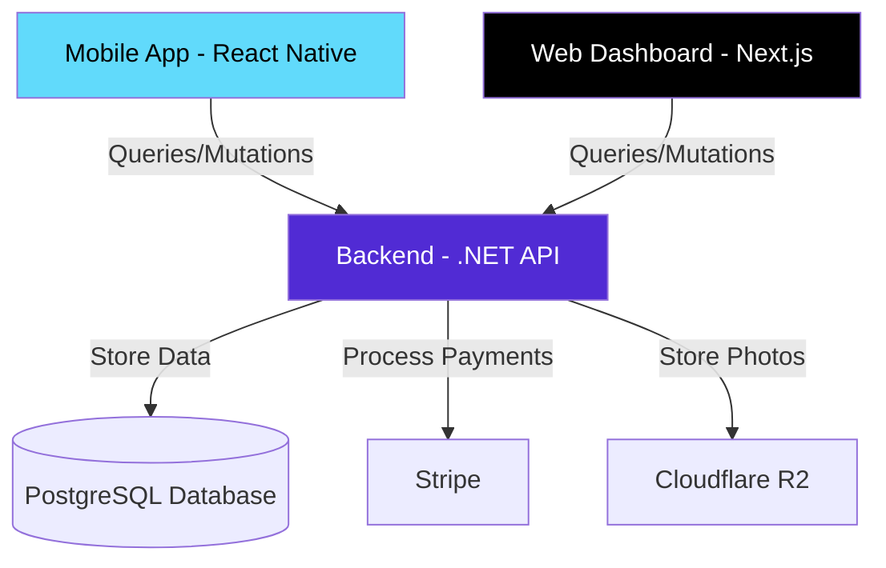

# Elaview Onboarding Guide for Beginners 🚀

Welcome to Elaview! This guide will help you understand what we're building, how it works, and how to get your workstation ready.

---

## 1. What is Elaview? (The Business Core)

Imagine you have a small coffee shop with a big window facing a busy street. That window is "Ad Space." On the other side, a local gym wants to tell people about their new membership deal. 

**Elaview is the marketplace that connects them.**

| Role | Description | Real-world Example |
|------|-------------|-------------------|
| **Ad Space Owner** | People with physical space (windows, walls, screens). | Coffee Shop owner, Storefront owner. |
| **Advertiser** | People who want to show their ads. | Local Gym, Real Estate Agent, Event Organizers. |

**The Workflow:**
1. **Owner** lists their space on Elaview.
2. **Advertiser** finds the space, uploads their ad, and pays.
3. **Owner** downloads the ad, prints it (if needed), and puts it up.
4. **Owner** takes a photo to prove it's up.
5. **Elaview** pays the owner.

---

## 2. High-Level Architecture

Here is how the different parts of our system talk to each other:



*   **Backend:** The "brain" of the operation. It handles security, payments, and talks to the database.
*   **Web/Mobile:** The "face" of the operation. This is what the users see and touch.
*   **PostgreSQL:** Where we save all the information (users, ads, bookings).
*   **Stripe:** A service we use to handle money safely.
*   **Cloudflare R2:** Where we store the photos owners upload.

---

## 3. Tech Stack (The Tools We Use)

As a beginner, you don't need to know everything yet. Here is the primary "recipe" for Elaview:

### Frontend (User Interfaces)
- **Next.js (Web):** A popular tool for building websites using **React**.
- **React Native (Mobile):** A way to build mobile apps using the same logic as React.
- **Bun:** Our "Package Manager." Think of it as a super-fast delivery service that brings us all the code libraries we need to build the app.

### Backend (The Brain)
- **.NET 10 & C#:** A powerful language and framework from Microsoft used for building the API.
- **GraphQL:** Instead of asking for a whole pizza when you just want a slice, GraphQL lets the frontend ask exactly for the data it needs.

---

## 4. Project Structure Walkthrough

When you open the project folder, here are the important bits:

```bash
elaview-production/
├── backend/           # 🧠 The .NET API (C# code)
├── clients/
│   ├── mobile/        # 📱 The Mobile App (React Native)
│   └── web/           # 💻 The Web Dashboard (Next.js)
├── docs/              # 📚 Detailed documentation (Read these later!)
├── scripts/           # 🛠️ Helper scripts to make development easier
└── devbox.json        # 📦 The environment recipe
```

---

## 5. Getting Started (Your First Commands)

We use a tool called **Devbox** to make sure everyone's computer works exactly the same way.

### Step 1: Enter the "Devbox Shell"
Open your terminal in the project folder and run:
```bash
devbox shell
```
> [!NOTE]
> This "magically" installs all the tools you need (like Bun, .NET, etc.) only for this project, without messing up your computer.

### Step 2: Install Dependencies
Run these to get the code libraries:
```bash
ev web:install
```

### Step 3: Start the Backend (Requires Docker)
Our backend needs a database to run. We use **Docker** to run a "tiny" database on your computer.
```bash
ev backend:start
```

### Step 4: Start the Web Client
In a new terminal tab (remember to run `devbox shell` there too!):
```bash
cd clients/web
bun dev
```
Now, open [http://localhost:3000](http://localhost:3000) in your browser!

### Pro-Tip for Interns: Folder Secrets 🤫
- **Backend (`backend/Features/`):** We use "Vertical Slice Architecture." Instead of looking for all "Services" in one folder, look for a feature name (like `Payments` or `Marketplace`). Everything related to that feature is grouped together!
- **Web (`clients/web/src/app/`):** The main pages are inside the `src/` folder.

---

## 6. Beginner Tips

1. **Don't Be Afraid to Break Things:** You're running this locally on your computer. You can't break the real website!
2. **Use the `ev` CLI:** We built a custom tool called `ev` to help you run common tasks. Type `ev --help` to see what it can do.
3. **Ask the AI:** If you see a piece of code you don't understand, just ask me! "Hey, what does this function in `clients/web/app/page.tsx` do?"

---

**Ready to explore? Try starting the web client and looking at the homepage code!**
