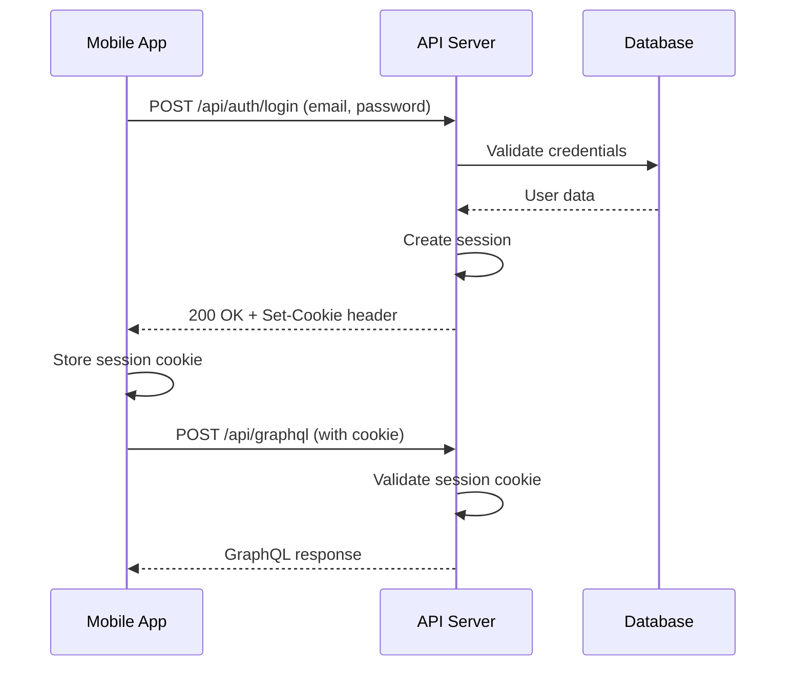
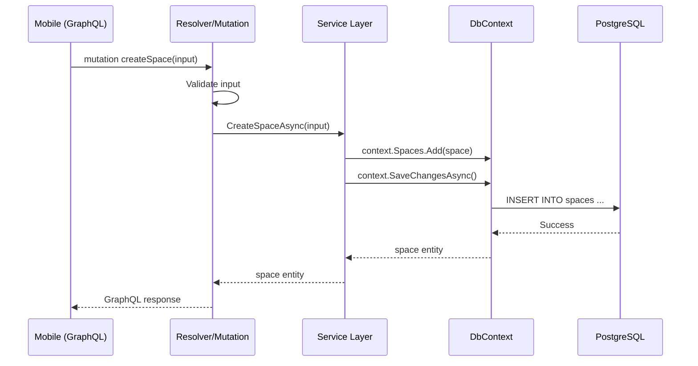

# Mobile API Integration Guide

> Complete guide for making API requests, configuring environments, and persisting data in the Elaview mobile app.

## Table of Contents

- [Backend Architecture Overview](#backend-architecture-overview)
- [Environment Setup](#environment-setup)
- [Making API Requests](#making-api-requests)
- [Authentication Flow](#authentication-flow)
- [Database Persistence](#database-persistence)
- [Development Workflow](#development-workflow)
- [GraphQL Code Generation](#graphql-code-generation)
- [Error Handling](#error-handling)
- [Testing API Integration](#testing-api-integration)

---

## Backend Architecture Overview

### Technology Stack

The Elaview backend is built with:

- **.NET 10.0** - Modern C# web framework
- **HotChocolate** - GraphQL server for .NET
- **PostgreSQL** - Primary database
- **Entity Framework Core** - ORM for database operations
- **Docker** - Containerized deployment
- **Doppler** - Secrets management

### API Endpoints

| Environment | REST Endpoint | GraphQL Endpoint |
|-------------|--------------|------------------|
| Local | `http://localhost:7106` | `http://localhost:7106/api/graphql` |
| Staging | `https://staging-api.elaview.com` | `https://staging-api.elaview.com/api/graphql` |
| Production | `https://api.elaview.com` | `https://api.elaview.com/api/graphql` |

### Available APIs

The backend exposes two types of APIs:

1. **REST API** - Traditional HTTP endpoints (authentication only)
   - `/api/auth/signup` - Create new user account
   - `/api/auth/login` - Authenticate user
   - `/api/auth/logout` - End user session

2. **GraphQL API** - Unified data query interface at `/api/graphql`
   - Queries - Fetch data (currentUser, spaces, bookings, etc.)
   - Mutations - Modify data (create, update, delete)
   - Subscriptions - Real-time updates (coming soon)

---

## Environment Setup

### Prerequisites

Before starting, ensure you have:

1. **Devbox** installed (manages development dependencies)
2. **Doppler CLI** installed and authenticated
3. **Docker** running (for backend services)

### Step 1: Initialize Devbox Shell

```bash
# From project root
devbox shell
```

This loads all required tools and environment variables via Doppler.

**What happens:**
- Loads `.NET SDK 10`, `PostgreSQL`, `Docker`, `Node.js`, `pnpm`
- Exports `ELAVIEW_DEVBOX_ROOT` and `ELAVIEW_EV_CMD` variables
- Sources `/scripts/init/env.sh` which loads Doppler secrets

### Step 2: Configure Doppler

Doppler automatically loads environment variables for the mobile app. The init script (`scripts/init/env.sh`) handles this:

```bash
# Login to Doppler (first time only)
doppler login

# Setup project and config
doppler setup --project elaview --config development --no-interactive
```

All secrets are prefixed with `ELAVIEW_` and environment-specific prefixes:
- `ELAVIEW_BACKEND_*` - Backend configuration
- `ELAVIEW_MOBILE_*` - Mobile app configuration
- `ELAVIEW_WEB_*` - Web app configuration

### Step 3: Start Backend Services

```bash
# Using the ev command (custom CLI)
ev backend:start

# Or directly with Docker
cd backend && docker compose up --build -d
```

**What this does:**
1. Starts PostgreSQL database container on configured port
2. Builds and starts .NET API server container
3. Runs migrations and seeds development data
4. Exposes GraphQL endpoint at `http://localhost:7106/api/graphql`

**Verify backend is running:**
```bash
# Check service status
ev backend:status

# View logs
ev backend:logs

# Or visit GraphQL playground
open http://localhost:7106/api/graphql
```

### Step 4: Configure Mobile Environment

The mobile app gets its environment variables from Doppler via devbox shell. Variables are read from `process.env.ELAVIEW_MOBILE_*` at build time.

**Environment configuration is already set up:**

1. **`app.config.js`** - Reads `ELAVIEW_MOBILE_*` variables from devbox and injects them via expo-constants
2. **`src/config/env.ts`** - Exports all environment variables for use in your app
3. **`src/config/api.ts`** - Provides configured API endpoints and utilities

**Usage in your code:**

```typescript
// Import environment variables anywhere
import { API_URL, GRAPHQL_ENDPOINT, ENV, DEBUG } from '@/config';

// Or import specific API config
import { endpoints, defaultFetchOptions } from '@/config/api';

// Use in your components/services
console.log('API URL:', API_URL); // http://localhost:7106
console.log('GraphQL:', GRAPHQL_ENDPOINT); // http://localhost:7106/api/graphql
console.log('Environment:', ENV); // 'development'
```

**How it works:**
1. Run `devbox shell` to load environment variables from Doppler
2. Variables with `ELAVIEW_MOBILE_` prefix are automatically read by `app.config.js` at build time
3. Access them via `@/config` imports throughout your app

**Available environment variables:**
- API configuration: `API_URL`, `GRAPHQL_ENDPOINT`, `APP_URL`
- Authentication: `CLERK_PUBLISHABLE_KEY`
- Cloudinary: `CLOUDINARY_CLOUD_NAME`, `CLOUDINARY_UPLOAD_PRESET_*`
- Google Maps: `GOOGLE_MAPS_API_KEY`, `GOOGLE_MAPS_MAP_ID`
- Stripe: `STRIPE_PUBLISHABLE_KEY`
- Feature flags: `ENABLE_NEW_BOOKING_FLOW`, `ENABLE_PUSH_NOTIFICATIONS`, `ENABLE_ANALYTICS`
- Environment: `ENV`, `DEBUG`

**Note:** Different environments (development, staging, production) have their own Doppler configurations with appropriate values. See `src/config/README.md` for detailed usage examples.

---

## Making API Requests

### Option 1: REST API (Authentication)

The backend uses **cookie-based authentication** for REST endpoints.

#### Example: Login Request

```typescript
// src/services/auth.ts
import { endpoints, defaultFetchOptions } from '@/config/api';

interface LoginRequest {
  email: string;
  password: string;
}

interface LoginResponse {
  id: string;
  email: string;
  name: string;
  role: 'Admin' | 'Advertiser' | 'User';
  message: string;
}

export async function login(email: string, password: string): Promise<LoginResponse> {
  const response = await fetch(endpoints.auth.login, {
    ...defaultFetchOptions,
    method: 'POST',
    body: JSON.stringify({ email, password }),
  });

  if (!response.ok) {
    const error = await response.json();
    throw new Error(error.message || 'Login failed');
  }

  return response.json();
}
```

#### Example: Signup Request

```typescript
interface SignupRequest {
  email: string;
  password: string;
  name: string;
}

export async function signup(data: SignupRequest): Promise<LoginResponse> {
  const response = await fetch(endpoints.auth.signup, {
    ...defaultFetchOptions,
    method: 'POST',
    body: JSON.stringify(data),
  });

  if (!response.ok) {
    const error = await response.json();
    throw new Error(error.message || 'Signup failed');
  }

  return response.json();
}
```

### Option 2: GraphQL API (Data Operations & Current User)

For everything beyond basic authentication (login/signup/logout), use the GraphQL API. This includes getting the current user.

#### Example: Get Current User (GraphQL)

```typescript
// src/hooks/useCurrentUser.ts
import { gql, useQuery } from '@apollo/client';

const CURRENT_USER_QUERY = gql`
  query CurrentUser {
    currentUser {
      id
      email
      name
      role
      status
      createdAt
      updatedAt
    }
  }
`;

interface User {
  id: string;
  email: string;
  name: string;
  role: 'Admin' | 'Advertiser' | 'User';
  status: 'Active' | 'Inactive' | 'Suspended';
  createdAt: string;
  updatedAt: string;
}

export function useCurrentUser() {
  const { data, loading, error, refetch } = useQuery<{ currentUser: User }>(CURRENT_USER_QUERY);

  return {
    user: data?.currentUser,
    loading,
    error,
    refetch,
  };
}
```

**Note:** The `role` field represents the user's permission level (Admin, Advertiser, User). Users can have additional **profile types** (AdvertiserProfile, SpaceOwnerProfile) which are separate entities linked to the user.

#### Setup Apollo Client (Recommended)

**Step 1: Install dependencies**

```bash
cd clients/mobile
pnpm add @apollo/client graphql
```

**Step 2: Create Apollo Client instance**

```typescript
// src/lib/apollo-client.ts
import { ApolloClient, InMemoryCache, createHttpLink } from '@apollo/client';
import { GRAPHQL_ENDPOINT } from '@/config';

const httpLink = createHttpLink({
  uri: GRAPHQL_ENDPOINT,
  credentials: 'include', // Send cookies for authentication
});

export const apolloClient = new ApolloClient({
  link: httpLink,
  cache: new InMemoryCache(),
  defaultOptions: {
    watchQuery: {
      fetchPolicy: 'cache-and-network',
    },
  },
});
```

**Step 3: Wrap app with ApolloProvider**

```typescript
// src/app/_layout.tsx
import { ApolloProvider } from '@apollo/client';
import { apolloClient } from '@/lib/apollo-client';

export default function RootLayout() {
  return (
    <ApolloProvider client={apolloClient}>
      {/* Your app content */}
    </ApolloProvider>
  );
}
```

#### Example: Query Spaces

```typescript
// src/hooks/useSpaces.ts
import { gql, useQuery } from '@apollo/client';

const GET_SPACES = gql`
  query GetSpaces($filter: SpaceFilter, $pagination: PaginationInput) {
    spaces(filter: $filter, pagination: $pagination) {
      edges {
        node {
          id
          title
          description
          photos
          city
          state
          pricePerWeek
          spaceType {
            id
            name
          }
          owner {
            id
            name
          }
        }
      }
      pageInfo {
        hasNextPage
        endCursor
      }
      totalCount
    }
  }
`;

export function useSpaces(city?: string, state?: string) {
  const { data, loading, error, fetchMore } = useQuery(GET_SPACES, {
    variables: {
      filter: city && state ? { city, state } : undefined,
      pagination: { first: 10 },
    },
  });

  return {
    spaces: data?.spaces.edges.map(edge => edge.node) || [],
    loading,
    error,
    hasMore: data?.spaces.pageInfo.hasNextPage,
    loadMore: () => {
      if (data?.spaces.pageInfo.hasNextPage) {
        fetchMore({
          variables: {
            pagination: {
              first: 10,
              after: data.spaces.pageInfo.endCursor,
            },
          },
        });
      }
    },
  };
}
```

#### Example: Create Booking Mutation

```typescript
// src/hooks/useCreateBooking.ts
import { gql, useMutation } from '@apollo/client';

const CREATE_BOOKING = gql`
  mutation CreateBooking($input: CreateBookingInput!) {
    createBooking(input: $input) {
      id
      status
      startDate
      endDate
      total
      space {
        id
        title
      }
    }
  }
`;

interface CreateBookingInput {
  spaceId: string;
  startDate: string;
  endDate: string;
  notes?: string;
}

export function useCreateBooking() {
  const [createBooking, { loading, error }] = useMutation(CREATE_BOOKING);

  const handleCreateBooking = async (input: CreateBookingInput) => {
    try {
      const { data } = await createBooking({
        variables: { input },
        // Refetch bookings query after creating
        refetchQueries: ['GetMyBookings'],
      });
      return data.createBooking;
    } catch (err) {
      console.error('Failed to create booking:', err);
      throw err;
    }
  };

  return { createBooking: handleCreateBooking, loading, error };
}
```

#### Example: Usage in Component

```typescript
// src/app/(advertiser)/discover.tsx
import { useSpaces } from '@/hooks/useSpaces';
import { useCreateBooking } from '@/hooks/useCreateBooking';

export default function DiscoverScreen() {
  const { spaces, loading, error, loadMore, hasMore } = useSpaces('Irvine', 'CA');
  const { createBooking } = useCreateBooking();

  const handleBookSpace = async (spaceId: string) => {
    try {
      const booking = await createBooking({
        spaceId,
        startDate: '2026-01-15',
        endDate: '2026-01-29',
        notes: 'Please position at eye level',
      });
      alert(`Booking created: ${booking.id}`);
    } catch (error) {
      alert('Failed to create booking');
    }
  };

  if (loading) return <Text>Loading spaces...</Text>;
  if (error) return <Text>Error: {error.message}</Text>;

  return (
    <FlatList
      data={spaces}
      renderItem={({ item }) => (
        <SpaceCard
          space={item}
          onBook={() => handleBookSpace(item.id)}
        />
      )}
      onEndReached={loadMore}
      onEndReachedThreshold={0.5}
    />
  );
}
```

---

## Authentication Flow

### Cookie-Based Authentication

The backend uses **cookie-based sessions** with the following flow:



**Important:** Always include `credentials: 'include'` in fetch/Apollo requests to send cookies.

### User Roles vs Profiles

The Elaview backend distinguishes between **roles** (permissions) and **profiles** (user types):

**Roles (Permission Levels):**
- `Admin` - Full system access
- `Advertiser` - Can book ad spaces
- `User` - Basic user permissions

**Profiles (User Types - separate entities):**
- `AdvertiserProfile` - Linked to users who book spaces
- `SpaceOwnerProfile` - Linked to users who list spaces

**Example:**
```typescript
// User entity
{
  id: "user-123",
  email: "john@example.com",
  role: "Advertiser",  // Permission level
  advertiserProfile: { // Profile type (separate entity)
    id: "adv-456",
    companyName: "Acme Corp",
    // ... other advertiser-specific fields
  }
}
```

A user can potentially have both profiles (e.g., an Advertiser role user could also have a SpaceOwnerProfile to list their own spaces).

### Handling Session Expiry

Sessions expire after 7 days of inactivity. Handle 401 responses:

```typescript
// src/lib/apollo-client.ts
import { ApolloClient, InMemoryCache, createHttpLink, from } from '@apollo/client';
import { onError } from '@apollo/client/link/error';
import { GRAPHQL_ENDPOINT } from '@/config';

const errorLink = onError(({ graphQLErrors, networkError }) => {
  if (graphQLErrors) {
    graphQLErrors.forEach(({ extensions }) => {
      if (extensions?.code === 'UNAUTHENTICATED') {
        // Redirect to login
        // Note: You'll need to handle this with a global event or context
        console.log('Session expired, redirecting to login');
      }
    });
  }

  if (networkError && 'statusCode' in networkError) {
    if (networkError.statusCode === 401) {
      console.log('Unauthorized, redirecting to login');
    }
  }
});

const httpLink = createHttpLink({
  uri: GRAPHQL_ENDPOINT,
  credentials: 'include',
});

export const apolloClient = new ApolloClient({
  link: from([errorLink, httpLink]),
  cache: new InMemoryCache(),
});
```

---

## Database Persistence

### Backend Database Architecture

The backend uses **Entity Framework Core** with PostgreSQL.

#### Database Context

**File: `backend/Shared/AppDbContext.cs`**

```csharp
public sealed class AppDbContext : DbContext {
    public DbSet<User> Users { get; set; }
    public DbSet<AdvertiserProfile> AdvertiserProfiles { get; set; }
    public DbSet<SpaceOwnerProfile> SpaceOwnerProfiles { get; set; }
    public DbSet<Space> Spaces { get; set; }
    public DbSet<Campaign> Campaigns { get; set; }
    // ... more entities
}
```

#### Saving Data Flow



### Mobile Local Persistence

For local data caching and offline support, consider these options:

#### Option 1: Apollo Client Cache (Recommended)

Apollo's InMemoryCache automatically caches query results:

```typescript
import { ApolloClient, InMemoryCache } from '@apollo/client';

const apolloClient = new ApolloClient({
  uri: GRAPHQL_ENDPOINT,
  cache: new InMemoryCache({
    typePolicies: {
      Query: {
        fields: {
          spaces: {
            // Merge incoming data with existing cached data
            keyArgs: ['filter'],
            merge(existing, incoming, { args }) {
              if (!existing) return incoming;
              return {
                ...incoming,
                edges: [...existing.edges, ...incoming.edges],
              };
            },
          },
        },
      },
    },
  }),
});
```

#### Option 2: Expo SecureStore (Sensitive Data)

For storing auth tokens or sensitive user data:

```typescript
import * as SecureStore from 'expo-secure-store';

// Save data
await SecureStore.setItemAsync('user_token', token);

// Retrieve data
const token = await SecureStore.getItemAsync('user_token');

// Delete data
await SecureStore.deleteItemAsync('user_token');
```

#### Option 3: AsyncStorage (Non-Sensitive Data)

For preferences and non-sensitive data:

```typescript
import AsyncStorage from '@react-native-async-storage/async-storage';

// Save
await AsyncStorage.setItem('theme', 'dark');

// Retrieve
const theme = await AsyncStorage.getItem('theme');

// Remove
await AsyncStorage.removeItem('theme');
```

---

## Development Workflow

### Using the `ev` Command

The project includes a custom CLI tool for common tasks:

```bash
# Backend commands
ev backend:start      # Start backend services
ev backend:stop       # Stop backend services
ev backend:restart    # Restart backend services
ev backend:logs       # View backend logs
ev backend:status     # Check service status
ev backend:exec       # Execute command in backend container

# Environment commands
ev env:list           # List all ELAVIEW_* env vars
ev env:list:mobile    # List mobile env vars
ev env:list:backend   # List backend env vars
ev env:list:web       # List web env vars

# Repository commands
ev repo:*             # Repository management commands

# Help
ev help               # Show available commands
```

### Mobile Development Commands

```bash
# From clients/mobile directory

# Start development server
pnpm dev              # Start with dev client
pnpm start            # Start standard Expo

# Platform-specific
pnpm ios              # Build and run on iOS
pnpm android          # Build and run on Android

# Code quality
pnpm lint             # Run ESLint
pnpm typecheck        # Run TypeScript compiler
```

### Common Development Tasks

#### Task 1: Add a New GraphQL Query

1. Write the query in your component or hook:
```typescript
const GET_MY_SPACES = gql`
  query GetMySpaces {
    mySpaces {
      id
      title
      photos
      pricePerWeek
    }
  }
`;
```

2. Use the query with Apollo:
```typescript
const { data, loading, error } = useQuery(GET_MY_SPACES);
```

3. (Optional) Run code generation to get TypeScript types (see next section)

#### Task 2: Test API Locally

1. Start backend:
```bash
ev backend:start
```

2. Open GraphQL Playground:
```bash
open http://localhost:7106/api/graphql
```

3. Test your query/mutation in the playground

4. Use it in your mobile app

#### Task 3: Debug API Issues

```bash
# View backend logs
ev backend:logs

# Execute commands in backend container
ev backend:exec server bash

# Check database
ev backend:exec database psql -U elaview -d elaview
```

---

## GraphQL Code Generation

### Setup (Similar to Web App)

The web app uses `@graphql-codegen/cli` to generate TypeScript types from GraphQL schema. You can set this up for mobile too.

#### Step 1: Install Dependencies

```bash
cd clients/mobile
pnpm add -D @graphql-codegen/cli @graphql-codegen/typescript @graphql-codegen/typescript-operations @graphql-codegen/typescript-react-apollo
```

#### Step 2: Create Codegen Config

**File: `clients/mobile/codegen.ts`**

```typescript
import { CodegenConfig } from '@graphql-codegen/cli';

const config: CodegenConfig = {
  overwrite: true,
  schema: 'http://localhost:7106/api/graphql',
  documents: ['src/**/*.{ts,tsx}'],
  ignoreNoDocuments: true,
  generates: {
    './src/generated/graphql.ts': {
      plugins: [
        'typescript',
        'typescript-operations',
        'typescript-react-apollo',
      ],
      config: {
        avoidOptionals: {
          field: true,
          inputValue: false,
        },
        defaultScalarType: 'unknown',
        nonOptionalTypename: true,
        skipTypeNameForRoot: true,
        maybeValue: 'T | undefined | null',
      },
    },
  },
};

export default config;
```

#### Step 3: Add Script to package.json

```json
{
  "scripts": {
    "codegen": "graphql-codegen --config codegen.ts",
    "codegen:watch": "graphql-codegen --config codegen.ts --watch"
  }
}
```

#### Step 4: Generate Types

```bash
# Make sure backend is running first
ev backend:start

# Generate types
pnpm codegen
```

#### Step 5: Use Generated Types

```typescript
import { useGetMySpacesQuery, useCreateBookingMutation } from '@/generated/graphql';

export function MySpacesScreen() {
  const { data, loading, error } = useGetMySpacesQuery();
  const [createBooking] = useCreateBookingMutation();

  // Now you have full TypeScript autocomplete and type checking!
  const spaces = data?.mySpaces; // Type: Space[] | undefined

  return (
    // Your component
  );
}
```

---

## Error Handling

### GraphQL Error Structure

```typescript
interface GraphQLError {
  message: string;
  locations?: Array<{ line: number; column: number }>;
  path?: string[];
  extensions?: {
    code: string;
    statusCode: number;
  };
}
```

### Common Error Codes

| Code | Status | Meaning | Action |
|------|--------|---------|--------|
| `UNAUTHENTICATED` | 401 | Not logged in | Redirect to login |
| `FORBIDDEN` | 403 | No permission | Show error message |
| `NOT_FOUND` | 404 | Resource missing | Show 404 screen |
| `BAD_REQUEST` | 400 | Invalid input | Show validation errors |
| `CONFLICT` | 409 | Data conflict | Show conflict message |
| `INTERNAL_ERROR` | 500 | Server error | Retry or report |

### Error Handling Utility

```typescript
// src/lib/error-handler.ts
import { ApolloError } from '@apollo/client';
import { useRouter } from 'expo-router';

export function useErrorHandler() {
  const router = useRouter();

  const handleError = (error: ApolloError) => {
    const code = error.graphQLErrors?.[0]?.extensions?.code;

    switch (code) {
      case 'UNAUTHENTICATED':
        router.replace('/(auth)/login');
        return 'Please log in to continue';

      case 'FORBIDDEN':
        return 'You do not have permission to perform this action';

      case 'NOT_FOUND':
        return 'The requested resource was not found';

      case 'BAD_REQUEST':
        const message = error.graphQLErrors?.[0]?.message;
        return message || 'Invalid request';

      case 'CONFLICT':
        return 'This action conflicts with existing data';

      default:
        console.error('Unhandled error:', error);
        return 'An unexpected error occurred';
    }
  };

  return { handleError };
}
```

### Usage in Component

```typescript
export function BookingScreen() {
  const { createBooking, loading, error } = useCreateBooking();
  const { handleError } = useErrorHandler();

  const handleSubmit = async () => {
    try {
      await createBooking(bookingData);
      router.push('/bookings/success');
    } catch (err) {
      const errorMessage = handleError(err as ApolloError);
      Alert.alert('Error', errorMessage);
    }
  };

  return (
    // Your component
  );
}
```

---

## Testing API Integration

### Manual Testing with GraphQL Playground

1. Start backend and open playground:
```bash
ev backend:start
open http://localhost:7106/api/graphql
```

2. Test authentication (login first):
```graphql
# Use /api/auth/login endpoint via REST, then use cookies in playground
```

3. Test queries:
```graphql
query GetSpaces {
  spaces(pagination: { first: 10 }) {
    edges {
      node {
        id
        title
        pricePerWeek
      }
    }
    totalCount
  }
}
```

4. Test mutations:
```graphql
mutation CreateBooking {
  createBooking(input: {
    spaceId: "space-001"
    startDate: "2026-01-15"
    endDate: "2026-01-29"
  }) {
    id
    status
    total
  }
}
```

### Automated Testing

Create test utilities for API mocking:

```typescript
// src/test/apollo-mock.ts
import { MockedProvider } from '@apollo/client/testing';
import { GET_SPACES } from '@/hooks/useSpaces';

export const mockSpaces = [
  {
    id: 'space-1',
    title: 'Coffee Shop Window',
    pricePerWeek: 100,
  },
];

export const getSpacesMock = {
  request: {
    query: GET_SPACES,
    variables: { pagination: { first: 10 } },
  },
  result: {
    data: {
      spaces: {
        edges: mockSpaces.map(space => ({ node: space })),
        pageInfo: { hasNextPage: false },
        totalCount: mockSpaces.length,
      },
    },
  },
};

// In your test
render(
  <MockedProvider mocks={[getSpacesMock]} addTypename={false}>
    <DiscoverScreen />
  </MockedProvider>
);
```

---

## Quick Reference

### Environment Variables

**Mobile app environment variables (loaded from Doppler via devbox):**

```bash
# All variables use ELAVIEW_MOBILE_ prefix
# They are automatically read by app.config.js and made available via @/config

# API Configuration
ELAVIEW_MOBILE_EXPO_PUBLIC_API_URL=http://localhost:7106
ELAVIEW_MOBILE_EXPO_PUBLIC_GRAPHQL_ENDPOINT=http://localhost:7106/api/graphql
ELAVIEW_MOBILE_EXPO_PUBLIC_APP_URL=exp://localhost:8081

# Authentication
ELAVIEW_MOBILE_CLERK_PUBLISHABLE_KEY=pk_test_xxx

# Cloudinary
ELAVIEW_MOBILE_EXPO_PUBLIC_CLOUDINARY_CLOUD_NAME=your-cloud-name
ELAVIEW_MOBILE_EXPO_PUBLIC_CLOUDINARY_UPLOAD_PRESET_CAMPAIGNS=elaview-campaigns
ELAVIEW_MOBILE_EXPO_PUBLIC_CLOUDINARY_UPLOAD_PRESET_SPACES=elaview-spaces
ELAVIEW_MOBILE_EXPO_PUBLIC_CLOUDINARY_UPLOAD_PRESET_VERIFICATION=elaview-verification

# Google Maps
ELAVIEW_MOBILE_EXPO_PUBLIC_GOOGLE_MAPS_API_KEY=your-api-key
ELAVIEW_MOBILE_EXPO_PUBLIC_GOOGLE_MAPS_MAP_ID=your-map-id

# Stripe
ELAVIEW_MOBILE_EXPO_PUBLIC_STRIPE_PUBLISHABLE_KEY=pk_test_xxx

# Feature Flags
ELAVIEW_MOBILE_EXPO_PUBLIC_ENABLE_NEW_BOOKING_FLOW=false
ELAVIEW_MOBILE_EXPO_PUBLIC_ENABLE_PUSH_NOTIFICATIONS=true
ELAVIEW_MOBILE_EXPO_PUBLIC_ENABLE_ANALYTICS=false

# Environment
ELAVIEW_MOBILE_EXPO_PUBLIC_ENV=development
ELAVIEW_MOBILE_EXPO_PUBLIC_DEBUG=true
```

**Access in code:**
```typescript
import { API_URL, GRAPHQL_ENDPOINT, STRIPE_PUBLISHABLE_KEY } from '@/config';
```

**Backend environment variables:**
```bash
ELAVIEW_BACKEND_DATABASE_HOST=localhost
ELAVIEW_BACKEND_DATABASE_PORT=5432
ELAVIEW_BACKEND_DATABASE_USER=elaview
ELAVIEW_BACKEND_DATABASE_PASSWORD=***
ELAVIEW_BACKEND_SERVER_PORT=7106
ELAVIEW_BACKEND_CORS_ORIGINS=http://localhost:3000,http://localhost:8081
ELAVIEW_BACKEND_AUTH_COOKIE_NAME=elaview_session
```

### Common Commands Cheatsheet

```bash
# Backend
ev backend:start           # Start backend
ev backend:logs            # View logs
ev backend:status          # Check status

# Mobile
pnpm dev                   # Start Expo dev server
pnpm ios                   # Run on iOS
pnpm android               # Run on Android
pnpm lint                  # Lint code
pnpm typecheck             # Type check

# Code Generation
pnpm codegen               # Generate GraphQL types

# Environment
ev env:list:mobile         # List mobile env vars
```

### Useful Backend Commands

```bash
# Database migrations
ev backend:exec server dotnet ef migrations add MigrationName
ev backend:exec server dotnet ef database update

# Database console
ev backend:exec database psql -U elaview -d elaview

# View backend logs
ev backend:logs server

# Restart specific service
ev backend:restart
```

---

## Additional Resources

- **API Contracts:** See `/docs/API-CONTRACTS.md` for complete GraphQL API reference
- **Architecture:** See `/docs/ARCHITECTURE.md` for system architecture
- **Domain Model:** See `/docs/DOMAIN-MODEL.md` for entity definitions
- **Mobile Screens:** See `/docs/MOBILE-SCREENS.md` for screen specifications
- **Project Setup:** See `/START_HERE.md` for comprehensive onboarding

---

## Troubleshooting

### Issue: "Cannot connect to backend"

**Solution:**
```bash
# Check if backend is running
ev backend:status

# If not running, start it
ev backend:start

# Check logs for errors
ev backend:logs
```

### Issue: "Authentication cookie not being sent"

**Solution:**
- Ensure `credentials: 'include'` is set in fetch/Apollo config
- Check CORS configuration in backend allows your origin
- Verify cookie is being set in browser/network tab

### Issue: "GraphQL schema not found during codegen"

**Solution:**
```bash
# Make sure backend is running
ev backend:start

# Check GraphQL endpoint is accessible
curl http://localhost:7106/api/graphql

# Run codegen with correct schema URL
pnpm codegen
```

### Issue: "Doppler secrets not loading"

**Solution:**
```bash
# Re-login to Doppler
doppler login

# Setup project again
doppler setup --project elaview --config development

# Restart devbox shell
exit
devbox shell
```

---

**Last Updated:** 2026-01-12
**Maintained By:** @mike-anderson (Mobile Lead)
