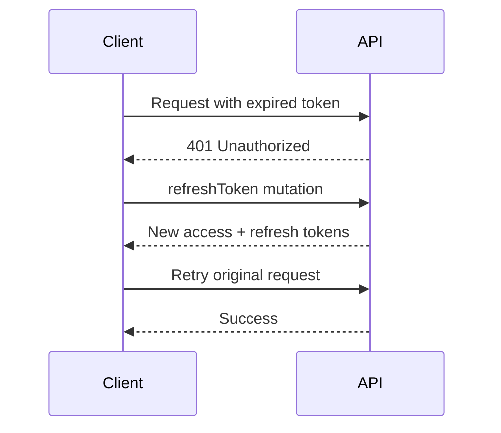

# Elaview API Contracts

> Complete GraphQL API reference for the Elaview marketplace.

## Table of Contents

- [Overview](#overview)
- [Authentication](#authentication)
- [Auth Operations](#auth-operations)
- [User Operations](#user-operations)
- [SpaceCategory Operations](#spacecategory-operations)
- [SpaceType Operations](#spacetype-operations)
- [Space Operations](#space-operations)
- [Booking Operations](#booking-operations)
- [Payment Operations](#payment-operations)
- [Payout Operations](#payout-operations)
- [Verification Operations](#verification-operations)
- [Notification Operations](#notification-operations)
- [Common Types](#common-types)
- [Error Handling](#error-handling)

---

## Overview

### Endpoint

| Environment | URL |
|-------------|-----|
| Local | `http://localhost:5000/graphql` |
| Staging | `https://staging-api.elaview.com/graphql` |
| Production | `https://api.elaview.com/graphql` |

### Headers

```http
Content-Type: application/json
Authorization: Bearer <access_token>
```

### Request Format

```json
{
  "query": "query GetMe { me { id email } }",
  "variables": {},
  "operationName": "GetMe"
}
```

---

## Authentication

All authenticated endpoints require a valid JWT in the `Authorization` header.

```typescript
// Apollo Client setup
const authLink = setContext((_, { headers }) => {
  const token = getAccessToken();
  return {
    headers: {
      ...headers,
      authorization: token ? `Bearer ${token}` : '',
    },
  };
});
```

### Token Refresh Flow



---

## Auth Operations

### signUp

Create a new user account.

```graphql
mutation SignUp($input: SignUpInput!) {
  signUp(input: $input) {
    accessToken
    refreshToken
    expiresIn
    user {
      id
      email
      role
      firstName
      lastName
    }
  }
}
```

**Input Type:**

```graphql
input SignUpInput {
  email: String!
  password: String!
  firstName: String!
  lastName: String!
  role: UserRole!
  phone: String
}

enum UserRole {
  ADVERTISER
  SPACE_OWNER
}
```

**Example:**

```json
{
  "input": {
    "email": "jane@company.com",
    "password": "SecurePass123!",
    "firstName": "Jane",
    "lastName": "Smith",
    "role": "ADVERTISER",
    "phone": "+17145551234"
  }
}
```

**Response:**

```json
{
  "data": {
    "signUp": {
      "accessToken": "eyJhbGciOiJSUzI1NiIsInR5cCI6IkpXVCJ9...",
      "refreshToken": "dGhpcyBpcyBhIHJlZnJlc2ggdG9rZW4...",
      "expiresIn": 3600,
      "user": {
        "id": "user-001",
        "email": "jane@company.com",
        "role": "ADVERTISER",
        "firstName": "Jane",
        "lastName": "Smith"
      }
    }
  }
}
```

---

### signIn

Authenticate an existing user.

```graphql
mutation SignIn($input: SignInInput!) {
  signIn(input: $input) {
    accessToken
    refreshToken
    expiresIn
    user {
      id
      email
      role
      firstName
      lastName
    }
  }
}
```

**Input Type:**

```graphql
input SignInInput {
  email: String!
  password: String!
}
```

**Example:**

```json
{
  "input": {
    "email": "jane@company.com",
    "password": "SecurePass123!"
  }
}
```

---

### signOut

Invalidate the current session.

```graphql
mutation SignOut {
  signOut
}
```

**Response:**

```json
{
  "data": {
    "signOut": true
  }
}
```

---

### refreshToken

Get new tokens using a refresh token.

```graphql
mutation RefreshToken($refreshToken: String!) {
  refreshToken(refreshToken: $refreshToken) {
    accessToken
    refreshToken
    expiresIn
  }
}
```

---

### forgotPassword

Request a password reset email.

```graphql
mutation ForgotPassword($email: String!) {
  forgotPassword(email: $email)
}
```

**Response:**

```json
{
  "data": {
    "forgotPassword": true
  }
}
```

---

### resetPassword

Reset password with token from email.

```graphql
mutation ResetPassword($input: ResetPasswordInput!) {
  resetPassword(input: $input)
}
```

**Input Type:**

```graphql
input ResetPasswordInput {
  token: String!
  newPassword: String!
}
```

---

## User Operations

### getMe

Get the current authenticated user.

```graphql
query GetMe {
  me {
    id
    email
    role
    firstName
    lastName
    phone
    avatarUrl
    stripeCustomerId
    stripeAccountId
    stripeAccountStatus
    emailNotifications
    pushNotifications
    createdAt
    updatedAt
  }
}
```

**Response:**

```json
{
  "data": {
    "me": {
      "id": "user-001",
      "email": "jane@company.com",
      "role": "ADVERTISER",
      "firstName": "Jane",
      "lastName": "Smith",
      "phone": "+17145551234",
      "avatarUrl": "https://files.elaview.com/avatars/user-001.jpg",
      "stripeCustomerId": "cus_ABC123",
      "stripeAccountId": null,
      "stripeAccountStatus": null,
      "emailNotifications": true,
      "pushNotifications": true,
      "createdAt": "2025-06-15T10:30:00Z",
      "updatedAt": "2025-12-01T14:22:00Z"
    }
  }
}
```

---

### updateProfile

Update the current user's profile.

```graphql
mutation UpdateProfile($input: UpdateProfileInput!) {
  updateProfile(input: $input) {
    id
    firstName
    lastName
    phone
    avatarUrl
    emailNotifications
    pushNotifications
    updatedAt
  }
}
```

**Input Type:**

```graphql
input UpdateProfileInput {
  firstName: String
  lastName: String
  phone: String
  avatarUrl: String
  emailNotifications: Boolean
  pushNotifications: Boolean
}
```

---

### deleteAccount

Delete the current user's account.

```graphql
mutation DeleteAccount {
  deleteAccount
}
```

**Response:**

```json
{
  "data": {
    "deleteAccount": true
  }
}
```

---

## SpaceCategory Operations

### getCategories

Get all active space categories.

```graphql
query GetCategories {
  categories {
    id
    slug
    name
    description
    isActive
    basePrintInstallFee
    feeCalculationType
    requiredPhotoCount
    requiresGpsValidation
    gpsRadiusMeters
    requiresProfessionalInstall
    estimatedInstallDays
    supportedFormats
    maxFileSizeMb
    minResolutionDpi
    iconUrl
    sortOrder
  }
}
```

**Response:**

```json
{
  "data": {
    "categories": [
      {
        "id": "cat-storefront-001",
        "slug": "storefront",
        "name": "Storefront",
        "description": "Storefronts, windows, and walls",
        "isActive": true,
        "basePrintInstallFee": 20.00,
        "feeCalculationType": "FIXED",
        "requiredPhotoCount": 3,
        "requiresGpsValidation": true,
        "gpsRadiusMeters": 100,
        "requiresProfessionalInstall": false,
        "estimatedInstallDays": 1,
        "supportedFormats": ["PDF", "PNG", "JPG"],
        "maxFileSizeMb": 25,
        "minResolutionDpi": 150,
        "iconUrl": "https://files.elaview.com/icons/storefront.svg",
        "sortOrder": 1
      }
    ]
  }
}
```

---

### getCategory

Get a specific category by slug.

```graphql
query GetCategory($slug: String!) {
  category(slug: $slug) {
    id
    slug
    name
    description
    spaceTypes {
      id
      slug
      name
      standardWidth
      standardHeight
      dimensionUnit
      printInstallFeeOverride
    }
  }
}
```

---

## SpaceType Operations

### getSpaceTypes

Get all active space types.

```graphql
query GetSpaceTypes {
  spaceTypes {
    id
    categoryId
    slug
    name
    description
    standardWidth
    standardHeight
    dimensionUnit
    printInstallFeeOverride
    isActive
    sortOrder
    category {
      id
      slug
      name
    }
  }
}
```

---

### getSpaceTypesByCategory

Get space types for a specific category.

```graphql
query GetSpaceTypesByCategory($categoryId: ID!) {
  spaceTypesByCategory(categoryId: $categoryId) {
    id
    slug
    name
    description
    standardWidth
    standardHeight
    dimensionUnit
    printInstallFeeOverride
    isActive
    sortOrder
  }
}
```

---

## Space Operations

### getSpaces

Get paginated list of spaces with optional filters.

```graphql
query GetSpaces($filter: SpaceFilter, $pagination: PaginationInput) {
  spaces(filter: $filter, pagination: $pagination) {
    edges {
      cursor
      node {
        id
        title
        description
        photos
        address
        city
        state
        zip
        lat
        lng
        pricePerWeek
        isActive
        viewCount
        spaceType {
          id
          name
          category {
            id
            name
          }
        }
        owner {
          id
          firstName
          lastName
          avatarUrl
        }
      }
    }
    pageInfo {
      hasNextPage
      hasPreviousPage
      startCursor
      endCursor
    }
    totalCount
  }
}
```

**Input Types:**

```graphql
input SpaceFilter {
  categoryId: ID
  spaceTypeId: ID
  city: String
  state: String
  minPrice: Float
  maxPrice: Float
  isActive: Boolean
}

input PaginationInput {
  first: Int
  after: String
  last: Int
  before: String
}
```

**Example:**

```json
{
  "filter": {
    "city": "Irvine",
    "state": "CA",
    "minPrice": 50,
    "maxPrice": 150
  },
  "pagination": {
    "first": 10
  }
}
```

---

### getSpace

Get a single space by ID.

```graphql
query GetSpace($id: ID!) {
  space(id: $id) {
    id
    title
    description
    photos
    address
    city
    state
    zip
    lat
    lng
    width
    height
    pricePerWeek
    isActive
    viewCount
    bookingCount
    createdAt
    updatedAt
    spaceType {
      id
      name
      standardWidth
      standardHeight
      dimensionUnit
      category {
        id
        name
        basePrintInstallFee
        requiredPhotoCount
        requiresGpsValidation
        gpsRadiusMeters
      }
    }
    owner {
      id
      firstName
      lastName
      avatarUrl
    }
  }
}
```

---

### getMySpaces

Get spaces owned by the current user.

```graphql
query GetMySpaces {
  mySpaces {
    id
    title
    photos
    city
    state
    pricePerWeek
    isActive
    viewCount
    bookingCount
    spaceType {
      id
      name
    }
  }
}
```

---

### searchSpaces

Search spaces with location and text query.

```graphql
query SearchSpaces($input: SearchInput!) {
  searchSpaces(input: $input) {
    edges {
      cursor
      node {
        id
        title
        photos
        city
        state
        pricePerWeek
        lat
        lng
        distance
      }
    }
    pageInfo {
      hasNextPage
      endCursor
    }
    totalCount
  }
}
```

**Input Type:**

```graphql
input SearchInput {
  query: String
  lat: Float
  lng: Float
  radiusMiles: Float
  categoryId: ID
  spaceTypeId: ID
  minPrice: Float
  maxPrice: Float
  sortBy: SpaceSortBy
  first: Int
  after: String
}

enum SpaceSortBy {
  RELEVANCE
  PRICE_LOW
  PRICE_HIGH
  DISTANCE
  NEWEST
}
```

---

### createSpace

Create a new space listing.

```graphql
mutation CreateSpace($input: CreateSpaceInput!) {
  createSpace(input: $input) {
    id
    title
    description
    photos
    address
    city
    state
    zip
    lat
    lng
    pricePerWeek
    isActive
    spaceType {
      id
      name
    }
  }
}
```

**Input Type:**

```graphql
input CreateSpaceInput {
  spaceTypeId: ID!
  title: String!
  description: String
  photos: [String!]!
  address: String!
  city: String!
  state: String!
  zip: String!
  lat: Float!
  lng: Float!
  width: Float
  height: Float
  pricePerWeek: Float!
}
```

---

### updateSpace

Update an existing space.

```graphql
mutation UpdateSpace($id: ID!, $input: UpdateSpaceInput!) {
  updateSpace(id: $id, input: $input) {
    id
    title
    description
    photos
    pricePerWeek
    isActive
    updatedAt
  }
}
```

**Input Type:**

```graphql
input UpdateSpaceInput {
  title: String
  description: String
  photos: [String!]
  pricePerWeek: Float
  isActive: Boolean
}
```

---

### deleteSpace

Delete a space listing.

```graphql
mutation DeleteSpace($id: ID!) {
  deleteSpace(id: $id)
}
```

---

## Booking Operations

### getBookings

Get bookings with optional filters (admin only).

```graphql
query GetBookings($filter: BookingFilter) {
  bookings(filter: $filter) {
    id
    status
    startDate
    endDate
    total
    createdAt
    advertiser {
      id
      firstName
      lastName
    }
    space {
      id
      title
    }
  }
}
```

**Input Type:**

```graphql
input BookingFilter {
  status: [BookingStatus!]
  advertiserId: ID
  spaceId: ID
  ownerId: ID
  startDateFrom: Date
  startDateTo: Date
}
```

---

### getBooking

Get a single booking by ID.

```graphql
query GetBooking($id: ID!) {
  booking(id: $id) {
    id
    status
    startDate
    endDate
    creativeFileUrl
    creativeFileName
    creativeFileSize
    pricePerWeek
    totalWeeks
    subtotal
    platformFee
    printInstallFee
    total
    notes
    requestedAt
    acceptedAt
    paidAt
    fileDownloadedAt
    installedAt
    verifiedAt
    completedAt
    cancelledAt
    cancellationReason
    autoApprovalAt
    advertiser {
      id
      firstName
      lastName
      email
      phone
      avatarUrl
    }
    space {
      id
      title
      photos
      address
      city
      state
      zip
      lat
      lng
      spaceType {
        id
        name
        category {
          id
          name
          requiredPhotoCount
          requiresGpsValidation
          gpsRadiusMeters
        }
      }
      owner {
        id
        firstName
        lastName
        avatarUrl
      }
    }
    payment {
      id
      amount
      status
      paidAt
    }
    payouts {
      id
      amount
      stage
      status
      paidAt
    }
    verification {
      id
      photos
      status
      capturedAt
    }
  }
}
```

---

### getMyBookings

Get bookings for the current user.

```graphql
query GetMyBookings($role: UserRole!, $status: [BookingStatus!], $pagination: PaginationInput) {
  myBookings(role: $role, status: $status, pagination: $pagination) {
    edges {
      cursor
      node {
        id
        status
        startDate
        endDate
        total
        createdAt
        space {
          id
          title
          photos
          city
          state
        }
        advertiser {
          id
          firstName
          lastName
        }
      }
    }
    pageInfo {
      hasNextPage
      endCursor
    }
    totalCount
  }
}
```

**Example (as advertiser):**

```json
{
  "role": "ADVERTISER",
  "status": ["PENDING_APPROVAL", "ACCEPTED", "PAID"],
  "pagination": { "first": 10 }
}
```

**Example (as owner):**

```json
{
  "role": "SPACE_OWNER",
  "status": ["PENDING_APPROVAL"],
  "pagination": { "first": 10 }
}
```

---

### createBooking

Create a new booking request.

```graphql
mutation CreateBooking($input: CreateBookingInput!) {
  createBooking(input: $input) {
    id
    status
    startDate
    endDate
    pricePerWeek
    totalWeeks
    subtotal
    platformFee
    printInstallFee
    total
    space {
      id
      title
      owner {
        id
        firstName
      }
    }
  }
}
```

**Input Type:**

```graphql
input CreateBookingInput {
  spaceId: ID!
  startDate: Date!
  endDate: Date!
  creativeFileUrl: String
  notes: String
}
```

**Example:**

```json
{
  "input": {
    "spaceId": "space-001",
    "startDate": "2026-01-15",
    "endDate": "2026-01-29",
    "notes": "Please position at eye level"
  }
}
```

---

### updateBookingStatus

Update booking status (for owner accept/reject).

```graphql
mutation UpdateBookingStatus($id: ID!, $status: BookingStatus!) {
  updateBookingStatus(id: $id, status: $status) {
    id
    status
    acceptedAt
    updatedAt
  }
}
```

**Example (accept booking):**

```json
{
  "id": "booking-001",
  "status": "ACCEPTED"
}
```

---

### cancelBooking

Cancel a booking.

```graphql
mutation CancelBooking($id: ID!, $reason: String) {
  cancelBooking(id: $id, reason: $reason) {
    id
    status
    cancelledAt
    cancellationReason
  }
}
```

---

### approveInstallation

Approve installation verification (advertiser).

```graphql
mutation ApproveInstallation($id: ID!) {
  approveInstallation(id: $id) {
    id
    status
    verifiedAt
  }
}
```

---

### disputeInstallation

Dispute installation verification (advertiser).

```graphql
mutation DisputeInstallation($id: ID!, $reason: String!) {
  disputeInstallation(id: $id, reason: $reason) {
    id
    status
    dispute {
      reason
      createdAt
    }
  }
}
```

**Input:**

```json
{
  "id": "booking-001",
  "reason": "Ad is not positioned correctly - should be at eye level per my notes"
}
```

---

## Payment Operations

### createPaymentIntent

Create a Stripe PaymentIntent for a booking.

```graphql
mutation CreatePaymentIntent($bookingId: ID!) {
  createPaymentIntent(bookingId: $bookingId) {
    clientSecret
    paymentIntentId
    amount
    currency
    booking {
      id
      status
      total
    }
  }
}
```

**Response:**

```json
{
  "data": {
    "createPaymentIntent": {
      "clientSecret": "pi_3ABC123_secret_XYZ",
      "paymentIntentId": "pi_3ABC123",
      "amount": 17250,
      "currency": "usd",
      "booking": {
        "id": "booking-001",
        "status": "ACCEPTED",
        "total": 172.50
      }
    }
  }
}
```

---

### confirmPayment

Confirm payment after Stripe confirmation (called by webhook, rarely by client).

```graphql
mutation ConfirmPayment($paymentIntentId: String!) {
  confirmPayment(paymentIntentId: $paymentIntentId) {
    id
    status
    amount
    paidAt
    booking {
      id
      status
      paidAt
    }
  }
}
```

---

### getPaymentStatus

Get payment status for a booking.

```graphql
query GetPaymentStatus($bookingId: ID!) {
  paymentStatus(bookingId: $bookingId) {
    id
    amount
    currency
    status
    cardBrand
    cardLast4
    paidAt
    refundedAmount
    refundedAt
  }
}
```

---

## Payout Operations

### getPayouts

Get payouts for the current user (owner).

```graphql
query GetPayouts($filter: PayoutFilter) {
  payouts(filter: $filter) {
    id
    bookingId
    amount
    stage
    status
    paidAt
    createdAt
    booking {
      id
      space {
        id
        title
      }
      advertiser {
        firstName
        lastName
      }
    }
  }
}
```

**Input Type:**

```graphql
input PayoutFilter {
  status: [PayoutStatus!]
  stage: PayoutStage
  fromDate: DateTime
  toDate: DateTime
}
```

---

### getPayoutStatus

Get status of a specific payout.

```graphql
query GetPayoutStatus($id: ID!) {
  payoutStatus(id: $id) {
    id
    amount
    stage
    status
    stripeTransferId
    paidAt
    failureCode
    failureMessage
  }
}
```

---

## Verification Operations

### submitVerification

Submit installation verification (owner).

```graphql
mutation SubmitVerification($input: SubmitVerificationInput!) {
  submitVerification(input: $input) {
    id
    photos
    gpsLat
    gpsLng
    gpsAccuracy
    distanceFromSpace
    capturedAt
    status
    booking {
      id
      status
      installedAt
      autoApprovalAt
    }
  }
}
```

**Input Type:**

```graphql
input SubmitVerificationInput {
  bookingId: ID!
  photos: [String!]!
  gpsLat: Float!
  gpsLng: Float!
  gpsAccuracy: Float!
  capturedAt: DateTime!
}
```

**Example:**

```json
{
  "input": {
    "bookingId": "booking-001",
    "photos": [
      "https://files.elaview.com/verifications/v001/photo1.jpg",
      "https://files.elaview.com/verifications/v001/photo2.jpg",
      "https://files.elaview.com/verifications/v001/photo3.jpg"
    ],
    "gpsLat": 33.6847,
    "gpsLng": -117.8264,
    "gpsAccuracy": 5.0,
    "capturedAt": "2025-12-30T11:00:00Z"
  }
}
```

---

### getVerification

Get verification for a booking.

```graphql
query GetVerification($bookingId: ID!) {
  verification(bookingId: $bookingId) {
    id
    photos
    gpsLat
    gpsLng
    gpsAccuracy
    distanceFromSpace
    capturedAt
    status
    reviewedBy {
      id
      firstName
      lastName
    }
    reviewedAt
    reviewNotes
    createdAt
  }
}
```

---

## Notification Operations

### getNotifications

Get notifications for the current user.

```graphql
query GetNotifications($unreadOnly: Boolean, $pagination: PaginationInput) {
  notifications(unreadOnly: $unreadOnly, pagination: $pagination) {
    edges {
      cursor
      node {
        id
        type
        title
        body
        data
        read
        readAt
        createdAt
      }
    }
    pageInfo {
      hasNextPage
      endCursor
    }
    unreadCount
  }
}
```

**Example:**

```json
{
  "unreadOnly": true,
  "pagination": { "first": 20 }
}
```

---

### markAsRead

Mark a notification as read.

```graphql
mutation MarkAsRead($id: ID!) {
  markAsRead(id: $id) {
    id
    read
    readAt
  }
}
```

---

### markAllAsRead

Mark all notifications as read.

```graphql
mutation MarkAllAsRead {
  markAllAsRead
}
```

**Response:**

```json
{
  "data": {
    "markAllAsRead": true
  }
}
```

---

### updateNotificationPreferences

Update notification preferences.

```graphql
mutation UpdateNotificationPreferences($input: NotificationPreferencesInput!) {
  updateNotificationPreferences(input: $input) {
    emailNotifications
    pushNotifications
    emailBookingUpdates
    emailPaymentUpdates
    emailMarketingUpdates
    pushBookingUpdates
    pushPaymentUpdates
  }
}
```

**Input Type:**

```graphql
input NotificationPreferencesInput {
  emailNotifications: Boolean
  pushNotifications: Boolean
  emailBookingUpdates: Boolean
  emailPaymentUpdates: Boolean
  emailMarketingUpdates: Boolean
  pushBookingUpdates: Boolean
  pushPaymentUpdates: Boolean
}
```

---

## Common Types

### DateTime & Date

```graphql
scalar DateTime  # ISO 8601: 2025-12-28T15:00:00Z
scalar Date      # ISO 8601: 2025-12-28
```

### Connection Types (Pagination)

```graphql
type SpaceConnection {
  edges: [SpaceEdge!]!
  pageInfo: PageInfo!
  totalCount: Int!
}

type SpaceEdge {
  cursor: String!
  node: Space!
}

type PageInfo {
  hasNextPage: Boolean!
  hasPreviousPage: Boolean!
  startCursor: String
  endCursor: String
}
```

### Enums

```graphql
enum UserRole {
  ADVERTISER
  SPACE_OWNER
  ADMIN
}

enum BookingStatus {
  PENDING_APPROVAL
  ACCEPTED
  PAID
  FILE_DOWNLOADED
  INSTALLED
  VERIFIED
  COMPLETED
  DISPUTED
  CANCELLED
}

enum PaymentStatus {
  PENDING
  PROCESSING
  SUCCEEDED
  FAILED
  REFUNDED
  PARTIALLY_REFUNDED
}

enum PayoutStage {
  PRINT_INSTALL_FEE
  REMAINDER
}

enum PayoutStatus {
  PENDING
  PROCESSING
  SUCCEEDED
  FAILED
}

enum VerificationStatus {
  PENDING
  APPROVED
  REJECTED
}

enum FeeCalculationType {
  FIXED
  PER_SQFT
  CUSTOM
}

enum DimensionUnit {
  INCHES
  FEET
  CM
}
```

---

## Error Handling

### Error Format

```json
{
  "errors": [
    {
      "message": "Booking not found",
      "locations": [{ "line": 2, "column": 3 }],
      "path": ["booking"],
      "extensions": {
        "code": "NOT_FOUND",
        "statusCode": 404
      }
    }
  ],
  "data": null
}
```

### Error Codes

| Code | HTTP Status | Description |
|------|-------------|-------------|
| `UNAUTHENTICATED` | 401 | Missing or invalid token |
| `FORBIDDEN` | 403 | Not authorized for this action |
| `NOT_FOUND` | 404 | Resource not found |
| `BAD_REQUEST` | 400 | Invalid input |
| `CONFLICT` | 409 | Resource conflict (e.g., overlapping booking) |
| `PAYMENT_FAILED` | 402 | Payment processing failed |
| `RATE_LIMITED` | 429 | Too many requests |
| `INTERNAL_ERROR` | 500 | Server error |

### Client-Side Error Handling

```typescript
import { ApolloError } from '@apollo/client';

function handleError(error: ApolloError) {
  const code = error.graphQLErrors?.[0]?.extensions?.code;
  
  switch (code) {
    case 'UNAUTHENTICATED':
      // Redirect to login
      break;
    case 'FORBIDDEN':
      // Show "not authorized" message
      break;
    case 'NOT_FOUND':
      // Show "not found" message
      break;
    case 'PAYMENT_FAILED':
      // Show payment retry UI
      break;
    default:
      // Show generic error
      break;
  }
}
```

---

## Related Documentation

- [Architecture](./ARCHITECTURE.md) - System architecture overview
- [Domain Model](./DOMAIN-MODEL.md) - Entity definitions
- [Booking Lifecycle](./BOOKING-LIFECYCLE.md) - Booking state machine
- [GraphQL Patterns](../.cursor/rules/06-graphql-patterns.mdc) - Apollo Client patterns
