# Elaview Architecture

> B2B advertising marketplace connecting local advertisers with physical advertising space owners.

## Table of Contents

- [System Overview](#system-overview)
- [Technology Stack](#technology-stack)
- [Data Flow](#data-flow)
- [Monorepo Structure](#monorepo-structure)
- [Deployment Architecture](#deployment-architecture)
- [Environments](#environments)
- [External Services](#external-services)
- [Security Architecture](#security-architecture)

---

## System Overview

```mermaid
graph TB
    subgraph Clients
        MA[📱 Mobile App<br/>Expo SDK 54]
        WA[🌐 Web App<br/>Next.js 15]
    end

    subgraph API Layer
        GQL[🔷 GraphQL API<br/>HotChocolate]
    end

    subgraph Backend
        NET[⚙️ .NET 8 Backend]
        AUTH[🔐 Auth Service]
        BOOK[📅 Booking Service]
        PAY[💳 Payment Service]
        NOTIFY[🔔 Notification Service]
    end

    subgraph Data Layer
        PG[(🐘 PostgreSQL)]
        CACHE[(⚡ Redis Cache)]
    end

    subgraph External Services
        STRIPE[💳 Stripe Connect]
        R2[☁️ Cloudflare R2]
        PUSH[📲 Expo Push]
    end

    MA --> |Apollo Client| GQL
    WA --> |Apollo Client| GQL
    
    GQL --> NET
    NET --> AUTH
    NET --> BOOK
    NET --> PAY
    NET --> NOTIFY
    
    AUTH --> PG
    BOOK --> PG
    PAY --> PG
    NOTIFY --> PG
    
    NET --> CACHE
    
    PAY --> STRIPE
    NET --> R2
    NOTIFY --> PUSH
    
    STRIPE --> |Webhooks| NET
```



### Component Responsibilities

| Component | Technology | Responsibility |
|-----------|------------|----------------|
| Mobile App | Expo SDK 54, React Native | Advertiser & space owner mobile experience |
| Web App | Next.js 15, App Router | Dashboard, admin panel, landing pages |
| GraphQL API | HotChocolate | Type-safe API layer, query/mutation handling |
| .NET Backend | .NET 8, C# | Business logic, domain services |
| PostgreSQL | Azure PostgreSQL | Primary data store |
| Redis | Azure Cache | Session cache, rate limiting |
| Stripe Connect | Stripe API | Payments, payouts, escrow |
| Cloudflare R2 | S3-compatible | Creative file storage, verification photos |
| Expo Push | Expo Notifications | Mobile push notifications |

---

## Technology Stack

### Frontend

| Layer | Technology | Version | Purpose |
|-------|------------|---------|---------|
| Mobile | Expo | SDK 54 | Cross-platform mobile app |
| Mobile Framework | React Native | 0.76+ | Native UI components |
| Mobile Router | Expo Router | v6 | File-based navigation |
| Web | Next.js | 15 | React framework with SSR/SSG |
| Web Router | App Router | - | File-based routing |
| State/API | Apollo Client | 3.9+ | GraphQL client, caching |
| UI Components | Custom + shadcn/ui | - | Design system |
| Styling (Mobile) | NativeWind | 4.x | Tailwind for React Native |
| Styling (Web) | Tailwind CSS | 3.x | Utility-first CSS |
| Animations | Reanimated | 4.x | Native animations |

### Backend

| Layer | Technology | Version | Purpose |
|-------|------------|---------|---------|
| Runtime | .NET | 8.0 | Backend runtime |
| Language | C# | 12 | Primary backend language |
| GraphQL | HotChocolate | 14+ | GraphQL server |
| ORM | Entity Framework Core | 8.x | Database access |
| Database | PostgreSQL | 16 | Primary data store |
| Cache | Redis | 7.x | Caching, sessions |
| Payments | Stripe Connect | - | Marketplace payments |
| Storage | Cloudflare R2 | - | File storage |

### Infrastructure

| Component | Technology | Purpose |
|-----------|------------|---------|
| Monorepo | Turborepo | Build orchestration |
| Package Manager | pnpm | Fast, disk-efficient |
| Web Hosting | Vercel | Next.js deployment |
| Mobile Build | EAS Build | Expo app builds |
| Backend Hosting | Azure App Service | .NET hosting |
| Database | Azure PostgreSQL | Managed PostgreSQL |
| CI/CD | GitHub Actions | Automated pipelines |
| Monitoring | Azure Application Insights | APM, logging |

---

## Data Flow

### Request Flow


### Booking & Payment Flow


### File Upload Flow


### Push Notification Flow


---

## Monorepo Structure

```
elaview/
├── apps/
│   ├── mobile/                    # Expo React Native App
│   │   ├── app/                   # Expo Router file-based routes
│   │   │   ├── (app)/             # Authenticated routes
│   │   │   │   ├── _layout.tsx    # Tab navigator
│   │   │   │   ├── index.tsx      # Home
│   │   │   │   ├── search.tsx     # Browse spaces
│   │   │   │   ├── bookings.tsx   # My bookings
│   │   │   │   └── profile.tsx    # Profile & settings
│   │   │   ├── (auth)/            # Auth routes
│   │   │   │   ├── login.tsx
│   │   │   │   └── register.tsx
│   │   │   └── _layout.tsx        # Root layout (auth check)
│   │   ├── src/
│   │   │   ├── components/        # Mobile-specific components
│   │   │   ├── hooks/             # Mobile-specific hooks
│   │   │   ├── services/          # Native modules, APIs
│   │   │   └── utils/             # Mobile utilities
│   │   ├── assets/                # Images, fonts
│   │   ├── app.json               # Expo config
│   │   └── package.json
│   │
│   └── web/                       # Next.js 15 App
│       ├── app/                   # App Router
│       │   ├── (auth)/            # Auth pages
│       │   ├── (dashboard)/       # Dashboard layouts
│       │   │   ├── @admin/        # Admin parallel route
│       │   │   ├── @advertiser/   # Advertiser parallel route
│       │   │   └── @spaceOwner/   # Owner parallel route
│       │   ├── (home)/            # Landing pages
│       │   ├── (public)/          # Public pages
│       │   └── api/               # API routes, webhooks
│       ├── shared/                # Web-specific shared code
│       │   ├── components/        # React components
│       │   ├── hooks/             # Custom hooks
│       │   └── contexts/          # React contexts
│       └── package.json
│
├── packages/                      # Shared packages
│   ├── features/                  # Domain features (future)
│   │   ├── bookings/
│   │   ├── payments/
│   │   └── spaces/
│   ├── graphql/                   # GraphQL layer
│   │   ├── generated/             # Codegen output
│   │   ├── operations/            # Queries & mutations
│   │   └── codegen.ts             # Codegen config
│   └── shared/                    # Shared utilities
│       ├── constants/
│       ├── validation/            # Zod schemas
│       └── types/
│
├── backend/                       # .NET GraphQL Backend
│   ├── Data/                      # EF Core, DbContext
│   ├── GraphQL/
│   │   ├── Queries/               # Query resolvers
│   │   ├── Mutations/             # Mutation resolvers
│   │   ├── Subscriptions/         # Real-time subscriptions
│   │   ├── Types/                 # GraphQL types
│   │   └── Resolvers/             # Field resolvers
│   ├── Models/                    # Entity models
│   ├── Services/                  # Business logic
│   ├── Program.cs                 # Entry point
│   └── ElaviewBackend.csproj
│
├── .cursor/rules/                 # AI context files
│   ├── 00-project-overview.mdc
│   ├── 01-architecture.mdc
│   ├── 02-domain-model.mdc
│   └── ...
│
├── .github/                       # CI/CD
│   └── workflows/
│       ├── pr-checks.yml
│       ├── staging.yml
│       └── production.yml
│
├── docs/                          # Documentation
│   ├── ARCHITECTURE.md
│   ├── DOMAIN-MODEL.md
│   ├── BOOKING-LIFECYCLE.md
│   └── API-CONTRACTS.md
│
├── infrastructure/                # IaC (Terraform)
│   └── main.tf
│
├── turbo.json                     # Turborepo config
├── pnpm-workspace.yaml            # pnpm workspaces
└── package.json                   # Root package.json
```

### Monorepo Dependency Graph


---

## Deployment Architecture


### Deployment Pipeline


---

## Environments

| Environment | Web URL | API URL | Database | Stripe Mode |
|-------------|---------|---------|----------|-------------|
| Local | `localhost:3000` | `localhost:5000/graphql` | Local PostgreSQL | Test |
| Staging | `staging.elaview.com` | `staging-api.elaview.com/graphql` | Azure PostgreSQL (staging) | Test |
| Production | `elaview.com` | `api.elaview.com/graphql` | Azure PostgreSQL (prod) | Live |

### Environment Variables

#### Frontend (Mobile & Web)

```env
# API
EXPO_PUBLIC_API_URL=https://api.elaview.com/graphql
NEXT_PUBLIC_API_URL=https://api.elaview.com/graphql

# Stripe
EXPO_PUBLIC_STRIPE_PUBLISHABLE_KEY=pk_live_xxx
NEXT_PUBLIC_STRIPE_PUBLISHABLE_KEY=pk_live_xxx

# Feature Flags
EXPO_PUBLIC_ENABLE_NEW_BOOKING_FLOW=true
```

#### Backend

```env
# Database
ConnectionStrings__DefaultConnection=Host=...;Database=elaview;...

# Stripe
Stripe__SecretKey=sk_live_xxx
Stripe__WebhookSecret=whsec_xxx
Stripe__ConnectWebhookSecret=whsec_xxx

# Cloudflare R2
R2__AccountId=xxx
R2__AccessKeyId=xxx
R2__SecretAccessKey=xxx
R2__BucketName=elaview-files
R2__PublicUrl=https://files.elaview.com

# Expo Push
Expo__AccessToken=xxx

# Auth
Jwt__Secret=xxx
Jwt__Issuer=https://api.elaview.com
Jwt__Audience=elaview-clients
Jwt__ExpiryMinutes=60
```

---

## External Services

### Stripe Connect

Used for marketplace payments with split payouts.


**Integration Points:**
- Payment Intents for booking payments
- Connected Accounts for space owners
- Transfers for two-stage payouts
- Webhooks for async updates

### Cloudflare R2

S3-compatible object storage for files.

**Buckets:**
- `elaview-creatives` - Advertiser creative files (PDF, PNG, JPG)
- `elaview-verification` - Verification photos
- `elaview-spaces` - Space listing photos

**Access:**
- Presigned URLs for uploads (15 min expiry)
- CDN URLs for public access
- Signed URLs for private files

### Expo Push

Mobile push notifications via Expo's push service.

**Notification Types:**
- Booking requests (to owner)
- Booking accepted (to advertiser)
- Payment received (to owner)
- File downloaded (to advertiser)
- Installation complete (to advertiser)
- Verification submitted (to advertiser)
- Auto-approval warning (to advertiser)

---

## Security Architecture

### Authentication Flow


### Security Layers

| Layer | Mechanism | Purpose |
|-------|-----------|---------|
| Transport | HTTPS/TLS 1.3 | Encryption in transit |
| Authentication | JWT (RS256) | Identity verification |
| Authorization | Role-based (RBAC) | Access control |
| Input Validation | Zod + HotChocolate | Prevent injection |
| Rate Limiting | Redis-based | Prevent abuse |
| File Validation | Type + size checks | Prevent malicious uploads |
| CORS | Strict origin whitelist | Cross-origin protection |
| CSP | Content Security Policy | XSS prevention |

### Role-Based Access Control


---

## Performance Considerations

### Caching Strategy

| Data Type | Cache Location | TTL | Invalidation |
|-----------|---------------|-----|--------------|
| Space categories | Apollo (normalized) | 1 hour | Manual |
| Space types | Apollo (normalized) | 1 hour | Manual |
| Space listings | Apollo (normalized) | 5 min | On mutation |
| User profile | Apollo (normalized) | 10 min | On mutation |
| Booking details | Apollo (normalized) | 1 min | On subscription |

### Database Indexing

Key indexes for performance:

```sql
-- Spaces
CREATE INDEX idx_spaces_location ON spaces USING GIST (location);
CREATE INDEX idx_spaces_status ON spaces (status) WHERE status = 'ACTIVE';
CREATE INDEX idx_spaces_owner ON spaces (owner_id);
CREATE INDEX idx_spaces_type ON spaces (space_type_id);

-- Bookings
CREATE INDEX idx_bookings_advertiser ON bookings (advertiser_id);
CREATE INDEX idx_bookings_space ON bookings (space_id);
CREATE INDEX idx_bookings_status ON bookings (status);
CREATE INDEX idx_bookings_dates ON bookings (start_date, end_date);

-- Search
CREATE INDEX idx_spaces_search ON spaces USING GIN (
  to_tsvector('english', title || ' ' || description)
);
```

---

## Monitoring & Observability

### Logging

- **Application Logs:** Azure Application Insights
- **Request Logs:** Structured JSON logging
- **Error Tracking:** Application Insights + Sentry (mobile)

### Metrics

- **API Latency:** P50, P95, P99 response times
- **Error Rate:** 4xx, 5xx errors by endpoint
- **Database:** Query duration, connection pool
- **Business Metrics:** Bookings, payments, conversions

### Alerting

| Metric | Threshold | Action |
|--------|-----------|--------|
| API Error Rate | > 1% | Page on-call |
| P99 Latency | > 3s | Alert team |
| Payment Failures | > 5 in 5 min | Page on-call |
| Database Connections | > 80% | Alert team |

---

## Related Documentation

- [Domain Model](./DOMAIN-MODEL.md) - Entity definitions and relationships
- [Booking Lifecycle](./BOOKING-LIFECYCLE.md) - Booking state machine
- [API Contracts](./API-CONTRACTS.md) - GraphQL operations reference
- [.cursor/rules/](../.cursor/rules/) - AI context files for development
