# Elaview Booking Lifecycle

> Complete documentation of the booking state machine for the Elaview marketplace.

## Table of Contents

- [State Diagram](#state-diagram)
- [Status Overview](#status-overview)
- [Status Details](#status-details)
- [Auto-Approval Logic](#auto-approval-logic)
- [Cancellation Flow](#cancellation-flow)
- [Dispute Flow](#dispute-flow)
- [Timeline Example](#timeline-example)

---

## State Diagram


### Simplified Flow (Happy Path)

```mermaid
graph LR
    A[📝 Request] --> B[✅ Accepted]
    B --> C[💳 Paid]
    C --> D[📥 Downloaded]
    D --> E[📸 Installed]
    E --> F[✓ Verified]
    F --> G[🎉 Completed]
    
    style A fill:#e3f2fd
    style B fill:#e8f5e9
    style C fill:#fff3e0
    style D fill:#f3e5f5
    style E fill:#e0f7fa
    style F fill:#c8e6c9
    style G fill:#a5d6a7
```



---

## Status Overview

| Status | Description | Actor | Duration |
|--------|-------------|-------|----------|
| `PENDING_APPROVAL` | Awaiting owner response | Owner | 24-48h typical |
| `ACCEPTED` | Owner accepted, awaiting payment | Advertiser | 72h max |
| `PAID` | Payment complete, funds in escrow | Owner | Until download |
| `FILE_DOWNLOADED` | Creative file downloaded | Owner | Until installed |
| `INSTALLED` | Verification photos submitted | Advertiser | 48h max |
| `VERIFIED` | Installation approved | System | Until end date |
| `COMPLETED` | Campaign finished | — | Final state |
| `DISPUTED` | Issue raised by advertiser | Admin | Until resolved |
| `CANCELLED` | Booking cancelled | — | Final state |

---

## Status Details

### PENDING_APPROVAL

**Description:** Advertiser has submitted a booking request. Waiting for space owner to review and accept.

| Attribute | Value |
|-----------|-------|
| **Entry Condition** | Booking created with valid dates and space |
| **Valid Next States** | `ACCEPTED`, `CANCELLED` |
| **Actions Triggered** | Push notification to owner, email to owner |
| **Timeout** | Auto-expire after 72h if no response |

#### User Views

| User | What They See |
|------|---------------|
| **Advertiser** | "Waiting for owner response" with request details |
| **Owner** | "New booking request" with Accept/Decline buttons |
| **Admin** | Request details, can contact either party |

#### Business Rules

- Owner has 72 hours to respond before request expires
- Advertiser can cancel at any time (no penalty)
- Owner can decline with optional reason
- Same space cannot have overlapping pending requests

---

### ACCEPTED

**Description:** Owner has accepted the booking request. Waiting for advertiser to complete payment.

| Attribute | Value |
|-----------|-------|
| **Entry Condition** | Owner clicks "Accept" on pending request |
| **Valid Next States** | `PAID`, `CANCELLED` |
| **Actions Triggered** | Push notification to advertiser, email with payment link |
| **Timeout** | Auto-cancel after 72h if no payment |

#### User Views

| User | What They See |
|------|---------------|
| **Advertiser** | "Accepted! Complete payment" with Pay button and pricing breakdown |
| **Owner** | "Waiting for payment" with expected amount |
| **Admin** | Booking details, payment status |

#### Business Rules

- Advertiser must upload creative file before or during payment
- Payment creates escrow hold (funds not released yet)
- Either party can cancel before payment

---

### PAID

**Description:** Payment complete. Funds are held in escrow. Owner should download creative file and prepare for installation.

| Attribute | Value |
|-----------|-------|
| **Entry Condition** | Stripe payment_intent.succeeded webhook |
| **Valid Next States** | `FILE_DOWNLOADED`, `CANCELLED` |
| **Actions Triggered** | Push notification to owner, email with download link |
| **Timeout** | None (owner proceeds when ready) |

#### User Views

| User | What They See |
|------|---------------|
| **Advertiser** | "Paid ✓ Waiting for installation" with timeline |
| **Owner** | "Payment received! Download file to continue" with Download button |
| **Admin** | Payment details, escrow status |

#### Business Rules

- Funds held in Stripe escrow
- Advertiser can cancel (full refund to advertiser, owner gets nothing)
- File must be downloaded before installation

---

### FILE_DOWNLOADED

**Description:** Owner has downloaded the creative file. Stage 1 payout (print+install fee) is triggered immediately.

| Attribute | Value |
|-----------|-------|
| **Entry Condition** | Owner downloads creative file |
| **Valid Next States** | `INSTALLED` |
| **Actions Triggered** | Stage 1 payout, push notification to advertiser |
| **Timeout** | Reminder after 24h if not installed |

#### User Views

| User | What They See |
|------|---------------|
| **Advertiser** | "File downloaded — installation in progress" |
| **Owner** | "File downloaded! $X.XX sent to your account. Print and install by [date]" |
| **Admin** | Download timestamp, Stage 1 payout status |

#### Business Rules

- **Stage 1 Payout:** Print+install fee transferred to owner immediately
- No cancellation allowed after this point
- Expected installation by campaign start date
- Owner must upload verification photos when complete

---

### INSTALLED

**Description:** Owner has uploaded verification photos. Waiting for advertiser to verify the installation.

| Attribute | Value |
|-----------|-------|
| **Entry Condition** | Owner submits verification with required photos |
| **Valid Next States** | `VERIFIED`, `DISPUTED` |
| **Actions Triggered** | Push notification to advertiser, start 48h auto-approval timer |
| **Timeout** | Auto-approve after 48 hours |

#### User Views

| User | What They See |
|------|---------------|
| **Advertiser** | "Verify installation" with photos, Approve/Dispute buttons, countdown to auto-approval |
| **Owner** | "Verification submitted — awaiting approval" |
| **Admin** | Verification photos, GPS data, approval countdown |

#### Business Rules

- Verification requires N photos (from category config)
- Photos must be taken in-app (no gallery)
- GPS must be within configured radius of space
- **Auto-approval:** If advertiser doesn't respond in 48h, auto-approves
- Dispute freezes remaining funds pending admin review

---

### VERIFIED

**Description:** Advertiser has approved the installation (or auto-approval triggered). Stage 2 payout released.

| Attribute | Value |
|-----------|-------|
| **Entry Condition** | Advertiser approves OR 48h passes without action |
| **Valid Next States** | `COMPLETED` |
| **Actions Triggered** | Stage 2 payout, push notifications to both parties |
| **Timeout** | Transition to COMPLETED when end date passes |

#### User Views

| User | What They See |
|------|---------------|
| **Advertiser** | "Installation verified ✓ Campaign running until [date]" |
| **Owner** | "Approved! $X.XX sent. Total earned: $Y.YY" |
| **Admin** | Both payout details, campaign timeline |

#### Business Rules

- **Stage 2 Payout:** Remaining owner earnings transferred
- Campaign is now active
- Automatic transition to COMPLETED when end date passes
- No further actions required from either party

---

### COMPLETED

**Description:** Campaign has finished. Final state.

| Attribute | Value |
|-----------|-------|
| **Entry Condition** | End date has passed while in VERIFIED status |
| **Valid Next States** | None (final state) |
| **Actions Triggered** | Push notifications, prompt for reviews |
| **Timeout** | — |

#### User Views

| User | What They See |
|------|---------------|
| **Advertiser** | "Campaign completed! Leave a review?" |
| **Owner** | "Campaign completed! Total earned: $X.XX" |
| **Admin** | Full booking history, payouts summary |

---

### DISPUTED

**Description:** Advertiser has raised a dispute about the installation. Admin review required.

| Attribute | Value |
|-----------|-------|
| **Entry Condition** | Advertiser clicks "Dispute" with reason |
| **Valid Next States** | `VERIFIED` (resolved: approve), `CANCELLED` (resolved: cancel) |
| **Actions Triggered** | Freeze Stage 2 payout, notify admin, notify owner |
| **Timeout** | Admin must resolve within 48h |

#### User Views

| User | What They See |
|------|---------------|
| **Advertiser** | "Dispute submitted — under review" with dispute reason |
| **Owner** | "Installation disputed — please wait for review" with dispute reason |
| **Admin** | Dispute details, verification photos, Resolve buttons |

#### Business Rules

- Stage 2 payout frozen until resolution
- Owner already received Stage 1 (cannot be clawed back easily)
- Admin can:
  - **Approve:** Resolve in owner's favor → transitions to VERIFIED
  - **Cancel:** Resolve in advertiser's favor → transitions to CANCELLED with partial refund
- Both parties notified of resolution with explanation

---

### CANCELLED

**Description:** Booking has been cancelled. Final state.

| Attribute | Value |
|-----------|-------|
| **Entry Condition** | Party cancels OR admin cancels disputed booking |
| **Valid Next States** | None (final state) |
| **Actions Triggered** | Refund (if applicable), notifications |
| **Timeout** | — |

#### User Views

| User | What They See |
|------|---------------|
| **Advertiser** | "Booking cancelled" with refund details |
| **Owner** | "Booking cancelled" with reason |
| **Admin** | Cancellation details, refund status |

---

## Auto-Approval Logic

When a booking enters `INSTALLED` status:

1. System records `autoApprovalAt = now + 48 hours`
2. After 24 hours, send reminder to advertiser: "Review installation — auto-approves in 24h"
3. At 48 hours, if still `INSTALLED`:
   - Transition to `VERIFIED`
   - Trigger Stage 2 payout
   - Notify both parties: "Installation auto-approved"

```typescript
// Scheduled job (runs every 15 minutes)
async function processAutoApprovals() {
  const bookings = await db.booking.findMany({
    where: {
      status: 'INSTALLED',
      autoApprovalAt: { lte: new Date() },
    },
  });

  for (const booking of bookings) {
    await transitionBookingStatus(booking.id, 'VERIFIED', {
      triggeredBy: 'SYSTEM',
      reason: 'Auto-approved after 48 hours',
    });
    
    await triggerStage2Payout(booking.id);
    
    await sendNotification(booking.advertiserId, {
      type: 'AUTO_APPROVAL',
      title: 'Installation Auto-Approved',
      body: 'Your booking was automatically approved.',
    });
  }
}
```

---

## Cancellation Flow

### Refund Matrix

| Cancelled At | Advertiser Refund | Owner Receives | Notes |
|--------------|-------------------|----------------|-------|
| `PENDING_APPROVAL` | N/A (no payment) | $0 | No financial impact |
| `ACCEPTED` | N/A (no payment) | $0 | No financial impact |
| `PAID` | 100% | $0 | Full refund before file download |
| `FILE_DOWNLOADED` | Subtotal - Print/Install Fee | Print/Install Fee | Owner keeps Stage 1 |
| `INSTALLED` | Case by case | At least Stage 1 | Admin reviews |
| `VERIFIED+` | Case by case | Usually full amount | Admin reviews |

### Cancellation Rules by Status


### Cancellation Examples

**Scenario 1: Cancelled at PAID**
- Booking total: $172.50 (subtotal $150 + platform fee $22.50)
- Refund to advertiser: $172.50 (100%)
- Owner receives: $0

**Scenario 2: Cancelled at FILE_DOWNLOADED**
- Booking total: $172.50
- Print/install fee: $20 (already paid to owner)
- Refund to advertiser: $152.50
- Owner keeps: $20

---

## Dispute Flow


### Dispute Reasons

| Reason | Description | Typical Resolution |
|--------|-------------|-------------------|
| `WRONG_LOCATION` | Ad not at correct address | Verify GPS, photos |
| `WRONG_POSITION` | Ad not in agreed position | Compare to listing |
| `DAMAGED` | Ad damaged during install | Photo evidence |
| `WRONG_SIZE` | Size doesn't match | Measure verification |
| `NOT_INSTALLED` | Ad not actually installed | Photo/GPS check |
| `OTHER` | Other issue | Admin discretion |

---

## Timeline Example

Complete happy-path timeline for a 2-week booking:

| Day | Time | Event | Status | Financial |
|-----|------|-------|--------|-----------|
| 1 | 10:00 | Advertiser requests booking | `PENDING_APPROVAL` | — |
| 1 | 14:30 | Owner accepts | `ACCEPTED` | — |
| 1 | 15:00 | Advertiser pays $172.50 | `PAID` | Escrow: $172.50 |
| 2 | 09:00 | Owner downloads file | `FILE_DOWNLOADED` | Stage 1: $20 → Owner |
| 3 | 11:00 | Owner submits verification | `INSTALLED` | Timer: 48h |
| 3 | 16:00 | Advertiser approves | `VERIFIED` | Stage 2: $107.50 → Owner |
| 17 | 00:00 | Campaign ends | `COMPLETED` | — |

**Financial Summary:**
- Advertiser paid: $172.50
- Platform fee (15%): $22.50
- Owner earned: $127.50 ($20 + $107.50)

---

## Status Transition Validation

Valid transitions enforced by the backend:

```typescript
const VALID_TRANSITIONS: Record<BookingStatus, BookingStatus[]> = {
  PENDING_APPROVAL: ['ACCEPTED', 'CANCELLED'],
  ACCEPTED: ['PAID', 'CANCELLED'],
  PAID: ['FILE_DOWNLOADED', 'CANCELLED'],
  FILE_DOWNLOADED: ['INSTALLED'],
  INSTALLED: ['VERIFIED', 'DISPUTED'],
  VERIFIED: ['COMPLETED'],
  DISPUTED: ['VERIFIED', 'CANCELLED'],
  COMPLETED: [],
  CANCELLED: [],
};

function canTransition(from: BookingStatus, to: BookingStatus): boolean {
  return VALID_TRANSITIONS[from]?.includes(to) ?? false;
}
```

---

## Related Documentation

- [Domain Model](./DOMAIN-MODEL.md) - Entity definitions
- [API Contracts](./API-CONTRACTS.md) - GraphQL operations for bookings
- [Payment Flow](../.cursor/rules/04-payment-flow.mdc) - Detailed payment documentation
