# Elaview CI/CD Pipeline

> Continuous Integration and Deployment documentation for the Elaview platform.

## Table of Contents

- [Pipeline Overview](#pipeline-overview)
- [Git Branching Strategy](#git-branching-strategy)
- [Workflows](#workflows)
- [Deployment Targets](#deployment-targets)
- [Secrets & Variables](#secrets--variables)
- [Workflow Files](#workflow-files)
- [Rollback Strategies](#rollback-strategies)
- [Monitoring & Alerts](#monitoring--alerts)
- [Hotfix Process](#hotfix-process)
- [Troubleshooting](#troubleshooting)

---

## Pipeline Overview

```mermaid
flowchart TD
    A[PR Created] --> B[Lint + Typecheck + Unit Tests]
    B --> C[Integration Tests]
    C --> D[Build Check]
    D --> E[Preview Deploy]
    E --> F{PR Approved?}
    F -->|Yes| G[Merge to develop]
    G --> H[Full Test Suite]
    H --> I[Deploy to Staging]
    I --> J[E2E Tests]
    J --> K{E2E Pass?}
    K -->|Yes| L[Ready for Production]
    K -->|No| M[Fix & Retry]
    M --> G
    L --> N[Merge to main]
    N --> O[Deploy to Production]
    O --> P[Smoke Tests]
    P --> Q{Smoke Pass?}
    Q -->|Yes| R[Notify Team ✓]
    Q -->|No| S[Auto Rollback]
    S --> T[Alert On-Call]
```



### Pipeline Stages

| Stage | Duration | Blocking | Description |
|-------|----------|----------|-------------|
| PR Checks | ~3 min | Yes | Lint, typecheck, unit tests |
| Build | ~2 min | Yes | Verify build succeeds |
| Preview | ~2 min | No | Deploy preview for review |
| Staging Deploy | ~5 min | Yes | Deploy to staging environment |
| E2E Tests | ~10 min | Yes | Full end-to-end test suite |
| Production Deploy | ~5 min | Yes | Deploy to production |
| Smoke Tests | ~3 min | Alert | Critical path verification |

---

## Git Branching Strategy


### Branch Types

| Branch | Purpose | Deploys To | Protected |
|--------|---------|------------|-----------|
| `main` | Production-ready code | Production | Yes (2 approvals) |
| `develop` | Integration branch | Staging | Yes (1 approval) |
| `feature/*` | New features | Preview | No |
| `fix/*` | Bug fixes | Preview | No |
| `hotfix/*` | Critical production fixes | Production | Yes (2 approvals) |

### Branch Naming

```bash
# Features
feature/booking-calendar
feature/payment-flow

# Bug fixes
fix/date-picker-crash
fix/notification-badge

# Hotfixes (from main)
hotfix/payment-double-charge
hotfix/auth-token-expiry
```

---

## Workflows

### 1. PR Checks (`.github/workflows/pr-checks.yml`)

**Trigger:** PR opened/updated against `develop`, `main`

**Jobs:**

| Job | Command | Runs In Parallel | Required |
|-----|---------|------------------|----------|
| `lint` | `pnpm lint` | Yes | Yes |
| `typecheck` | `pnpm typecheck` | Yes | Yes |
| `test-unit` | `pnpm test:unit --coverage` | Yes | Yes |
| `test-integration` | `pnpm test:integration` | After lint+typecheck | Yes |
| `build` | `pnpm build` | After lint+typecheck | Yes |

**Status Checks:** All jobs must pass before merge is allowed.

### 2. Staging Deploy (`.github/workflows/staging.yml`)

**Trigger:** Push to `develop`

**Jobs:**

| Order | Job | Description |
|-------|-----|-------------|
| 1 | `test` | Full test suite with coverage |
| 2 | `deploy-backend-staging` | Deploy to Azure staging slot |
| 3 | `deploy-web-staging` | Vercel deploy to staging.elaview.com |
| 4 | `deploy-mobile-staging` | EAS Update to staging channel |
| 5 | `e2e-staging` | Maestro + Playwright against staging |
| 6 | `notify` | Slack notification with results |

### 3. Production Deploy (`.github/workflows/production.yml`)

**Trigger:** Push to `main`

**Environment:** `production` (requires manual approval)

**Jobs:**

| Order | Job | Description |
|-------|-----|-------------|
| 1 | `deploy-backend-production` | Deploy to Azure production |
| 2 | `deploy-web-production` | Vercel --prod to elaview.com |
| 3 | `deploy-mobile-production` | EAS Build + Submit to stores |
| 4 | `smoke-tests` | Critical path E2E verification |
| 5 | `notify` | Slack + PagerDuty notification |

---

## Deployment Targets

### By Environment

| App | Platform | Staging | Production |
|-----|----------|---------|------------|
| Web | Vercel | staging.elaview.com | elaview.com |
| Mobile iOS | EAS | Internal TestFlight | App Store |
| Mobile Android | EAS | Internal track | Play Store |
| Backend | Azure | staging-api.elaview.com | api.elaview.com |

### Mobile Update Channels

| Channel | Purpose | Update Method |
|---------|---------|---------------|
| `development` | Local testing | `expo start` |
| `preview` | PR previews | EAS Update |
| `staging` | Staging builds | EAS Update |
| `production` | Production | EAS Update (OTA) or Build (native) |

### Update Types

| Change Type | Method | Approval | Time to Users |
|-------------|--------|----------|---------------|
| JS/TS only | EAS Update (OTA) | Automatic | Immediate |
| Native code | EAS Build + Submit | App Store Review | 1-7 days |
| SDK upgrade | EAS Build + Submit | App Store Review | 1-7 days |

---

## Secrets & Variables

### GitHub Secrets (Settings → Secrets → Actions)

```bash
# Vercel
VERCEL_TOKEN=xxx              # Vercel API token
VERCEL_ORG_ID=xxx             # Vercel organization ID
VERCEL_PROJECT_ID_WEB=xxx     # Web app project ID

# Expo/EAS
EXPO_TOKEN=xxx                # Expo access token

# Turborepo Remote Cache
TURBO_TOKEN=xxx               # Turbo remote cache token

# Notifications
SLACK_WEBHOOK_URL=xxx         # Slack incoming webhook

# Code Coverage
CODECOV_TOKEN=xxx             # Codecov upload token

# Error Tracking
SENTRY_AUTH_TOKEN=xxx         # Sentry release auth
SENTRY_ORG=elaview            # Sentry organization
SENTRY_PROJECT_WEB=elaview-web
SENTRY_PROJECT_MOBILE=elaview-mobile

# Azure (Backend)
AZURE_CREDENTIALS=xxx         # Azure service principal JSON
AZURE_WEBAPP_NAME=elaview-api

# Apple (for EAS Submit)
APPLE_ID=xxx
APPLE_APP_SPECIFIC_PASSWORD=xxx
ASC_API_KEY_ID=xxx
ASC_ISSUER_ID=xxx
ASC_API_KEY=xxx               # Base64 encoded .p8 file

# Google Play (for EAS Submit)
GOOGLE_SERVICE_ACCOUNT_KEY=xxx # Base64 encoded JSON
```

### GitHub Variables (Settings → Variables → Actions)

```bash
TURBO_TEAM=elaview
NODE_VERSION=20
PNPM_VERSION=9
```

### Environment-Specific Files

```bash
# .env.local (development) — gitignored
EXPO_PUBLIC_API_URL=http://localhost:5000/graphql
EXPO_PUBLIC_STRIPE_KEY=pk_test_xxx
EXPO_PUBLIC_CLERK_PUBLISHABLE_KEY=pk_test_xxx

# .env.staging — gitignored
EXPO_PUBLIC_API_URL=https://staging-api.elaview.com/graphql
EXPO_PUBLIC_STRIPE_KEY=pk_test_xxx
EXPO_PUBLIC_CLERK_PUBLISHABLE_KEY=pk_test_xxx
EXPO_PUBLIC_SENTRY_DSN=xxx

# .env.production — gitignored
EXPO_PUBLIC_API_URL=https://api.elaview.com/graphql
EXPO_PUBLIC_STRIPE_KEY=pk_live_xxx
EXPO_PUBLIC_CLERK_PUBLISHABLE_KEY=pk_live_xxx
EXPO_PUBLIC_SENTRY_DSN=xxx
```

---

## Workflow Files

### PR Checks Workflow

```yaml
# .github/workflows/pr-checks.yml

name: PR Checks

on:
  pull_request:
    branches: [develop, main]

concurrency:
  group: ${{ github.workflow }}-${{ github.ref }}
  cancel-in-progress: true

env:
  TURBO_TOKEN: ${{ secrets.TURBO_TOKEN }}
  TURBO_TEAM: ${{ vars.TURBO_TEAM }}

jobs:
  lint:
    runs-on: ubuntu-latest
    steps:
      - uses: actions/checkout@v4
      - uses: pnpm/action-setup@v3
        with:
          version: 9
      - uses: actions/setup-node@v4
        with:
          node-version: 20
          cache: 'pnpm'
      - run: pnpm install --frozen-lockfile
      - run: pnpm lint

  typecheck:
    runs-on: ubuntu-latest
    steps:
      - uses: actions/checkout@v4
      - uses: pnpm/action-setup@v3
        with:
          version: 9
      - uses: actions/setup-node@v4
        with:
          node-version: 20
          cache: 'pnpm'
      - run: pnpm install --frozen-lockfile
      - run: pnpm typecheck

  test-unit:
    runs-on: ubuntu-latest
    steps:
      - uses: actions/checkout@v4
      - uses: pnpm/action-setup@v3
        with:
          version: 9
      - uses: actions/setup-node@v4
        with:
          node-version: 20
          cache: 'pnpm'
      - run: pnpm install --frozen-lockfile
      - run: pnpm test:unit --coverage
      - uses: codecov/codecov-action@v4
        with:
          token: ${{ secrets.CODECOV_TOKEN }}
          files: ./coverage/lcov.info

  test-integration:
    runs-on: ubuntu-latest
    needs: [lint, typecheck]
    steps:
      - uses: actions/checkout@v4
      - uses: pnpm/action-setup@v3
        with:
          version: 9
      - uses: actions/setup-node@v4
        with:
          node-version: 20
          cache: 'pnpm'
      - run: pnpm install --frozen-lockfile
      - run: pnpm test:integration

  build:
    runs-on: ubuntu-latest
    needs: [lint, typecheck]
    steps:
      - uses: actions/checkout@v4
      - uses: pnpm/action-setup@v3
        with:
          version: 9
      - uses: actions/setup-node@v4
        with:
          node-version: 20
          cache: 'pnpm'
      - run: pnpm install --frozen-lockfile
      - run: pnpm build
```

### Staging Deploy Workflow

```yaml
# .github/workflows/staging.yml

name: Deploy to Staging

on:
  push:
    branches: [develop]

concurrency:
  group: staging-deploy
  cancel-in-progress: false

env:
  TURBO_TOKEN: ${{ secrets.TURBO_TOKEN }}
  TURBO_TEAM: ${{ vars.TURBO_TEAM }}

jobs:
  test:
    runs-on: ubuntu-latest
    steps:
      - uses: actions/checkout@v4
      - uses: pnpm/action-setup@v3
        with:
          version: 9
      - uses: actions/setup-node@v4
        with:
          node-version: 20
          cache: 'pnpm'
      - run: pnpm install --frozen-lockfile
      - run: pnpm test

  deploy-backend-staging:
    runs-on: ubuntu-latest
    needs: test
    steps:
      - uses: actions/checkout@v4
      - uses: azure/login@v2
        with:
          creds: ${{ secrets.AZURE_CREDENTIALS }}
      - run: |
          cd backend
          dotnet publish -c Release -o ./publish
      - uses: azure/webapps-deploy@v3
        with:
          app-name: elaview-api
          slot-name: staging
          package: ./backend/publish

  deploy-web-staging:
    runs-on: ubuntu-latest
    needs: test
    steps:
      - uses: actions/checkout@v4
      - uses: pnpm/action-setup@v3
        with:
          version: 9
      - uses: actions/setup-node@v4
        with:
          node-version: 20
          cache: 'pnpm'
      - run: pnpm install --frozen-lockfile
      - run: pnpm --filter web build
        env:
          NEXT_PUBLIC_API_URL: https://staging-api.elaview.com/graphql
      - uses: amondnet/vercel-action@v25
        with:
          vercel-token: ${{ secrets.VERCEL_TOKEN }}
          vercel-org-id: ${{ secrets.VERCEL_ORG_ID }}
          vercel-project-id: ${{ secrets.VERCEL_PROJECT_ID_WEB }}
          alias-domains: staging.elaview.com

  deploy-mobile-staging:
    runs-on: ubuntu-latest
    needs: test
    steps:
      - uses: actions/checkout@v4
      - uses: pnpm/action-setup@v3
        with:
          version: 9
      - uses: actions/setup-node@v4
        with:
          node-version: 20
          cache: 'pnpm'
      - uses: expo/expo-github-action@v8
        with:
          expo-version: latest
          eas-version: latest
          token: ${{ secrets.EXPO_TOKEN }}
      - run: pnpm install --frozen-lockfile
      - run: |
          cd clients/mobile
          eas update --branch staging --message "${{ github.event.head_commit.message }}"

  e2e-staging:
    runs-on: macos-latest
    needs: [deploy-web-staging, deploy-mobile-staging, deploy-backend-staging]
    steps:
      - uses: actions/checkout@v4
      - uses: pnpm/action-setup@v3
        with:
          version: 9
      - uses: actions/setup-node@v4
        with:
          node-version: 20
          cache: 'pnpm'
      - run: pnpm install --frozen-lockfile
      
      # Playwright for web
      - run: pnpm --filter web test:e2e
        env:
          BASE_URL: https://staging.elaview.com
      
      # Maestro for mobile
      - name: Install Maestro
        run: curl -Ls https://get.maestro.mobile.dev | bash
      - name: Run Maestro tests
        run: |
          cd clients/mobile
          maestro test e2e/flows/

  notify:
    runs-on: ubuntu-latest
    needs: [e2e-staging]
    if: always()
    steps:
      - uses: 8398a7/action-slack@v3
        with:
          status: ${{ job.status }}
          fields: repo,message,commit,author,action,eventName,workflow
        env:
          SLACK_WEBHOOK_URL: ${{ secrets.SLACK_WEBHOOK_URL }}
```

### Production Deploy Workflow

```yaml
# .github/workflows/production.yml

name: Deploy to Production

on:
  push:
    branches: [main]

concurrency:
  group: production-deploy
  cancel-in-progress: false

env:
  TURBO_TOKEN: ${{ secrets.TURBO_TOKEN }}
  TURBO_TEAM: ${{ vars.TURBO_TEAM }}

jobs:
  deploy-backend-production:
    runs-on: ubuntu-latest
    environment: production
    steps:
      - uses: actions/checkout@v4
      - uses: azure/login@v2
        with:
          creds: ${{ secrets.AZURE_CREDENTIALS }}
      - run: |
          cd backend
          dotnet publish -c Release -o ./publish
      - uses: azure/webapps-deploy@v3
        with:
          app-name: elaview-api
          package: ./backend/publish

  deploy-web-production:
    runs-on: ubuntu-latest
    environment: production
    steps:
      - uses: actions/checkout@v4
      - uses: pnpm/action-setup@v3
        with:
          version: 9
      - uses: actions/setup-node@v4
        with:
          node-version: 20
          cache: 'pnpm'
      - run: pnpm install --frozen-lockfile
      - run: pnpm --filter web build
        env:
          NEXT_PUBLIC_API_URL: https://api.elaview.com/graphql
          SENTRY_AUTH_TOKEN: ${{ secrets.SENTRY_AUTH_TOKEN }}
      - uses: amondnet/vercel-action@v25
        with:
          vercel-token: ${{ secrets.VERCEL_TOKEN }}
          vercel-org-id: ${{ secrets.VERCEL_ORG_ID }}
          vercel-project-id: ${{ secrets.VERCEL_PROJECT_ID_WEB }}
          vercel-args: '--prod'

  deploy-mobile-production:
    runs-on: ubuntu-latest
    environment: production
    steps:
      - uses: actions/checkout@v4
      - uses: pnpm/action-setup@v3
        with:
          version: 9
      - uses: actions/setup-node@v4
        with:
          node-version: 20
          cache: 'pnpm'
      - uses: expo/expo-github-action@v8
        with:
          expo-version: latest
          eas-version: latest
          token: ${{ secrets.EXPO_TOKEN }}
      - run: pnpm install --frozen-lockfile
      
      # OTA Update for JS-only changes
      - run: |
          cd clients/mobile
          eas update --branch production --message "v${{ github.run_number }}"
      
      # Uncomment for native builds (when needed)
      # - run: |
      #     cd clients/mobile
      #     eas build --profile production --platform all --non-interactive
      #     eas submit --profile production --platform all

  smoke-tests:
    runs-on: macos-latest
    needs: [deploy-web-production, deploy-mobile-production, deploy-backend-production]
    steps:
      - uses: actions/checkout@v4
      - uses: pnpm/action-setup@v3
        with:
          version: 9
      - uses: actions/setup-node@v4
        with:
          node-version: 20
          cache: 'pnpm'
      - run: pnpm install --frozen-lockfile
      - run: pnpm --filter web test:e2e:smoke
        env:
          BASE_URL: https://elaview.com

  notify:
    runs-on: ubuntu-latest
    needs: [smoke-tests]
    if: always()
    steps:
      - name: Notify Success
        if: ${{ needs.smoke-tests.result == 'success' }}
        uses: 8398a7/action-slack@v3
        with:
          status: success
          text: '🚀 Production deploy successful!'
          fields: repo,message,commit,author
        env:
          SLACK_WEBHOOK_URL: ${{ secrets.SLACK_WEBHOOK_URL }}
      
      - name: Notify Failure
        if: ${{ needs.smoke-tests.result == 'failure' }}
        uses: 8398a7/action-slack@v3
        with:
          status: failure
          text: '🚨 Production smoke tests failed! Investigating...'
          fields: repo,message,commit,author
        env:
          SLACK_WEBHOOK_URL: ${{ secrets.SLACK_WEBHOOK_URL }}
```

---

## Rollback Strategies

### Web (Vercel)

```bash
# Option 1: Instant rollback via CLI
vercel rollback [deployment-url]

# Option 2: Rollback to specific deployment
vercel rollback dpl_xxx

# Option 3: Via Vercel Dashboard
# Deployments → Select previous → ... → Rollback

# Option 4: Promote staging
vercel promote staging.elaview.com
```

### Mobile (EAS)

```bash
# OTA Rollback (JS-only changes) — Instant
eas update --branch production --message "Rollback to v1.2.3"

# Or republish a previous update
eas update:republish --group [update-group-id]

# Native Rollback (requires new build + store review)
# 1. Build from previous tag
git checkout v1.2.3
eas build --profile production --platform all

# 2. Submit to stores
eas submit --profile production --platform all
```

### Backend (Azure)

```bash
# Option 1: Swap deployment slots (instant)
az webapp deployment slot swap \
  --name elaview-api \
  --resource-group elaview-rg \
  --slot staging \
  --target-slot production

# Option 2: Redeploy previous container
az webapp config container set \
  --name elaview-api \
  --resource-group elaview-rg \
  --docker-custom-image-name elaview.azurecr.io/api:v1.2.3

# Option 3: Restore from backup
az webapp restore \
  --name elaview-api \
  --resource-group elaview-rg \
  --backup-name [backup-name]
```

### Automated Rollback

```yaml
# In production workflow, after smoke tests fail
rollback:
  runs-on: ubuntu-latest
  needs: [smoke-tests]
  if: ${{ needs.smoke-tests.result == 'failure' }}
  steps:
    - name: Rollback Vercel
      run: |
        PREVIOUS=$(vercel ls --prod | head -2 | tail -1 | awk '{print $1}')
        vercel rollback $PREVIOUS
      env:
        VERCEL_TOKEN: ${{ secrets.VERCEL_TOKEN }}
    
    - name: Rollback EAS Update
      run: |
        cd clients/mobile
        eas update:republish --group $(eas update:list --branch production --json | jq -r '.[1].group')
      env:
        EXPO_TOKEN: ${{ secrets.EXPO_TOKEN }}
    
    - name: Notify
      uses: 8398a7/action-slack@v3
      with:
        status: custom
        custom_payload: |
          {
            "text": "⚠️ Auto-rollback triggered due to smoke test failures"
          }
      env:
        SLACK_WEBHOOK_URL: ${{ secrets.SLACK_WEBHOOK_URL }}
```

---

## Monitoring & Alerts

### Services

| Service | Purpose | Alert Channel |
|---------|---------|---------------|
| Sentry | Error tracking | Slack #errors |
| Vercel | Web deploy status | Slack #deploys |
| EAS | Mobile build status | Slack #deploys |
| GitHub Actions | CI/CD failures | Slack #ci |
| Uptime Robot | Availability monitoring | Slack #alerts + PagerDuty |
| Azure Monitor | Backend health | Slack #alerts |
| Stripe Dashboard | Payment monitoring | Email + Slack #payments |

### Alert Thresholds

| Metric | Warning | Critical | Action |
|--------|---------|----------|--------|
| Error rate | > 1% | > 5% | Page on-call |
| API latency (p95) | > 500ms | > 2s | Investigate |
| Build time | > 10 min | > 20 min | Check caching |
| Uptime | < 99.9% | < 99% | Page on-call |
| Failed payments | > 5/hr | > 20/hr | Alert team |

### Slack Notification Format

```typescript
// Success notification
{
  "text": "✅ Deploy to production succeeded",
  "blocks": [
    {
      "type": "section",
      "text": {
        "type": "mrkdwn",
        "text": "*Deploy to Production*\n✅ All systems operational"
      }
    },
    {
      "type": "section",
      "fields": [
        { "type": "mrkdwn", "text": "*Commit:* abc123" },
        { "type": "mrkdwn", "text": "*Author:* @mike" },
        { "type": "mrkdwn", "text": "*Web:* elaview.com" },
        { "type": "mrkdwn", "text": "*Mobile:* v1.2.3" }
      ]
    }
  ]
}
```

---

## Hotfix Process

For critical production bugs requiring immediate fix:

### Steps


### Commands

```bash
# 1. Create hotfix branch from main
git checkout main
git pull origin main
git checkout -b hotfix/payment-double-charge

# 2. Make the fix
# ... code changes ...

# 3. Test locally
pnpm test
pnpm test:integration

# 4. Push and create PR to main
git push -u origin hotfix/payment-double-charge
# Create PR via GitHub UI (requires 2 approvals)

# 5. After merge, sync with develop
git checkout develop
git pull origin develop
git merge main
git push origin develop
```

### Hotfix Requirements

| Requirement | Details |
|-------------|---------|
| Branch from | `main` |
| PR target | `main` |
| Approvals | 2 required |
| Tests | All CI checks must pass |
| Scope | Minimal changes only |
| Documentation | Update CHANGELOG.md |

### Post-Hotfix

1. ✅ Verify fix in production
2. ✅ Monitor error rates for 1 hour
3. ✅ Cherry-pick or merge to `develop`
4. ✅ Create post-mortem if P0/P1

---

## Troubleshooting

### Common Issues

| Issue | Cause | Solution |
|-------|-------|----------|
| Build timeout | Large dependencies | Check Turbo cache |
| E2E flaky tests | Timing issues | Add proper waits |
| EAS build fails | Native dependencies | Check eas.json config |
| Vercel 500 errors | Env vars missing | Check Vercel dashboard |
| Slot swap fails | Health check failing | Check startup probe |

### Debug Commands

```bash
# Check Turbo cache status
turbo run build --dry-run

# View EAS build logs
eas build:view [build-id]

# Check Vercel deployment
vercel inspect [deployment-url]

# View Azure deployment logs
az webapp log tail --name elaview-api --resource-group elaview-rg

# Re-run failed workflow
gh run rerun [run-id]

# View workflow logs
gh run view [run-id] --log
```

### Cache Invalidation

```bash
# Clear Turbo cache
rm -rf node_modules/.cache/turbo

# Clear GitHub Actions cache
gh cache delete --all

# Clear Vercel build cache
# Settings → General → Build Cache → Clear

# Clear EAS cache
eas build --clear-cache
```

---

## Related Documentation

- [Testing](./TESTING.md) - Test requirements and commands
- [Architecture](./ARCHITECTURE.md) - System overview
- [Environment Setup](./ENVIRONMENT-SETUP.md) - Local development setup
