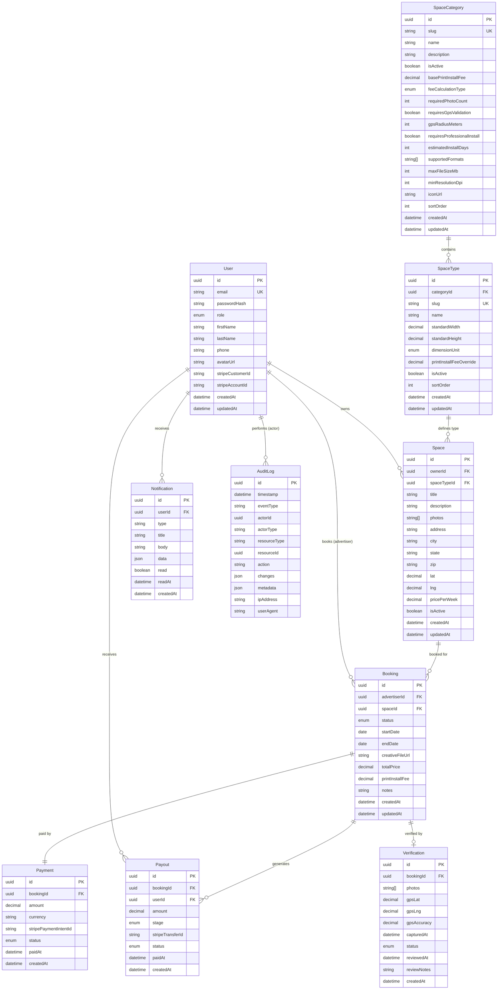

# Elaview Domain Model

> Complete entity documentation for the Elaview B2B advertising marketplace.

## Table of Contents

- [Entity Relationship Diagram](#entity-relationship-diagram)
- [Entities](#entities)
  - [User](#user)
  - [SpaceCategory](#spacecategory)
  - [SpaceType](#spacetype)
  - [Space](#space)
  - [Booking](#booking)
  - [Payment](#payment)
  - [Payout](#payout)
  - [Verification](#verification)
  - [Notification](#notification)
  - [AuditLog](#auditlog)
- [Enums](#enums)

---

## Entity Relationship Diagram



---

## Entities

### User

Represents all users in the system: advertisers, space owners, and administrators.

#### Fields

| Field | Type | Required | Description |
|-------|------|----------|-------------|
| `id` | UUID | ✓ | Primary key |
| `email` | String | ✓ | Unique email address |
| `passwordHash` | String | ✓ | Bcrypt hashed password |
| `role` | UserRole | ✓ | User role enum |
| `firstName` | String | ✓ | First name |
| `lastName` | String | ✓ | Last name |
| `phone` | String | | Phone number (E.164 format) |
| `avatarUrl` | String | | Profile image URL |
| `stripeCustomerId` | String | | Stripe customer ID (for advertisers) |
| `stripeAccountId` | String | | Stripe Connect account ID (for owners) |
| `stripeAccountStatus` | StripeAccountStatus | | Connect onboarding status |
| `emailNotifications` | Boolean | ✓ | Email notification preference (default: true) |
| `pushNotifications` | Boolean | ✓ | Push notification preference (default: true) |
| `createdAt` | DateTime | ✓ | Account creation timestamp |
| `updatedAt` | DateTime | ✓ | Last update timestamp |
| `lastLoginAt` | DateTime | | Last login timestamp |

#### Relationships

| Relationship | Type | Target | Description |
|--------------|------|--------|-------------|
| `spaces` | One-to-Many | Space | Spaces owned by this user |
| `bookingsAsAdvertiser` | One-to-Many | Booking | Bookings made as advertiser |
| `payouts` | One-to-Many | Payout | Payouts received |
| `notifications` | One-to-Many | Notification | Notifications received |

#### Constraints

- `email` must be unique and valid email format
- `role` must be one of: `ADVERTISER`, `SPACE_OWNER`, `ADMIN`
- `phone` must be valid E.164 format when provided
- Space owners must complete Stripe Connect onboarding before receiving payouts

#### Example JSON

```json
{
  "id": "550e8400-e29b-41d4-a716-446655440000",
  "email": "advertiser@company.com",
  "role": "ADVERTISER",
  "firstName": "Jane",
  "lastName": "Smith",
  "phone": "+17145551234",
  "avatarUrl": "https://files.elaview.com/avatars/550e8400.jpg",
  "stripeCustomerId": "cus_ABC123",
  "stripeAccountId": null,
  "stripeAccountStatus": null,
  "emailNotifications": true,
  "pushNotifications": true,
  "createdAt": "2025-06-15T10:30:00Z",
  "updatedAt": "2025-12-01T14:22:00Z",
  "lastLoginAt": "2025-12-28T09:15:00Z"
}
```

---

### SpaceCategory

**Config-driven categories for advertising spaces.** New categories can be added via admin panel without code changes.

> ⚠️ **CRITICAL:** Space categories are DATABASE-DRIVEN. Never hardcode category logic in application code.

#### Fields

| Field | Type | Required | Default | Description |
|-------|------|----------|---------|-------------|
| `id` | UUID | ✓ | | Primary key |
| `slug` | String | ✓ | | URL-friendly identifier (unique) |
| `name` | String | ✓ | | Display name |
| `description` | String | | | Category description |
| `isActive` | Boolean | ✓ | true | Whether category is available |
| `basePrintInstallFee` | Decimal | ✓ | | Default print+install fee |
| `feeCalculationType` | FeeCalculationType | ✓ | FIXED | How fee is calculated |
| `requiredPhotoCount` | Integer | ✓ | 3 | Photos needed for verification |
| `requiresGpsValidation` | Boolean | ✓ | true | Validate photo GPS location |
| `gpsRadiusMeters` | Integer | ✓ | 100 | Allowed distance from space |
| `requiresProfessionalInstall` | Boolean | ✓ | false | Needs professional installer |
| `estimatedInstallDays` | Integer | ✓ | 1 | Expected days to install |
| `supportedFormats` | String[] | ✓ | | Allowed file formats |
| `maxFileSizeMb` | Integer | ✓ | 25 | Maximum upload size |
| `minResolutionDpi` | Integer | ✓ | 150 | Minimum print resolution |
| `iconUrl` | String | | | Category icon URL |
| `sortOrder` | Integer | ✓ | 0 | Display order |
| `createdAt` | DateTime | ✓ | | Creation timestamp |
| `updatedAt` | DateTime | ✓ | | Last update timestamp |

#### Relationships

| Relationship | Type | Target | Description |
|--------------|------|--------|-------------|
| `spaceTypes` | One-to-Many | SpaceType | Types within this category |

#### Constraints

- `slug` must be unique, lowercase, alphanumeric with hyphens
- `basePrintInstallFee` must be >= 0
- `requiredPhotoCount` must be >= 1
- `gpsRadiusMeters` must be > 0 when `requiresGpsValidation` is true
- `supportedFormats` must contain at least one format

#### Example JSON

```json
{
  "id": "cat-storefront-001",
  "slug": "storefront",
  "name": "Storefront",
  "description": "Storefronts, windows, and walls in retail locations",
  "isActive": true,
  "basePrintInstallFee": 20.00,
  "feeCalculationType": "FIXED",
  "requiredPhotoCount": 3,
  "requiresGpsValidation": true,
  "gpsRadiusMeters": 100,
  "requiresProfessionalInstall": false,
  "estimatedInstallDays": 1,
  "supportedFormats": ["PDF", "PNG", "JPG"],
  "maxFileSizeMb": 25,
  "minResolutionDpi": 150,
  "iconUrl": "https://files.elaview.com/icons/storefront.svg",
  "sortOrder": 1,
  "createdAt": "2025-01-01T00:00:00Z",
  "updatedAt": "2025-01-01T00:00:00Z"
}
```

#### MVP Categories

| Category | Base Fee | Fee Type | GPS Required | Install Days |
|----------|----------|----------|--------------|--------------|
| Storefront | $20 | FIXED | Yes (100m) | 1 |
| Billboard | $100 | PER_SQFT | Yes (50m) | 3 |
| Vehicle | $50 | FIXED | Yes (500m) | 2 |

---

### SpaceType

Specific types of advertising spaces within a category.

#### Fields

| Field | Type | Required | Default | Description |
|-------|------|----------|---------|-------------|
| `id` | UUID | ✓ | | Primary key |
| `categoryId` | UUID | ✓ | | Foreign key to SpaceCategory |
| `slug` | String | ✓ | | URL-friendly identifier |
| `name` | String | ✓ | | Display name |
| `description` | String | | | Type description |
| `standardWidth` | Decimal | | | Default width |
| `standardHeight` | Decimal | | | Default height |
| `dimensionUnit` | DimensionUnit | ✓ | INCHES | Unit of measurement |
| `printInstallFeeOverride` | Decimal | | | Override category base fee |
| `isActive` | Boolean | ✓ | true | Whether type is available |
| `sortOrder` | Integer | ✓ | 0 | Display order within category |
| `createdAt` | DateTime | ✓ | | Creation timestamp |
| `updatedAt` | DateTime | ✓ | | Last update timestamp |

#### Relationships

| Relationship | Type | Target | Description |
|--------------|------|--------|-------------|
| `category` | Many-to-One | SpaceCategory | Parent category |
| `spaces` | One-to-Many | Space | Spaces of this type |

#### Constraints

- `slug` must be unique within category
- `printInstallFeeOverride` overrides category's `basePrintInstallFee` when set
- `dimensionUnit` must be one of: `INCHES`, `FEET`, `CM`

#### Example JSON

```json
{
  "id": "type-window-poster-001",
  "categoryId": "cat-storefront-001",
  "slug": "window-poster",
  "name": "Window Poster",
  "description": "Standard window poster display behind glass",
  "standardWidth": 24,
  "standardHeight": 36,
  "dimensionUnit": "INCHES",
  "printInstallFeeOverride": null,
  "isActive": true,
  "sortOrder": 2,
  "createdAt": "2025-01-01T00:00:00Z",
  "updatedAt": "2025-01-01T00:00:00Z"
}
```

#### MVP Space Types (Storefront Category)

| Type | Slug | Standard Size | Fee Override |
|------|------|---------------|--------------|
| Bulletin Board | `bulletin-board` | 24" × 36" | $10 |
| Window Poster | `window-poster` | 24" × 36" | $20 |
| Window Vinyl | `window-vinyl` | 48" × 48" | $35 |
| Wall Mount | `wall-mount` | 36" × 48" | $30 |
| A-Frame Sign | `a-frame-sign` | 24" × 36" | $25 |

---

### Space

Individual advertising spaces listed by space owners.

#### Fields

| Field | Type | Required | Description |
|-------|------|----------|-------------|
| `id` | UUID | ✓ | Primary key |
| `ownerId` | UUID | ✓ | Foreign key to User (owner) |
| `spaceTypeId` | UUID | ✓ | Foreign key to SpaceType |
| `title` | String | ✓ | Listing title |
| `description` | String | | Detailed description |
| `photos` | String[] | ✓ | Array of photo URLs (min 1) |
| `address` | String | ✓ | Street address |
| `city` | String | ✓ | City |
| `state` | String | ✓ | State (2-letter code) |
| `zip` | String | ✓ | ZIP code |
| `lat` | Decimal | ✓ | Latitude |
| `lng` | Decimal | ✓ | Longitude |
| `width` | Decimal | | Actual width (overrides type default) |
| `height` | Decimal | | Actual height (overrides type default) |
| `pricePerWeek` | Decimal | ✓ | Weekly rental price |
| `isActive` | Boolean | ✓ | Whether listing is visible |
| `viewCount` | Integer | ✓ | Number of views |
| `bookingCount` | Integer | ✓ | Number of completed bookings |
| `createdAt` | DateTime | ✓ | Creation timestamp |
| `updatedAt` | DateTime | ✓ | Last update timestamp |

#### Relationships

| Relationship | Type | Target | Description |
|--------------|------|--------|-------------|
| `owner` | Many-to-One | User | Space owner |
| `spaceType` | Many-to-One | SpaceType | Type of space |
| `bookings` | One-to-Many | Booking | Bookings for this space |

#### Constraints

- `photos` must contain at least 1 URL
- `pricePerWeek` must be > 0
- `lat` must be between -90 and 90
- `lng` must be between -180 and 180
- Owner must have `SPACE_OWNER` role

#### Example JSON

```json
{
  "id": "space-001",
  "ownerId": "user-owner-001",
  "spaceTypeId": "type-window-poster-001",
  "title": "High-Traffic Coffee Shop Window",
  "description": "Prime window space in busy downtown coffee shop. 500+ daily foot traffic.",
  "photos": [
    "https://files.elaview.com/spaces/space-001/photo1.jpg",
    "https://files.elaview.com/spaces/space-001/photo2.jpg",
    "https://files.elaview.com/spaces/space-001/photo3.jpg"
  ],
  "address": "123 Main Street",
  "city": "Irvine",
  "state": "CA",
  "zip": "92618",
  "lat": 33.6846,
  "lng": -117.8265,
  "width": 24,
  "height": 36,
  "pricePerWeek": 75.00,
  "isActive": true,
  "viewCount": 342,
  "bookingCount": 8,
  "createdAt": "2025-03-15T10:00:00Z",
  "updatedAt": "2025-12-20T08:30:00Z"
}
```

---

### Booking

Represents an advertising campaign booking between advertiser and space owner.

#### Fields

| Field | Type | Required | Description |
|-------|------|----------|-------------|
| `id` | UUID | ✓ | Primary key |
| `advertiserId` | UUID | ✓ | Foreign key to User (advertiser) |
| `spaceId` | UUID | ✓ | Foreign key to Space |
| `status` | BookingStatus | ✓ | Current booking status |
| `startDate` | Date | ✓ | Campaign start date |
| `endDate` | Date | ✓ | Campaign end date |
| `creativeFileUrl` | String | | Uploaded creative file URL |
| `creativeFileName` | String | | Original filename |
| `creativeFileSize` | Integer | | File size in bytes |
| `pricePerWeek` | Decimal | ✓ | Price per week at booking time |
| `totalWeeks` | Integer | ✓ | Number of weeks |
| `subtotal` | Decimal | ✓ | pricePerWeek × totalWeeks |
| `platformFee` | Decimal | ✓ | 15% platform fee |
| `printInstallFee` | Decimal | ✓ | Print + installation fee |
| `total` | Decimal | ✓ | subtotal + platformFee |
| `notes` | String | | Advertiser notes to owner |
| `requestedAt` | DateTime | ✓ | When booking was requested |
| `acceptedAt` | DateTime | | When owner accepted |
| `paidAt` | DateTime | | When payment completed |
| `fileDownloadedAt` | DateTime | | When owner downloaded file |
| `installedAt` | DateTime | | When marked as installed |
| `verifiedAt` | DateTime | | When advertiser verified |
| `completedAt` | DateTime | | When campaign completed |
| `cancelledAt` | DateTime | | When cancelled |
| `cancellationReason` | String | | Reason for cancellation |
| `autoApprovalAt` | DateTime | | When auto-approval is scheduled |
| `createdAt` | DateTime | ✓ | Creation timestamp |
| `updatedAt` | DateTime | ✓ | Last update timestamp |

#### Relationships

| Relationship | Type | Target | Description |
|--------------|------|--------|-------------|
| `advertiser` | Many-to-One | User | Booking advertiser |
| `space` | Many-to-One | Space | Booked space |
| `payment` | One-to-One | Payment | Payment record |
| `payouts` | One-to-Many | Payout | Payout records |
| `verification` | One-to-One | Verification | Installation verification |

#### Constraints

- `endDate` must be after `startDate`
- `status` must follow valid state transitions (see [Booking Lifecycle](./BOOKING-LIFECYCLE.md))
- `creativeFileUrl` required before `FILE_DOWNLOADED` status
- Only one active booking per space for overlapping dates

#### Example JSON

```json
{
  "id": "booking-001",
  "advertiserId": "user-advertiser-001",
  "spaceId": "space-001",
  "status": "VERIFIED",
  "startDate": "2026-01-15",
  "endDate": "2026-01-29",
  "creativeFileUrl": "https://files.elaview.com/creatives/booking-001/ad.pdf",
  "creativeFileName": "winter-sale-poster.pdf",
  "creativeFileSize": 5242880,
  "pricePerWeek": 75.00,
  "totalWeeks": 2,
  "subtotal": 150.00,
  "platformFee": 22.50,
  "printInstallFee": 20.00,
  "total": 172.50,
  "notes": "Please position at eye level",
  "requestedAt": "2025-12-28T10:00:00Z",
  "acceptedAt": "2025-12-28T14:30:00Z",
  "paidAt": "2025-12-28T15:00:00Z",
  "fileDownloadedAt": "2025-12-29T09:00:00Z",
  "installedAt": "2025-12-30T11:00:00Z",
  "verifiedAt": "2025-12-30T16:00:00Z",
  "completedAt": null,
  "cancelledAt": null,
  "cancellationReason": null,
  "autoApprovalAt": null,
  "createdAt": "2025-12-28T10:00:00Z",
  "updatedAt": "2025-12-30T16:00:00Z"
}
```

---

### Payment

Records payment for a booking via Stripe.

#### Fields

| Field | Type | Required | Description |
|-------|------|----------|-------------|
| `id` | UUID | ✓ | Primary key |
| `bookingId` | UUID | ✓ | Foreign key to Booking |
| `amount` | Decimal | ✓ | Payment amount (cents) |
| `currency` | String | ✓ | Currency code (default: USD) |
| `stripePaymentIntentId` | String | ✓ | Stripe PaymentIntent ID |
| `stripeChargeId` | String | | Stripe Charge ID |
| `status` | PaymentStatus | ✓ | Payment status |
| `cardBrand` | String | | Card brand (visa, mastercard, etc.) |
| `cardLast4` | String | | Last 4 digits of card |
| `failureCode` | String | | Stripe failure code if failed |
| `failureMessage` | String | | Stripe failure message |
| `refundedAmount` | Decimal | | Amount refunded |
| `refundedAt` | DateTime | | When refunded |
| `paidAt` | DateTime | | When payment succeeded |
| `createdAt` | DateTime | ✓ | Creation timestamp |

#### Relationships

| Relationship | Type | Target | Description |
|--------------|------|--------|-------------|
| `booking` | One-to-One | Booking | Associated booking |

#### Constraints

- `amount` must be > 0
- `currency` must be valid ISO 4217 code
- One payment per booking

#### Example JSON

```json
{
  "id": "payment-001",
  "bookingId": "booking-001",
  "amount": 17250,
  "currency": "USD",
  "stripePaymentIntentId": "pi_3ABC123XYZ",
  "stripeChargeId": "ch_3DEF456UVW",
  "status": "SUCCEEDED",
  "cardBrand": "visa",
  "cardLast4": "4242",
  "failureCode": null,
  "failureMessage": null,
  "refundedAmount": 0,
  "refundedAt": null,
  "paidAt": "2025-12-28T15:00:00Z",
  "createdAt": "2025-12-28T14:55:00Z"
}
```

---

### Payout

Records payouts to space owners (two-stage system).

#### Fields

| Field | Type | Required | Description |
|-------|------|----------|-------------|
| `id` | UUID | ✓ | Primary key |
| `bookingId` | UUID | ✓ | Foreign key to Booking |
| `userId` | UUID | ✓ | Foreign key to User (recipient) |
| `amount` | Decimal | ✓ | Payout amount (cents) |
| `stage` | PayoutStage | ✓ | Payout stage |
| `stripeTransferId` | String | | Stripe Transfer ID |
| `status` | PayoutStatus | ✓ | Payout status |
| `failureCode` | String | | Failure code if failed |
| `failureMessage` | String | | Failure message |
| `paidAt` | DateTime | | When transfer completed |
| `createdAt` | DateTime | ✓ | Creation timestamp |

#### Relationships

| Relationship | Type | Target | Description |
|--------------|------|--------|-------------|
| `booking` | Many-to-One | Booking | Associated booking |
| `user` | Many-to-One | User | Payout recipient |

#### Constraints

- Two payouts per booking: Stage 1 (print+install) and Stage 2 (remainder)
- Stage 1 triggered on `FILE_DOWNLOADED`
- Stage 2 triggered on `VERIFIED`
- Recipient must have completed Stripe Connect onboarding

#### Example JSON

```json
{
  "id": "payout-001",
  "bookingId": "booking-001",
  "userId": "user-owner-001",
  "amount": 2000,
  "stage": "PRINT_INSTALL_FEE",
  "stripeTransferId": "tr_1ABC123",
  "status": "SUCCEEDED",
  "failureCode": null,
  "failureMessage": null,
  "paidAt": "2025-12-29T09:05:00Z",
  "createdAt": "2025-12-29T09:00:00Z"
}
```

#### Two-Stage Payout Example

| Stage | Trigger | Amount | Description |
|-------|---------|--------|-------------|
| Stage 1 | File downloaded | $20 | Print + install fee |
| Stage 2 | Verified | $107.50 | Subtotal - platform fee - stage 1 |

---

### Verification

Records installation verification submitted by space owner.

#### Fields

| Field | Type | Required | Description |
|-------|------|----------|-------------|
| `id` | UUID | ✓ | Primary key |
| `bookingId` | UUID | ✓ | Foreign key to Booking |
| `photos` | String[] | ✓ | Verification photo URLs |
| `gpsLat` | Decimal | ✓ | Latitude where photos taken |
| `gpsLng` | Decimal | ✓ | Longitude where photos taken |
| `gpsAccuracy` | Decimal | ✓ | GPS accuracy in meters |
| `distanceFromSpace` | Decimal | ✓ | Calculated distance from space |
| `capturedAt` | DateTime | ✓ | When photos were captured |
| `status` | VerificationStatus | ✓ | Verification status |
| `reviewedBy` | UUID | | Admin who reviewed (if disputed) |
| `reviewedAt` | DateTime | | When reviewed |
| `reviewNotes` | String | | Admin review notes |
| `createdAt` | DateTime | ✓ | Creation timestamp |

#### Relationships

| Relationship | Type | Target | Description |
|--------------|------|--------|-------------|
| `booking` | One-to-One | Booking | Associated booking |

#### Constraints

- `photos` must contain at least N photos (from category config)
- Photos must be taken via in-app camera (no gallery uploads)
- GPS must be within category's `gpsRadiusMeters` of space location
- One verification per booking

#### Example JSON

```json
{
  "id": "verification-001",
  "bookingId": "booking-001",
  "photos": [
    "https://files.elaview.com/verifications/verification-001/photo1.jpg",
    "https://files.elaview.com/verifications/verification-001/photo2.jpg",
    "https://files.elaview.com/verifications/verification-001/photo3.jpg"
  ],
  "gpsLat": 33.6847,
  "gpsLng": -117.8264,
  "gpsAccuracy": 5.0,
  "distanceFromSpace": 12.5,
  "capturedAt": "2025-12-30T11:00:00Z",
  "status": "APPROVED",
  "reviewedBy": null,
  "reviewedAt": null,
  "reviewNotes": null,
  "createdAt": "2025-12-30T11:00:00Z"
}
```

---

### Notification

Push and in-app notifications for users.

#### Fields

| Field | Type | Required | Description |
|-------|------|----------|-------------|
| `id` | UUID | ✓ | Primary key |
| `userId` | UUID | ✓ | Foreign key to User |
| `type` | NotificationType | ✓ | Notification type |
| `title` | String | ✓ | Notification title |
| `body` | String | ✓ | Notification body |
| `data` | JSON | | Additional data payload |
| `read` | Boolean | ✓ | Whether notification is read |
| `readAt` | DateTime | | When marked as read |
| `expoPushToken` | String | | Expo push token used |
| `pushSentAt` | DateTime | | When push was sent |
| `pushStatus` | String | | Expo push receipt status |
| `createdAt` | DateTime | ✓ | Creation timestamp |

#### Relationships

| Relationship | Type | Target | Description |
|--------------|------|--------|-------------|
| `user` | Many-to-One | User | Notification recipient |

#### Notification Types

| Type | Recipient | Description |
|------|-----------|-------------|
| `BOOKING_REQUESTED` | Owner | New booking request |
| `BOOKING_ACCEPTED` | Advertiser | Owner accepted booking |
| `BOOKING_REJECTED` | Advertiser | Owner rejected booking |
| `PAYMENT_RECEIVED` | Owner | Payment completed |
| `FILE_DOWNLOADED` | Advertiser | Owner downloaded creative |
| `INSTALLATION_COMPLETE` | Advertiser | Owner submitted verification |
| `VERIFICATION_APPROVED` | Owner | Advertiser approved |
| `VERIFICATION_DISPUTED` | Owner | Advertiser disputed |
| `AUTO_APPROVAL_WARNING` | Advertiser | 24h before auto-approval |
| `PAYOUT_SENT` | Owner | Payout transferred |
| `BOOKING_COMPLETED` | Both | Campaign ended |

#### Example JSON

```json
{
  "id": "notification-001",
  "userId": "user-owner-001",
  "type": "BOOKING_REQUESTED",
  "title": "New Booking Request",
  "body": "Jane Smith wants to book your Coffee Shop Window for 2 weeks",
  "data": {
    "bookingId": "booking-001",
    "spaceId": "space-001",
    "advertiserId": "user-advertiser-001",
    "route": "/bookings/booking-001"
  },
  "read": false,
  "readAt": null,
  "expoPushToken": "ExponentPushToken[xxxxx]",
  "pushSentAt": "2025-12-28T10:00:05Z",
  "pushStatus": "ok",
  "createdAt": "2025-12-28T10:00:00Z"
}
```

---

### AuditLog

Immutable audit trail for compliance and debugging.

#### Fields

| Field | Type | Required | Description |
|-------|------|----------|-------------|
| `id` | UUID | ✓ | Primary key |
| `timestamp` | DateTime | ✓ | When event occurred |
| `eventType` | String | ✓ | Event category |
| `actorId` | UUID | | User who performed action |
| `actorType` | String | ✓ | Actor type (USER, SYSTEM, WEBHOOK) |
| `resourceType` | String | ✓ | Affected resource type |
| `resourceId` | UUID | | Affected resource ID |
| `action` | String | ✓ | Action performed |
| `changes` | JSON | | Before/after values |
| `metadata` | JSON | | Additional context |
| `ipAddress` | String | | Client IP address |
| `userAgent` | String | | Client user agent |

#### Event Types

| Event Type | Actions |
|------------|---------|
| `AUTH` | SIGN_UP, SIGN_IN, SIGN_OUT, PASSWORD_RESET |
| `USER` | UPDATE_PROFILE, DELETE_ACCOUNT |
| `SPACE` | CREATE, UPDATE, DELETE, ACTIVATE, DEACTIVATE |
| `BOOKING` | CREATE, STATUS_CHANGE, CANCEL, DISPUTE |
| `PAYMENT` | CREATE, SUCCEED, FAIL, REFUND |
| `PAYOUT` | CREATE, SUCCEED, FAIL |
| `VERIFICATION` | SUBMIT, APPROVE, REJECT |
| `ADMIN` | Any admin action |

#### Example JSON

```json
{
  "id": "audit-001",
  "timestamp": "2025-12-28T15:00:00Z",
  "eventType": "BOOKING",
  "actorId": "user-advertiser-001",
  "actorType": "USER",
  "resourceType": "Booking",
  "resourceId": "booking-001",
  "action": "STATUS_CHANGE",
  "changes": {
    "before": { "status": "ACCEPTED" },
    "after": { "status": "PAID" }
  },
  "metadata": {
    "paymentIntentId": "pi_3ABC123XYZ",
    "amount": 17250
  },
  "ipAddress": "192.168.1.1",
  "userAgent": "Elaview/1.0.0 (iOS 17.2)"
}
```

---

## Enums

### UserRole

```typescript
enum UserRole {
  ADVERTISER = 'ADVERTISER',
  SPACE_OWNER = 'SPACE_OWNER',
  ADMIN = 'ADMIN',
}
```

### BookingStatus

```typescript
enum BookingStatus {
  PENDING_APPROVAL = 'PENDING_APPROVAL',
  ACCEPTED = 'ACCEPTED',
  PAID = 'PAID',
  FILE_DOWNLOADED = 'FILE_DOWNLOADED',
  INSTALLED = 'INSTALLED',
  VERIFIED = 'VERIFIED',
  COMPLETED = 'COMPLETED',
  DISPUTED = 'DISPUTED',
  CANCELLED = 'CANCELLED',
}
```

### PaymentStatus

```typescript
enum PaymentStatus {
  PENDING = 'PENDING',
  PROCESSING = 'PROCESSING',
  SUCCEEDED = 'SUCCEEDED',
  FAILED = 'FAILED',
  REFUNDED = 'REFUNDED',
  PARTIALLY_REFUNDED = 'PARTIALLY_REFUNDED',
}
```

### PayoutStage

```typescript
enum PayoutStage {
  PRINT_INSTALL_FEE = 'PRINT_INSTALL_FEE',  // Stage 1
  REMAINDER = 'REMAINDER',                   // Stage 2
}
```

### PayoutStatus

```typescript
enum PayoutStatus {
  PENDING = 'PENDING',
  PROCESSING = 'PROCESSING',
  SUCCEEDED = 'SUCCEEDED',
  FAILED = 'FAILED',
}
```

### VerificationStatus

```typescript
enum VerificationStatus {
  PENDING = 'PENDING',
  APPROVED = 'APPROVED',
  REJECTED = 'REJECTED',
}
```

### FeeCalculationType

```typescript
enum FeeCalculationType {
  FIXED = 'FIXED',       // Flat fee regardless of size
  PER_SQFT = 'PER_SQFT', // Fee per square foot
  CUSTOM = 'CUSTOM',     // Custom calculation logic
}
```

### DimensionUnit

```typescript
enum DimensionUnit {
  INCHES = 'INCHES',
  FEET = 'FEET',
  CM = 'CM',
}
```

### StripeAccountStatus

```typescript
enum StripeAccountStatus {
  NOT_STARTED = 'NOT_STARTED',
  PENDING = 'PENDING',
  COMPLETE = 'COMPLETE',
  RESTRICTED = 'RESTRICTED',
}
```

---

## Related Documentation

- [Architecture](./ARCHITECTURE.md) - System architecture overview
- [Booking Lifecycle](./BOOKING-LIFECYCLE.md) - Booking state machine
- [API Contracts](./API-CONTRACTS.md) - GraphQL operations reference
