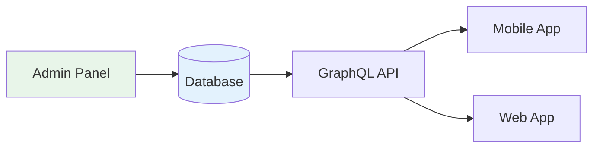

# Elaview Extensibility

> How Elaview's database-driven architecture enables new space categories without code changes.

## Table of Contents

- [Why Database-Driven Space Types?](#why-database-driven-space-types)
- [SpaceCategory Configuration](#spacecategory-configuration)
- [SpaceType Configuration](#spacetype-configuration)
- [How Config Affects Code](#how-config-affects-code)
- [Adding a New Category](#adding-a-new-category)
- [Future Categories](#future-categories)
- [What Requires Code Changes](#what-requires-code-changes)
- [Admin Panel Operations](#admin-panel-operations)

---

## Why Database-Driven Space Types?

### The Problem

Traditional approach: Hardcode space types in application code.

```typescript
// ❌ BAD: Hardcoded space types
const SPACE_TYPES = {
  WINDOW_POSTER: { fee: 20, photosRequired: 3 },
  WALL_MOUNT: { fee: 30, photosRequired: 3 },
  BILLBOARD: { fee: 500, photosRequired: 5 },  // Adding this requires deploy
};

function getInstallFee(type: string): number {
  return SPACE_TYPES[type].fee;  // Adding new types = code change
}
```

**Problems with this approach:**
- Adding "Billboard" requires code changes
- Changing fees requires deployment
- Different teams blocked waiting on deploys
- Risk of bugs when modifying shared constants
- No audit trail for configuration changes

### The Solution

Database-driven configuration: `SpaceCategory` and `SpaceType` are entities with fields that control system behavior.

```typescript
// ✅ GOOD: Database-driven configuration
const category = await db.spaceCategory.findUnique({ 
  where: { slug: 'billboard' } 
});

function getInstallFee(spaceType: SpaceType): number {
  return spaceType.printInstallFeeOverride 
    ?? spaceType.category.basePrintInstallFee;
}
```

**Benefits:**
- Add new categories via admin panel — zero code changes
- Change fees, requirements instantly — no deploy needed
- Business team can manage categories independently
- Full audit trail of all changes
- A/B test different configurations easily

### Result

> **Add billboards, bus stops, vehicle wraps via admin panel — zero code changes.**



---

## SpaceCategory Configuration

Each `SpaceCategory` has configuration fields that control system behavior across the entire application.

### Configuration Fields

| Field | Type | Description | System Effect |
|-------|------|-------------|---------------|
| `slug` | string | URL-safe identifier | Used in routes: `/spaces/storefront/...` |
| `name` | string | Display name | Shown in UI: "Storefront" |
| `description` | string | Category description | Shown on browse/filter pages |
| `isActive` | boolean | Enable/disable category | Hidden from listings when false |
| `basePrintInstallFee` | decimal | Default fee for category | Used if SpaceType doesn't override |
| `feeCalculationType` | enum | How fee is calculated | Controls fee calculation logic |
| `requiredPhotoCount` | integer | Photos needed for verification | Verification UI shows N capture steps |
| `requiresGpsValidation` | boolean | Validate photo GPS location | GPS check runs/skips based on this |
| `gpsRadiusMeters` | integer | Acceptable distance from listing | Error if photo taken outside radius |
| `requiresProfessionalInstall` | boolean | Needs professional installer | Different install flow/timeline |
| `estimatedInstallDays` | integer | Expected installation time | Deadline calculations, notifications |
| `supportedFormats` | string[] | Allowed file formats | Creative upload validation |
| `maxFileSizeMb` | integer | Maximum file size | Upload validation, presigned URL config |
| `minResolutionDpi` | integer | Minimum print resolution | Creative quality warning/rejection |
| `iconUrl` | string | Category icon | Shown in category selectors |
| `sortOrder` | integer | Display order | Controls UI ordering |

### Fee Calculation Types

| Type | Description | Use Case |
|------|-------------|----------|
| `FIXED` | Flat fee regardless of size | Storefronts, small displays |
| `PER_SQFT` | Fee multiplied by square footage | Billboards, large surfaces |
| `CUSTOM` | Special logic (requires code) | Complex pricing models |

---

## SpaceType Configuration

`SpaceType` is a child of `SpaceCategory` with type-specific settings.

### Configuration Fields

| Field | Type | Description | System Effect |
|-------|------|-------------|---------------|
| `slug` | string | URL-safe identifier | Routes: `/spaces/storefront/window-poster` |
| `name` | string | Display name | "Window Poster" |
| `description` | string | Type description | Shown on listing creation |
| `standardWidth` | decimal | Default width | Pre-fills dimension inputs |
| `standardHeight` | decimal | Default height | Pre-fills dimension inputs |
| `dimensionUnit` | enum | INCHES, FEET, CM | Display and calculation |
| `printInstallFeeOverride` | decimal? | Override category fee | If set, uses this instead of category base |
| `isActive` | boolean | Enable/disable type | Hidden when false |
| `sortOrder` | integer | Display order | Controls UI ordering |

### Override Example

```
Category: Storefront
├── basePrintInstallFee: $20

SpaceTypes:
├── Bulletin Board (override: $10)  → Fee: $10
├── Window Poster (no override)     → Fee: $20
├── Window Vinyl (override: $35)    → Fee: $35
└── Wall Mount (override: $30)      → Fee: $30
```

---

## How Config Affects Code

### 1. Fee Calculation

```typescript
// packages/features/payments/utils/fee-calculator.ts

import { SpaceType, FeeCalculationType } from '@elaview/graphql/generated';

export function calculatePrintInstallFee(
  spaceType: SpaceType,
  dimensions?: { width: number; height: number }
): number {
  const { category } = spaceType;
  
  // SpaceType override takes precedence over category base fee
  const baseFee = spaceType.printInstallFeeOverride 
    ?? category.basePrintInstallFee;
  
  switch (category.feeCalculationType) {
    case 'FIXED':
      // Flat fee, dimensions don't matter
      return baseFee;
      
    case 'PER_SQFT':
      // Fee per square foot
      if (!dimensions) {
        throw new Error('Dimensions required for PER_SQFT calculation');
      }
      const sqft = (dimensions.width * dimensions.height) / 144; // sq inches to sq ft
      return baseFee * sqft;
      
    case 'CUSTOM':
      // Extensibility point for complex pricing
      return customFeeLogic(spaceType, dimensions);
      
    default:
      return baseFee;
  }
}
```

### 2. Verification Flow

```typescript
// apps/mobile/src/features/verification/VerificationCapture.tsx

function VerificationCapture({ booking }: Props) {
  const { category } = booking.space.spaceType;
  
  // Dynamic photo count from database config
  const totalPhotos = category.requiredPhotoCount;
  const [currentPhoto, setCurrentPhoto] = useState(1);
  
  // GPS validation controlled by database config
  const shouldValidateGps = category.requiresGpsValidation;
  const maxDistance = category.gpsRadiusMeters;
  
  const validateGps = async (photoLocation: Location) => {
    if (!shouldValidateGps) return true; // Skip if not required
    
    const distance = calculateDistance(
      photoLocation,
      { lat: booking.space.lat, lng: booking.space.lng }
    );
    
    if (distance > maxDistance) {
      throw new Error(
        `Photo taken ${Math.round(distance)}m away. ` +
        `Must be within ${maxDistance}m of the space.`
      );
    }
    return true;
  };
  
  return (
    <View>
      <Text>Photo {currentPhoto} of {totalPhotos}</Text>
      <CameraView onCapture={handleCapture} />
      {shouldValidateGps && <GpsIndicator maxDistance={maxDistance} />}
    </View>
  );
}
```

### 3. Creative Upload Validation

```typescript
// packages/features/bookings/utils/creative-validation.ts

import { z } from 'zod';
import { SpaceCategory } from '@elaview/graphql/generated';

export function createCreativeSchema(category: SpaceCategory) {
  return z.object({
    file: z.instanceof(File)
      .refine(
        (file) => {
          const ext = file.name.split('.').pop()?.toUpperCase();
          return category.supportedFormats.includes(ext ?? '');
        },
        {
          message: `File must be one of: ${category.supportedFormats.join(', ')}`,
        }
      )
      .refine(
        (file) => file.size <= category.maxFileSizeMb * 1024 * 1024,
        {
          message: `File must be under ${category.maxFileSizeMb}MB`,
        }
      ),
  });
}

// Usage
const category = await getCategory('billboard');
const schema = createCreativeSchema(category);
const result = schema.safeParse({ file: uploadedFile });

if (!result.success) {
  // Show validation errors from category config
  showError(result.error.issues[0].message);
}
```

### 4. Deadline Calculations

```typescript
// packages/features/bookings/utils/deadlines.ts

export function calculateInstallationDeadline(
  booking: Booking
): Date {
  const { estimatedInstallDays } = booking.space.spaceType.category;
  
  const deadline = new Date(booking.startDate);
  deadline.setDate(deadline.getDate() + estimatedInstallDays);
  
  return deadline;
}

export function getDeadlineMessage(booking: Booking): string {
  const deadline = calculateInstallationDeadline(booking);
  const { requiresProfessionalInstall } = booking.space.spaceType.category;
  
  if (requiresProfessionalInstall) {
    return `Professional installation required by ${format(deadline, 'MMM d')}`;
  }
  
  return `Please install by ${format(deadline, 'MMM d')}`;
}
```

### 5. UI Rendering

```typescript
// apps/mobile/src/components/CategorySelector.tsx

function CategorySelector({ onSelect }: Props) {
  const { data } = useQuery(GET_CATEGORIES);
  
  // Categories come from database, sorted by sortOrder
  return (
    <ScrollView horizontal>
      {data?.categories
        .filter((c) => c.isActive)
        .sort((a, b) => a.sortOrder - b.sortOrder)
        .map((category) => (
          <CategoryCard
            key={category.id}
            name={category.name}
            icon={category.iconUrl}
            onPress={() => onSelect(category)}
          />
        ))}
    </ScrollView>
  );
}
```

---

## Adding a New Category

### Example: Adding "Billboard" Category

**Step 1: Create SpaceCategory via Admin Panel**

```json
{
  "slug": "billboard",
  "name": "Billboard",
  "description": "Large outdoor advertising displays",
  "isActive": true,
  "basePrintInstallFee": 500.00,
  "feeCalculationType": "PER_SQFT",
  "requiredPhotoCount": 5,
  "requiresGpsValidation": true,
  "gpsRadiusMeters": 500,
  "requiresProfessionalInstall": true,
  "estimatedInstallDays": 7,
  "supportedFormats": ["PDF", "AI", "PSD"],
  "maxFileSizeMb": 100,
  "minResolutionDpi": 300,
  "iconUrl": "https://files.elaview.com/icons/billboard.svg",
  "sortOrder": 2
}
```

**Step 2: Create SpaceTypes via Admin Panel**

```json
[
  {
    "categoryId": "cat-billboard-001",
    "slug": "14x48-standard",
    "name": "14×48 Standard Billboard",
    "description": "Standard highway billboard",
    "standardWidth": 48,
    "standardHeight": 14,
    "dimensionUnit": "FEET",
    "printInstallFeeOverride": null,
    "isActive": true,
    "sortOrder": 1
  },
  {
    "categoryId": "cat-billboard-001",
    "slug": "10x30-junior",
    "name": "10×30 Junior Billboard",
    "description": "Smaller urban billboard",
    "standardWidth": 30,
    "standardHeight": 10,
    "dimensionUnit": "FEET",
    "printInstallFeeOverride": 350.00,
    "isActive": true,
    "sortOrder": 2
  },
  {
    "categoryId": "cat-billboard-001",
    "slug": "digital",
    "name": "Digital Billboard",
    "description": "LED digital display",
    "standardWidth": 48,
    "standardHeight": 14,
    "dimensionUnit": "FEET",
    "printInstallFeeOverride": 0,
    "isActive": true,
    "sortOrder": 3
  }
]
```

**Step 3: Done!**

- ✅ Owners can now list billboards
- ✅ Advertisers can search and book billboards
- ✅ Verification requires 5 photos with 500m GPS radius
- ✅ Fees calculated per square foot
- ✅ 7-day installation timeline shown

**No code changes. No deployment. No PR review.**

---

## Future Categories

Planned categories that can be added without code changes:

| Category | Pro Install | GPS Radius | Install Days | Fee Type | Photo Count |
|----------|-------------|------------|--------------|----------|-------------|
| **Storefront** (MVP) | No | 100m | 1 | FIXED | 3 |
| **Billboard** | Yes | 500m | 7 | PER_SQFT | 5 |
| **Bus Stop** | Yes | 200m | 3 | FIXED | 4 |
| **Bench** | Yes | 100m | 2 | FIXED | 3 |
| **Vehicle Wrap** | Yes | N/A | 3 | CUSTOM | 6 |
| **Subway** | Yes | 300m | 5 | FIXED | 4 |
| **Digital Kiosk** | Yes | 50m | 1 | FIXED | 2 |
| **Street Pole** | Yes | 150m | 2 | FIXED | 3 |

### Category-Specific Notes

**Vehicle Wrap:**
- No GPS validation (vehicle moves)
- Custom fee logic (based on vehicle type)
- Requires multiple angle photos

**Digital Kiosk:**
- No physical print file (digital upload)
- Lower photo requirement
- Smaller GPS radius (indoor locations)

---

## What Requires Code Changes

### ✅ NO CODE REQUIRED

These changes can be made via admin panel:

| Change | How |
|--------|-----|
| Add new SpaceCategory | Admin panel → Categories → Create |
| Add new SpaceType | Admin panel → Space Types → Create |
| Change base fees | Edit category/type in admin |
| Change photo count | Edit `requiredPhotoCount` |
| Enable/disable GPS validation | Toggle `requiresGpsValidation` |
| Change GPS radius | Edit `gpsRadiusMeters` |
| Change file size limits | Edit `maxFileSizeMb` |
| Add supported formats | Edit `supportedFormats` array |
| Disable a category | Set `isActive: false` |
| Reorder categories | Update `sortOrder` values |

### ⚠️ CODE REQUIRED

These changes require development work:

| Change | Why | Effort |
|--------|-----|--------|
| New `feeCalculationType` (e.g., `TIERED`) | Need to implement calculation logic | Medium |
| New verification method (e.g., video) | New capture UI and upload handling | High |
| New user role | Auth, permissions, navigation changes | High |
| New booking status | State machine, UI, notifications | High |
| New payment provider | Integration, webhook handling | High |
| Category-specific booking flow | Custom screens, validation | Medium |
| Custom notification templates | Template logic, rendering | Low |

### Extension Points

The architecture includes extension points for future customization:

```typescript
// CUSTOM fee calculation - add new pricing strategies here
function customFeeLogic(
  spaceType: SpaceType,
  dimensions?: { width: number; height: number }
): number {
  switch (spaceType.category.slug) {
    case 'vehicle-wrap':
      // Vehicle wrap pricing based on vehicle type
      return calculateVehicleWrapFee(spaceType);
    
    case 'tiered-billboard':
      // Tiered pricing based on location traffic
      return calculateTieredBillboardFee(spaceType, dimensions);
    
    default:
      throw new Error(`Unknown custom pricing for: ${spaceType.category.slug}`);
  }
}
```

---

## Admin Panel Operations

### Category Management

```graphql
# Create category
mutation CreateCategory($input: CreateCategoryInput!) {
  createCategory(input: $input) {
    id
    slug
    name
  }
}

# Update category
mutation UpdateCategory($id: ID!, $input: UpdateCategoryInput!) {
  updateCategory(id: $id, input: $input) {
    id
    basePrintInstallFee
    requiredPhotoCount
  }
}

# Disable category (soft delete)
mutation DisableCategory($id: ID!) {
  updateCategory(id: $id, input: { isActive: false }) {
    id
    isActive
  }
}
```

### Audit Trail

All configuration changes are logged:

```json
{
  "eventType": "ADMIN",
  "action": "UPDATE_CATEGORY",
  "resourceType": "SpaceCategory",
  "resourceId": "cat-storefront-001",
  "changes": {
    "before": { "basePrintInstallFee": 20.00 },
    "after": { "basePrintInstallFee": 25.00 }
  },
  "actorId": "admin-001",
  "timestamp": "2026-01-15T10:30:00Z"
}
```

---

## Testing New Categories

When adding a new category, verify:

1. **Browse/Search:**
   - [ ] Category appears in filter list
   - [ ] Spaces show with correct type badge
   - [ ] Sort order is correct

2. **Listing Creation:**
   - [ ] Category selectable by owners
   - [ ] Space types load correctly
   - [ ] Dimensions pre-fill from type config

3. **Booking Flow:**
   - [ ] Correct fee calculated
   - [ ] Creative validation uses category config
   - [ ] Price breakdown shows correct amounts

4. **Verification:**
   - [ ] Correct photo count shown
   - [ ] GPS validation runs/skips correctly
   - [ ] Distance threshold matches config

5. **Payouts:**
   - [ ] Correct print+install fee calculated
   - [ ] Two-stage payout works correctly

---

## Related Documentation

- [Domain Model](./DOMAIN-MODEL.md) - Entity definitions for SpaceCategory and SpaceType
- [Booking Lifecycle](./BOOKING-LIFECYCLE.md) - How categories affect booking flow
- [API Contracts](./API-CONTRACTS.md) - GraphQL operations for categories
- [.cursor/rules/02-domain-model.mdc](../.cursor/rules/02-domain-model.mdc) - AI context for domain entities
