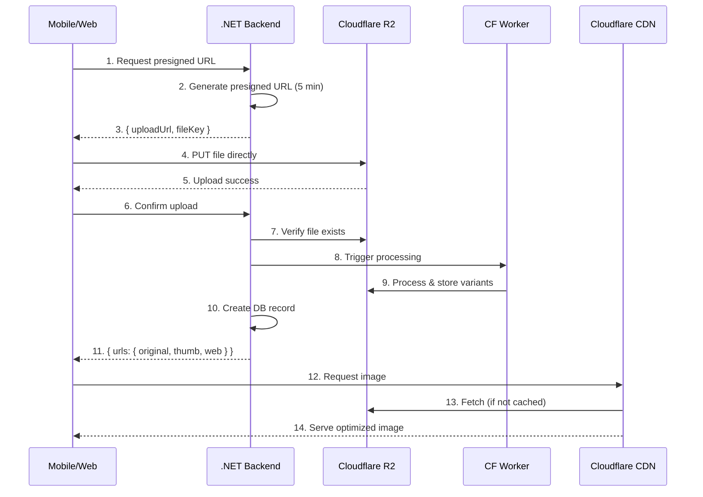

# Elaview File Handling

> File upload, storage, and processing for the Elaview platform.

## Table of Contents

- [Overview](#overview)
- [Architecture](#architecture)
- [Upload Flow](#upload-flow)
- [File Types](#file-types)
- [Image Optimization](#image-optimization)
- [GPS Validation](#gps-validation)
- [Access Control](#access-control)
- [Cleanup Strategy](#cleanup-strategy)
- [CDN Configuration](#cdn-configuration)
- [Error Handling](#error-handling)
- [Mobile Implementation](#mobile-implementation)

---

## Overview

| Component | Technology | Purpose |
|-----------|------------|---------|
| Storage | Cloudflare R2 | S3-compatible object storage |
| CDN | Cloudflare | Automatic with R2, global edge caching |
| Processing | Sharp (Node.js) | Image resizing, format conversion |
| EXIF | exif-parser | GPS extraction for verification |

### Why Cloudflare R2?

- **Cost:** No egress fees (vs AWS S3)
- **Performance:** Integrated CDN, global edge
- **Compatibility:** S3 API compatible
- **Simple:** No separate CDN configuration needed

---

## Architecture



---

## Upload Flow

### Step 1: Request Presigned URL

```typescript
// Client request
const response = await fetch('/api/upload/presign', {
  method: 'POST',
  headers: { 'Content-Type': 'application/json' },
  body: JSON.stringify({
    filename: 'storefront.jpg',
    contentType: 'image/jpeg',
    purpose: 'space_photo', // space_photo | creative | verification
    spaceId: 'space-123', // Optional: for validation
  }),
});

const { uploadUrl, fileKey, expiresAt } = await response.json();
```

### Step 2: Upload to R2

```typescript
// Direct upload to R2 (bypasses backend)
await fetch(uploadUrl, {
  method: 'PUT',
  headers: { 'Content-Type': contentType },
  body: file,
});
```

### Step 3: Confirm Upload

```typescript
// Confirm and trigger processing
const result = await fetch('/api/upload/confirm', {
  method: 'POST',
  headers: { 'Content-Type': 'application/json' },
  body: JSON.stringify({
    fileKey,
    purpose: 'space_photo',
    metadata: {
      spaceId: 'space-123',
      position: 0, // Order in gallery
    },
  }),
});

const { urls } = await result.json();
// { original, thumb200, thumb600, web }
```

### Backend Implementation

```csharp
// backend/Controllers/UploadController.cs

[HttpPost("presign")]
public async Task<IActionResult> GetPresignedUrl([FromBody] PresignRequest request)
{
    // Validate request
    if (!IsValidContentType(request.ContentType, request.Purpose))
        return BadRequest("Invalid content type for purpose");
    
    // Generate unique file key
    var fileKey = $"{request.Purpose}/{Guid.NewGuid()}/{SanitizeFilename(request.Filename)}";
    
    // Generate presigned URL (5 minutes)
    var presignedUrl = await _r2Service.GeneratePresignedPutUrl(
        fileKey,
        request.ContentType,
        TimeSpan.FromMinutes(5)
    );
    
    // Track pending upload
    await _cache.SetAsync($"pending:{fileKey}", new PendingUpload
    {
        FileKey = fileKey,
        Purpose = request.Purpose,
        UserId = User.GetUserId(),
        ExpiresAt = DateTime.UtcNow.AddMinutes(5),
    }, TimeSpan.FromMinutes(10));
    
    return Ok(new
    {
        UploadUrl = presignedUrl,
        FileKey = fileKey,
        ExpiresAt = DateTime.UtcNow.AddMinutes(5),
    });
}

[HttpPost("confirm")]
public async Task<IActionResult> ConfirmUpload([FromBody] ConfirmRequest request)
{
    // Get pending upload
    var pending = await _cache.GetAsync<PendingUpload>($"pending:{request.FileKey}");
    if (pending == null)
        return BadRequest("Upload session expired or not found");
    
    // Verify file exists in R2
    if (!await _r2Service.FileExistsAsync(request.FileKey))
        return BadRequest("File not found in storage");
    
    // Get file metadata
    var metadata = await _r2Service.GetObjectMetadataAsync(request.FileKey);
    
    // Validate file
    var validation = await ValidateFile(request.FileKey, pending.Purpose, metadata);
    if (!validation.IsValid)
    {
        await _r2Service.DeleteAsync(request.FileKey);
        return BadRequest(validation.Error);
    }
    
    // Process image (async via queue for large files)
    var urls = await _imageProcessor.ProcessAsync(request.FileKey, pending.Purpose);
    
    // Create database record
    var file = new StoredFile
    {
        Id = Guid.NewGuid().ToString(),
        FileKey = request.FileKey,
        Purpose = pending.Purpose,
        UserId = pending.UserId,
        ContentType = metadata.ContentType,
        SizeBytes = metadata.ContentLength,
        Urls = urls,
        CreatedAt = DateTime.UtcNow,
    };
    
    _db.StoredFiles.Add(file);
    await _db.SaveChangesAsync();
    
    // Clear pending
    await _cache.RemoveAsync($"pending:{request.FileKey}");
    
    return Ok(new { Urls = urls });
}
```

---

## File Types

### Space Photos

Photos for space listings shown to advertisers.

| Property | Value |
|----------|-------|
| Formats | JPG, PNG, WebP |
| Max size | 10 MB |
| Max count | 10 per space |
| Processing | Resize, thumbnails, WebP conversion |

**Processing Pipeline:**
1. Resize to max 2000px width (maintain aspect ratio)
2. Generate thumbnails: 200px, 600px
3. Convert to WebP for delivery
4. Strip EXIF data (privacy)
5. Store all variants

**Output URLs:**
```typescript
{
  original: "https://cdn.elaview.com/space_photo/abc123/original.jpg",
  thumb200: "https://cdn.elaview.com/space_photo/abc123/thumb-200.webp",
  thumb600: "https://cdn.elaview.com/space_photo/abc123/thumb-600.webp",
  web: "https://cdn.elaview.com/space_photo/abc123/web.webp",
}
```

### Creative Files

Ad artwork uploaded by advertisers for printing/display.

| Property | Value |
|----------|-------|
| Formats | Per SpaceCategory config (PDF, PNG, JPG) |
| Max size | 25-100 MB per SpaceCategory config |
| Validation | Dimensions, resolution, file type |

**Validation Rules (from SpaceCategory config):**

```typescript
interface SpaceCategoryFileConfig {
  supportedFormats: string[];      // ["pdf", "png", "jpg"]
  maxFileSizeMb: number;           // 25-100
  minResolutionDpi: number;        // 150-300
  requiresDimensionMatch: boolean; // true for print
}

// Example: Storefront category
{
  supportedFormats: ["pdf", "png", "jpg"],
  maxFileSizeMb: 25,
  minResolutionDpi: 150,
  requiresDimensionMatch: true,
}

// Example: Billboard category (future)
{
  supportedFormats: ["pdf", "tiff"],
  maxFileSizeMb: 100,
  minResolutionDpi: 300,
  requiresDimensionMatch: true,
}
```

**Dimension Validation (per SpaceType):**

```typescript
interface SpaceTypeDimensions {
  widthInches: number;
  heightInches: number;
  tolerancePercent: number; // e.g., 5% tolerance
}

// Example: Window Poster (18x24)
{
  widthInches: 18,
  heightInches: 24,
  tolerancePercent: 5,
}
```

**Server-side Validation:**

```csharp
public async Task<ValidationResult> ValidateCreative(
    string fileKey,
    SpaceType spaceType,
    SpaceCategory category)
{
    var file = await _r2Service.GetAsync(fileKey);
    var metadata = await _fileAnalyzer.AnalyzeAsync(file);
    
    // Check format
    if (!category.SupportedFormats.Contains(metadata.Format))
        return ValidationResult.Fail($"Format {metadata.Format} not supported");
    
    // Check size
    if (metadata.SizeBytes > category.MaxFileSizeMb * 1024 * 1024)
        return ValidationResult.Fail($"File exceeds {category.MaxFileSizeMb}MB limit");
    
    // Check resolution
    if (metadata.Dpi < category.MinResolutionDpi)
        return ValidationResult.Fail($"Resolution {metadata.Dpi}dpi below {category.MinResolutionDpi}dpi minimum");
    
    // Check dimensions
    if (category.RequiresDimensionMatch)
    {
        var expectedWidth = spaceType.WidthInches * metadata.Dpi;
        var expectedHeight = spaceType.HeightInches * metadata.Dpi;
        var tolerance = spaceType.TolerancePercent / 100.0;
        
        if (!IsWithinTolerance(metadata.WidthPx, expectedWidth, tolerance) ||
            !IsWithinTolerance(metadata.HeightPx, expectedHeight, tolerance))
        {
            return ValidationResult.Fail(
                $"Dimensions should be {spaceType.WidthInches}x{spaceType.HeightInches} inches at {category.MinResolutionDpi}dpi");
        }
    }
    
    return ValidationResult.Success();
}
```

### Verification Photos

Proof of installation photos taken by space owners.

| Property | Value |
|----------|-------|
| Formats | JPG only (camera output) |
| Max size | 15 MB |
| Min count | Per SpaceCategory config (1-4) |
| Source | In-app camera only (no gallery) |
| Requirements | EXIF GPS data, timestamp |

**Validation Requirements:**

| Requirement | Purpose |
|-------------|---------|
| Camera-only capture | Prevent stock photos |
| EXIF GPS data | Verify location |
| EXIF timestamp | Verify recency |
| GPS within radius | Verify at listing location |

**Processing Pipeline:**
1. Extract EXIF GPS coordinates
2. Extract EXIF timestamp
3. Validate GPS against listing location
4. Store original with EXIF (for disputes)
5. Store stripped version (for display)
6. Generate thumbnails

---

## Image Optimization

### Processing Pipeline

```typescript
// workers/image-processor/src/index.ts

import sharp from 'sharp';

interface ProcessedUrls {
  original: string;
  thumb200: string;
  thumb600: string;
  web: string;
}

async function processImage(
  fileKey: string,
  purpose: 'space_photo' | 'verification'
): Promise<ProcessedUrls> {
  const original = await r2.get(fileKey);
  const buffer = await original.arrayBuffer();
  
  // Base processing
  const processed = sharp(Buffer.from(buffer))
    .rotate() // Auto-rotate based on EXIF
    .resize(2000, null, { withoutEnlargement: true });
  
  // Strip EXIF for space photos (privacy)
  if (purpose === 'space_photo') {
    processed.withMetadata({ orientation: undefined });
  }
  
  const resizedBuffer = await processed.toBuffer();
  
  // Generate thumbnails (WebP for smaller size)
  const [thumb200, thumb600, webp] = await Promise.all([
    sharp(resizedBuffer).resize(200).webp({ quality: 80 }).toBuffer(),
    sharp(resizedBuffer).resize(600).webp({ quality: 85 }).toBuffer(),
    sharp(resizedBuffer).webp({ quality: 85 }).toBuffer(),
  ]);
  
  // Upload all variants
  const baseKey = fileKey.replace(/\.[^.]+$/, ''); // Remove extension
  
  await Promise.all([
    r2.put(`${baseKey}/original.jpg`, resizedBuffer, {
      httpMetadata: { contentType: 'image/jpeg' },
    }),
    r2.put(`${baseKey}/thumb-200.webp`, thumb200, {
      httpMetadata: { contentType: 'image/webp' },
    }),
    r2.put(`${baseKey}/thumb-600.webp`, thumb600, {
      httpMetadata: { contentType: 'image/webp' },
    }),
    r2.put(`${baseKey}/web.webp`, webp, {
      httpMetadata: { contentType: 'image/webp' },
    }),
  ]);
  
  // Delete original upload
  await r2.delete(fileKey);
  
  return {
    original: `${CDN_URL}/${baseKey}/original.jpg`,
    thumb200: `${CDN_URL}/${baseKey}/thumb-200.webp`,
    thumb600: `${CDN_URL}/${baseKey}/thumb-600.webp`,
    web: `${CDN_URL}/${baseKey}/web.webp`,
  };
}
```

### Image Size Guidelines

| Variant | Max Width | Format | Quality | Use Case |
|---------|-----------|--------|---------|----------|
| original | 2000px | JPEG | 90% | Fallback, downloads |
| web | 2000px | WebP | 85% | Full-size display |
| thumb600 | 600px | WebP | 85% | List cards, previews |
| thumb200 | 200px | WebP | 80% | Thumbnails, avatars |

---

## GPS Validation

### Extraction

```typescript
// workers/verification-processor/src/gps.ts

import ExifParser from 'exif-parser';

interface GpsData {
  lat: number;
  lng: number;
  timestamp: Date | null;
}

export function extractGps(buffer: Buffer): GpsData | null {
  try {
    const parser = ExifParser.create(buffer);
    const result = parser.parse();
    
    if (!result.tags.GPSLatitude || !result.tags.GPSLongitude) {
      return null;
    }
    
    return {
      lat: result.tags.GPSLatitude,
      lng: result.tags.GPSLongitude,
      timestamp: result.tags.DateTimeOriginal
        ? new Date(result.tags.DateTimeOriginal * 1000)
        : null,
    };
  } catch {
    return null;
  }
}
```

### Validation

```typescript
// workers/verification-processor/src/validate.ts

interface ValidationResult {
  valid: boolean;
  error?: string;
  distance?: number;
}

export async function validateVerificationGps(
  photos: Buffer[],
  listing: { lat: number; lng: number },
  category: { requiresGpsValidation: boolean; gpsRadiusMeters: number }
): Promise<ValidationResult> {
  // Skip validation if category doesn't require it
  if (!category.requiresGpsValidation) {
    return { valid: true };
  }
  
  for (let i = 0; i < photos.length; i++) {
    const gps = extractGps(photos[i]);
    
    if (!gps) {
      return {
        valid: false,
        error: `Photo ${i + 1} is missing GPS data. Please enable location services and retake.`,
      };
    }
    
    const distance = haversineDistance(
      { lat: gps.lat, lng: gps.lng },
      { lat: listing.lat, lng: listing.lng }
    );
    
    if (distance > category.gpsRadiusMeters) {
      return {
        valid: false,
        error: `Photo ${i + 1} was taken ${Math.round(distance)}m from the listing location (maximum: ${category.gpsRadiusMeters}m).`,
        distance,
      };
    }
  }
  
  return { valid: true };
}

function haversineDistance(
  point1: { lat: number; lng: number },
  point2: { lat: number; lng: number }
): number {
  const R = 6371000; // Earth's radius in meters
  const φ1 = (point1.lat * Math.PI) / 180;
  const φ2 = (point2.lat * Math.PI) / 180;
  const Δφ = ((point2.lat - point1.lat) * Math.PI) / 180;
  const Δλ = ((point2.lng - point1.lng) * Math.PI) / 180;

  const a =
    Math.sin(Δφ / 2) * Math.sin(Δφ / 2) +
    Math.cos(φ1) * Math.cos(φ2) * Math.sin(Δλ / 2) * Math.sin(Δλ / 2);
  const c = 2 * Math.atan2(Math.sqrt(a), Math.sqrt(1 - a));

  return R * c;
}
```

### GPS Radius by Category

| Category | GPS Radius | Reason |
|----------|------------|--------|
| Storefront | 50m | Small venues, precise location |
| Billboard | 200m | Large structures, road-side |
| Bus Stop | 100m | Fixed locations, transit |
| Vehicle Wrap | None | Mobile, no fixed location |

---

## Access Control

### Public vs Private Files

| File Type | Access | Method |
|-----------|--------|--------|
| Space photos | Public | Direct CDN URL |
| Creative (before payment) | Private | Signed URL (1 hour) |
| Creative (after payment) | Private | Signed URL (24 hours) |
| Verification photos | Private | Signed URL (1 hour) |

### Signed URL Generation

```csharp
// backend/Services/R2Service.cs

public async Task<string> GenerateSignedUrl(
    string fileKey,
    TimeSpan expiry,
    string? downloadFilename = null)
{
    var request = new GetPreSignedUrlRequest
    {
        BucketName = _bucketName,
        Key = fileKey,
        Expires = DateTime.UtcNow.Add(expiry),
    };
    
    if (downloadFilename != null)
    {
        request.ResponseHeaderOverrides.ContentDisposition =
            $"attachment; filename=\"{downloadFilename}\"";
    }
    
    return await _s3Client.GetPreSignedURLAsync(request);
}
```

### Creative Download (Owner)

```csharp
// backend/GraphQL/Mutations/BookingMutations.cs

[Authorize(Roles = "SpaceOwner")]
public async Task<CreativeDownloadResult> DownloadCreative(
    string bookingId,
    [Service] IBookingService bookingService)
{
    var booking = await _db.Bookings
        .Include(b => b.Creative)
        .Include(b => b.Space)
        .FirstOrDefaultAsync(b => b.Id == bookingId);
    
    // Verify ownership
    if (booking.Space.OwnerId != currentUserId)
        throw new UnauthorizedAccessException();
    
    // Verify booking status
    if (booking.Status != BookingStatus.PAID)
        throw new InvalidOperationException("Booking must be paid to download");
    
    // Generate signed URL (24 hours)
    var signedUrl = await _r2Service.GenerateSignedUrl(
        booking.Creative.FileKey,
        TimeSpan.FromHours(24),
        $"creative-{booking.Id}.{booking.Creative.Format}"
    );
    
    // Update status if first download
    if (booking.Status == BookingStatus.PAID)
    {
        booking.Status = BookingStatus.FILE_DOWNLOADED;
        booking.FileDownloadedAt = DateTime.UtcNow;
        
        // Trigger Stage 1 payout (print + install fee)
        await bookingService.ProcessPrintFeePayout(booking);
        
        await _db.SaveChangesAsync();
    }
    
    return new CreativeDownloadResult
    {
        DownloadUrl = signedUrl,
        ExpiresAt = DateTime.UtcNow.AddHours(24),
        Filename = $"creative-{booking.Id}.{booking.Creative.Format}",
    };
}
```

---

## Cleanup Strategy

### Retention Rules

| File Type | Retention | Trigger |
|-----------|-----------|---------|
| Pending uploads (no confirm) | 24 hours | Upload started |
| Cancelled booking creatives | 30 days | Booking cancelled |
| Completed booking creatives | 1 year | Campaign end date |
| Verification photos | 2 years | Upload date |
| Space photos (active listing) | Forever | Until deleted |
| Space photos (deleted listing) | 30 days | Listing deleted |

### Cleanup Job

```csharp
// backend/Jobs/FileCleanupJob.cs

public class FileCleanupJob : BackgroundService
{
    protected override async Task ExecuteAsync(CancellationToken stoppingToken)
    {
        while (!stoppingToken.IsCancellationRequested)
        {
            await CleanupPendingUploads();
            await CleanupCancelledBookingFiles();
            await CleanupExpiredCreatives();
            await CleanupDeletedListingPhotos();
            
            await Task.Delay(TimeSpan.FromHours(6), stoppingToken);
        }
    }
    
    private async Task CleanupPendingUploads()
    {
        // Find uploads older than 24 hours without confirmation
        var cutoff = DateTime.UtcNow.AddHours(-24);
        
        var pending = await _r2Service.ListObjectsAsync("pending/");
        
        foreach (var obj in pending.Where(o => o.LastModified < cutoff))
        {
            await _r2Service.DeleteAsync(obj.Key);
            _logger.LogInformation("Deleted orphaned upload: {Key}", obj.Key);
        }
    }
    
    private async Task CleanupExpiredCreatives()
    {
        // Find creatives from bookings completed over 1 year ago
        var cutoff = DateTime.UtcNow.AddYears(-1);
        
        var expiredFiles = await _db.StoredFiles
            .Where(f => f.Purpose == "creative")
            .Where(f => f.Booking.Status == BookingStatus.COMPLETED)
            .Where(f => f.Booking.CampaignEndDate < cutoff)
            .ToListAsync();
        
        foreach (var file in expiredFiles)
        {
            await _r2Service.DeleteAsync(file.FileKey);
            _db.StoredFiles.Remove(file);
            _logger.LogInformation("Deleted expired creative: {Key}", file.FileKey);
        }
        
        await _db.SaveChangesAsync();
    }
}
```

---

## CDN Configuration

### Cache Headers

```typescript
// workers/cdn-headers/src/index.ts

export default {
  async fetch(request: Request, env: Env): Promise<Response> {
    const response = await env.R2.fetch(request);
    const headers = new Headers(response.headers);
    
    const url = new URL(request.url);
    
    // Processed images: cache forever (content-addressed)
    if (url.pathname.includes('/thumb-') || url.pathname.includes('/web.')) {
      headers.set('Cache-Control', 'public, max-age=31536000, immutable');
    }
    // Original images: cache for 1 week
    else if (url.pathname.includes('/original')) {
      headers.set('Cache-Control', 'public, max-age=604800');
    }
    // Signed URLs: no cache
    else if (url.searchParams.has('X-Amz-Signature')) {
      headers.set('Cache-Control', 'private, no-store');
    }
    
    return new Response(response.body, {
      status: response.status,
      headers,
    });
  },
};
```

### CORS Configuration

```typescript
// R2 bucket CORS configuration

const corsRules = [
  {
    AllowedOrigins: [
      'https://elaview.com',
      'https://*.elaview.com',
      'http://localhost:3000', // Development
    ],
    AllowedMethods: ['GET', 'PUT', 'HEAD'],
    AllowedHeaders: ['Content-Type', 'Content-Length'],
    MaxAgeSeconds: 3600,
  },
];
```

### CDN URL Structure

```
https://cdn.elaview.com/
├── space_photo/
│   └── {uuid}/
│       ├── original.jpg
│       ├── thumb-200.webp
│       ├── thumb-600.webp
│       └── web.webp
├── creative/
│   └── {uuid}/
│       └── {filename}.pdf  (signed URL access only)
├── verification/
│   └── {uuid}/
│       ├── original.jpg    (with EXIF, signed URL)
│       ├── display.jpg     (stripped EXIF, signed URL)
│       └── thumb-200.webp  (signed URL)
└── avatar/
    └── {uuid}/
        ├── original.jpg
        └── thumb-200.webp
```

---

## Error Handling

### Upload Errors

| Error | Cause | User Message |
|-------|-------|--------------|
| `UPLOAD_EXPIRED` | Presigned URL expired | "Upload session expired. Please try again." |
| `FILE_TOO_LARGE` | Exceeds size limit | "File is too large. Maximum size is {max}MB." |
| `INVALID_FORMAT` | Wrong file type | "Please upload a {formats} file." |
| `INVALID_DIMENSIONS` | Wrong dimensions | "Image should be {width}x{height} inches." |
| `LOW_RESOLUTION` | DPI too low | "Image resolution is too low. Minimum {dpi}dpi required." |
| `MISSING_GPS` | No EXIF GPS | "Photo is missing location data. Please enable location services." |
| `GPS_OUT_OF_RANGE` | Too far from listing | "Photo was taken too far from the listing location." |

### Error Response Format

```typescript
interface UploadError {
  code: string;
  message: string;
  details?: {
    expected?: string;
    actual?: string;
    limit?: number;
  };
}

// Example response
{
  "error": {
    "code": "INVALID_DIMENSIONS",
    "message": "Image should be 18x24 inches at 150dpi.",
    "details": {
      "expected": "2700x3600 px",
      "actual": "1800x2400 px"
    }
  }
}
```

---

## Mobile Implementation

### Image Picker (Space Photos)

```typescript
// apps/mobile/src/hooks/useImagePicker.ts

import * as ImagePicker from 'expo-image-picker';
import * as ImageManipulator from 'expo-image-manipulator';

export function useImagePicker() {
  async function pickImage(): Promise<PickedImage | null> {
    const permission = await ImagePicker.requestMediaLibraryPermissionsAsync();
    if (!permission.granted) {
      Alert.alert('Permission required', 'Please allow access to your photos.');
      return null;
    }

    const result = await ImagePicker.launchImageLibraryAsync({
      mediaTypes: ImagePicker.MediaTypeOptions.Images,
      quality: 0.9,
      allowsMultipleSelection: true,
      selectionLimit: 10,
    });

    if (result.canceled) return null;

    // Pre-compress on device to reduce upload time
    const compressed = await Promise.all(
      result.assets.map(async (asset) => {
        const manipulated = await ImageManipulator.manipulateAsync(
          asset.uri,
          [{ resize: { width: 2000 } }],
          { compress: 0.85, format: ImageManipulator.SaveFormat.JPEG }
        );
        return {
          uri: manipulated.uri,
          width: manipulated.width,
          height: manipulated.height,
        };
      })
    );

    return compressed;
  }

  return { pickImage };
}
```

### Camera (Verification Photos)

```typescript
// apps/mobile/src/hooks/useVerificationCamera.ts

import * as ImagePicker from 'expo-image-picker';
import * as Location from 'expo-location';

export function useVerificationCamera() {
  async function takePhoto(): Promise<VerificationPhoto | null> {
    // Request camera permission
    const cameraPermission = await ImagePicker.requestCameraPermissionsAsync();
    if (!cameraPermission.granted) {
      Alert.alert('Camera required', 'Please allow camera access to take verification photos.');
      return null;
    }

    // Request location permission
    const locationPermission = await Location.requestForegroundPermissionsAsync();
    if (!locationPermission.granted) {
      Alert.alert('Location required', 'Please enable location services for verification.');
      return null;
    }

    // Launch camera (NOT image library)
    const result = await ImagePicker.launchCameraAsync({
      mediaTypes: ImagePicker.MediaTypeOptions.Images,
      quality: 0.9,
      exif: true, // Include EXIF data
    });

    if (result.canceled) return null;

    const asset = result.assets[0];

    // Verify EXIF GPS exists
    if (!asset.exif?.GPSLatitude || !asset.exif?.GPSLongitude) {
      Alert.alert(
        'Location missing',
        'Photo does not contain location data. Please ensure location services are enabled and try again.'
      );
      return null;
    }

    return {
      uri: asset.uri,
      exif: asset.exif,
      gps: {
        lat: asset.exif.GPSLatitude,
        lng: asset.exif.GPSLongitude,
      },
    };
  }

  return { takePhoto };
}
```

### Upload Hook

```typescript
// apps/mobile/src/hooks/useFileUpload.ts

import { useMutation } from '@apollo/client';
import { PRESIGN_UPLOAD, CONFIRM_UPLOAD } from '@/graphql/operations';

interface UploadOptions {
  purpose: 'space_photo' | 'creative' | 'verification';
  onProgress?: (progress: number) => void;
}

export function useFileUpload() {
  const [presign] = useMutation(PRESIGN_UPLOAD);
  const [confirm] = useMutation(CONFIRM_UPLOAD);

  async function upload(
    file: { uri: string; name: string; type: string },
    options: UploadOptions
  ): Promise<UploadResult> {
    // 1. Get presigned URL
    const { data: presignData } = await presign({
      variables: {
        filename: file.name,
        contentType: file.type,
        purpose: options.purpose,
      },
    });

    const { uploadUrl, fileKey } = presignData.presignUpload;

    // 2. Upload to R2
    const response = await fetch(file.uri);
    const blob = await response.blob();

    const xhr = new XMLHttpRequest();
    
    await new Promise<void>((resolve, reject) => {
      xhr.upload.onprogress = (e) => {
        if (e.lengthComputable) {
          options.onProgress?.(e.loaded / e.total);
        }
      };
      
      xhr.onload = () => {
        if (xhr.status >= 200 && xhr.status < 300) {
          resolve();
        } else {
          reject(new Error(`Upload failed: ${xhr.status}`));
        }
      };
      
      xhr.onerror = () => reject(new Error('Upload failed'));
      
      xhr.open('PUT', uploadUrl);
      xhr.setRequestHeader('Content-Type', file.type);
      xhr.send(blob);
    });

    // 3. Confirm upload
    const { data: confirmData } = await confirm({
      variables: { fileKey, purpose: options.purpose },
    });

    return confirmData.confirmUpload;
  }

  return { upload };
}
```

---

## Related Documentation

- [API Contracts](./API-CONTRACTS.md) - Upload GraphQL operations
- [Extensibility](./EXTENSIBILITY.md) - SpaceCategory file config
- [Booking Lifecycle](./BOOKING-LIFECYCLE.md) - When files are uploaded/downloaded
- [Mobile Screens](./MOBILE-SCREENS.md) - Upload UI screens
