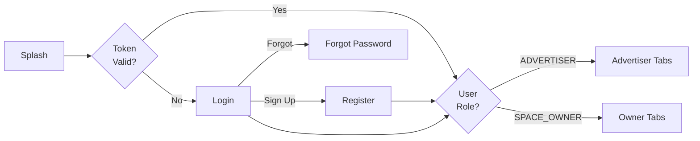

# Elaview Mobile Screens

> Complete screen documentation for the Elaview mobile app (Expo SDK 54, Expo Router v6).

## Table of Contents

- [Navigation Structure](#navigation-structure)
- [Screen Overview](#screen-overview)
- [Shared Screens](#shared-screens)
- [Advertiser Screens](#advertiser-screens)
- [Owner Screens](#owner-screens)
- [Screen Details](#screen-details)
- [Common Patterns](#common-patterns)

---

## Navigation Structure

```mermaid
graph TD
    ROOT[_layout.tsx<br/>Root Layout] --> AUTH[(auth)<br/>Auth Group]
    ROOT --> APP[(app)<br/>Main App]
    
    AUTH --> LOGIN[login.tsx]
    AUTH --> REGISTER[register.tsx]
    AUTH --> FORGOT[forgot-password.tsx]
    
    APP --> TABS[(tabs)<br/>Tab Navigator]
    APP --> MODALS[Modals & Stacks]
    
    TABS --> ADV_TABS[(advertiser)<br/>Advertiser Tabs]
    TABS --> OWNER_TABS[(owner)<br/>Owner Tabs]
    
    ADV_TABS --> DISCOVER[discover.tsx<br/>🗺️ Map]
    ADV_TABS --> ADV_BOOKINGS[bookings.tsx<br/>📋 Bookings]
    ADV_TABS --> ADV_NOTIF[notifications.tsx<br/>🔔 Alerts]
    ADV_TABS --> ADV_PROFILE[profile.tsx<br/>👤 Profile]
    
    OWNER_TABS --> LISTINGS[listings.tsx<br/>🏠 Spaces]
    OWNER_TABS --> OWNER_BOOKINGS[bookings.tsx<br/>📋 Requests]
    OWNER_TABS --> EARNINGS[earnings.tsx<br/>💰 Earnings]
    OWNER_TABS --> OWNER_PROFILE[profile.tsx<br/>👤 Profile]
    
    MODALS --> SPACE_DETAIL[spaces/[id].tsx]
    MODALS --> BOOKING_FLOW[book/[spaceId]/...]
    MODALS --> BOOKING_DETAIL[bookings/[id].tsx]
    MODALS --> SETTINGS[settings/...]
```

### File System Structure

```
clients/mobile/app/
├── _layout.tsx                    # Root layout (auth check)
├── (auth)/
│   ├── _layout.tsx                # Auth stack layout
│   ├── login.tsx
│   ├── register.tsx
│   └── forgot-password.tsx
└── (app)/
    ├── _layout.tsx                # Main app layout (role switch)
    ├── (tabs)/
    │   ├── _layout.tsx            # Tab navigator
    │   ├── (advertiser)/
    │   │   ├── _layout.tsx        # Advertiser tabs config
    │   │   ├── discover.tsx       # Map view
    │   │   ├── bookings.tsx       # My bookings
    │   │   ├── notifications.tsx  # Notification center
    │   │   └── profile.tsx        # Profile
    │   └── (owner)/
    │       ├── _layout.tsx        # Owner tabs config
    │       ├── listings.tsx       # My spaces
    │       ├── bookings.tsx       # Booking requests
    │       ├── earnings.tsx       # Earnings dashboard
    │       └── profile.tsx        # Profile
    ├── spaces/
    │   └── [id].tsx               # Space detail
    ├── book/
    │   └── [spaceId]/
    │       ├── index.tsx          # Booking request
    │       ├── creative.tsx       # Upload creative
    │       └── payment.tsx        # Payment
    ├── bookings/
    │   └── [id]/
    │       ├── index.tsx          # Booking detail
    │       ├── verify.tsx         # Review installation (advertiser)
    │       └── capture.tsx        # Capture verification (owner)
    ├── listings/
    │   ├── new.tsx                # Create listing
    │   └── [id]/
    │       └── edit.tsx           # Edit listing
    ├── settings/
    │   ├── index.tsx              # Settings list
    │   ├── notifications.tsx      # Notification preferences
    │   └── payment-methods.tsx    # Saved payment methods
    └── profile/
        └── edit.tsx               # Edit profile
```

---

## Screen Overview

### Authentication Flow



### Role-Based Navigation

| User Role | Default Tab | Available Tabs |
|-----------|-------------|----------------|
| ADVERTISER | Discover | Discover, Bookings, Notifications, Profile |
| SPACE_OWNER | Listings | Listings, Bookings, Earnings, Profile |

---

## Shared Screens

| Screen | Route | Purpose | Key Components | Data |
|--------|-------|---------|----------------|------|
| Login | `/(auth)/login` | User authentication | EmailInput, PasswordInput, OAuthButtons | `signIn` mutation |
| Register | `/(auth)/register` | Create account | RoleSelector, FormSteps | `signUp` mutation |
| Forgot Password | `/(auth)/forgot-password` | Reset password | EmailInput, SuccessMessage | `forgotPassword` mutation |
| Profile | `/(app)/profile` | View/edit profile | Avatar, ProfileForm | `getMe`, `updateProfile` |
| Edit Profile | `/(app)/profile/edit` | Edit profile details | AvatarUpload, Form | `updateProfile` |
| Settings | `/(app)/settings` | App settings | SettingsList, VersionInfo | Local storage |
| Notification Prefs | `/(app)/settings/notifications` | Notification settings | ToggleList | `updateNotificationPreferences` |
| Notification Center | `/(app)/.../notifications` | All notifications | NotificationList, UnreadBadge | `getNotifications` |

---

## Advertiser Screens

| Screen | Route | Purpose | Key Components | Data |
|--------|-------|---------|----------------|------|
| Discover | `/(advertiser)/discover` | Browse spaces on map | MapView, SpaceMarkers, BottomSheet, FilterChips | `searchSpaces` |
| Search Filters | `/(advertiser)/discover` (modal) | Filter spaces | LocationPicker, PriceSlider, TypeSelector, DateRange | — |
| Space Detail | `/spaces/[id]` | View space info | ImageGallery, SpaceInfo, OwnerCard, BookButton, Map | `getSpace` |
| Booking Request | `/book/[spaceId]` | Create booking | DateRangePicker, PriceSummary, NotesInput | — |
| Creative Upload | `/book/[spaceId]/creative` | Upload ad file | FilePicker, ValidationStatus, Preview, SpecSheet | R2 upload |
| Payment | `/book/[spaceId]/payment` | Complete payment | OrderSummary, CardInput, ApplePay, PayButton | `createPaymentIntent` |
| My Bookings | `/(advertiser)/bookings` | List my bookings | BookingList, StatusTabs | `getMyBookings` |
| Booking Detail | `/bookings/[id]` | View booking | StatusTimeline, SpaceCard, ActionButtons, Chat | `getBooking` |
| Installation Review | `/bookings/[id]/verify` | Review install photos | PhotoGallery, MapPreview, ApproveButton, DisputeForm | `getVerification`, `approveInstallation` |

---

## Owner Screens

| Screen | Route | Purpose | Key Components | Data |
|--------|-------|---------|----------------|------|
| Dashboard | `/(owner)/listings` | My listings overview | ListingGrid, AddFAB, QuickStats | `getMySpaces` |
| Create Listing | `/listings/new` | Add new space | PhotoUpload, TypeSelector, DimensionsInput, PriceInput, LocationPicker | `createSpace` |
| Edit Listing | `/listings/[id]/edit` | Edit space | Same as create, DeleteButton | `getSpace`, `updateSpace`, `deleteSpace` |
| Booking Requests | `/(owner)/bookings` | Incoming requests | RequestList, StatusFilter | `getMyBookings` |
| Booking Detail | `/bookings/[id]` | Manage booking | StatusTimeline, AdvertiserCard, ActionChecklist, CreativePreview | `getBooking` |
| Download File | `/bookings/[id]` (action) | Get print file | FilePreview, DownloadButton, PrintingGuide | Download + `updateBookingStatus` |
| Verification Capture | `/bookings/[id]/capture` | Upload install photos | GuidedCamera, GPSIndicator, PhotoPreview, SubmitButton | `submitVerification` |
| Earnings | `/(owner)/earnings` | Track income | BalanceCard, PayoutHistory, PendingList, WithdrawButton | `getPayouts` |

---

## Screen Details

### Login Screen

**Route:** `/(auth)/login`

#### Wireframe

```
┌─────────────────────────────┐
│                             │
│         [LOGO]              │
│                             │
│  ┌───────────────────────┐  │
│  │ Email                 │  │
│  └───────────────────────┘  │
│                             │
│  ┌───────────────────────┐  │
│  │ Password          👁️  │  │
│  └───────────────────────┘  │
│                             │
│  [      Sign In        ]    │
│                             │
│  Forgot password?           │
│                             │
│  ─────── or ───────         │
│                             │
│  [  Continue with Apple  ]  │
│  [  Continue with Google ]  │
│                             │
│  Don't have an account?     │
│  Sign up                    │
│                             │
└─────────────────────────────┘
```

#### User Flow

1. User enters email and password
2. Tap "Sign In"
3. Loading state while authenticating
4. On success: Navigate to appropriate tabs based on role
5. On error: Show inline error message

#### States

| State | Display |
|-------|---------|
| Default | Form with enabled inputs |
| Loading | Button shows spinner, inputs disabled |
| Error | Red border on inputs, error message below |
| Success | Brief success, then navigate |

#### Accessibility

- Email input: `accessibilityLabel="Email address"`
- Password input: `accessibilityLabel="Password"`, toggle for show/hide
- Sign In button: `accessibilityRole="button"`, `accessibilityState={{ disabled: isLoading }}`
- Links: `accessibilityRole="link"`

---

### Discover Screen (Advertiser)

**Route:** `/(advertiser)/discover`

#### Wireframe

```
┌─────────────────────────────┐
│ 🔍 Search location...    ⚙️ │
├─────────────────────────────┤
│                             │
│    ┌───┐                    │
│    │ 📍│     ┌───┐          │
│    └───┘     │ 📍│   ┌───┐  │
│              └───┘   │ 📍│  │
│     [MAP VIEW]       └───┘  │
│                             │
│        ┌───┐                │
│        │ 📍│                │
│        └───┘                │
│                             │
├─────────────────────────────┤
│ [Storefront] [Billboard] +  │ ← Filter chips
├─────────────────────────────┤
│ ┌─────────────────────────┐ │ ← Bottom sheet
│ │ 📷  Coffee Shop Window  │ │
│ │     Irvine, CA          │ │
│ │     $75/week     ⭐ 4.8 │ │
│ │     [View Details]      │ │
│ └─────────────────────────┘ │
└─────────────────────────────┘
```

#### User Flow

1. Map loads centered on user location (or last viewed)
2. Markers show available spaces
3. Tap marker → Show space preview in bottom sheet
4. Tap "View Details" → Navigate to space detail
5. Tap filter chips → Open filter modal
6. Search bar → Location search with autocomplete

#### States

| State | Display |
|-------|---------|
| Loading | Map skeleton + centered spinner |
| No Results | Map with "No spaces in this area" overlay |
| Location Error | Prompt to enable location or search manually |
| Offline | Show cached data with offline banner |

#### Key Components

```typescript
// Bottom sheet with react-native-reanimated
<BottomSheet
  snapPoints={['25%', '50%', '90%']}
  index={0}
>
  <SpacePreviewCard
    space={selectedSpace}
    onPress={() => router.push(`/spaces/${selectedSpace.id}`)}
  />
</BottomSheet>
```

#### Accessibility

- Map: `accessibilityLabel="Map showing ${count} available spaces"`
- Markers: `accessibilityLabel="${space.title}, ${space.pricePerWeek} per week"`
- Filter chips: `accessibilityRole="button"`, `accessibilityState={{ selected }}`

---

### Space Detail Screen

**Route:** `/spaces/[id]`

#### Wireframe

```
┌─────────────────────────────┐
│ ←                     ♡  ⋮  │
├─────────────────────────────┤
│ ┌─────────────────────────┐ │
│ │                         │ │
│ │    [PHOTO GALLERY]      │ │
│ │       ● ○ ○ ○           │ │
│ └─────────────────────────┘ │
├─────────────────────────────┤
│ Coffee Shop Window          │
│ Window Poster • 24" × 36"   │
│                             │
│ ┌───────────────────────┐   │
│ │ $75/week              │   │
│ │ 500+ daily foot traffic│   │
│ └───────────────────────┘   │
│                             │
│ ┌─────────────────────────┐ │
│ │ 👤 John's Coffee Shop   │ │
│ │    Member since 2024    │ │
│ │    ⭐ 4.8 (12 reviews)  │ │
│ └─────────────────────────┘ │
│                             │
│ About this space            │
│ Prime window space in busy  │
│ downtown coffee shop...     │
│                             │
│ [MAP PREVIEW]               │
│ 123 Main St, Irvine, CA     │
│                             │
│ Print Specifications        │
│ • Format: PDF, PNG, JPG     │
│ • Max size: 25 MB           │
│ • Min resolution: 150 DPI   │
│                             │
├─────────────────────────────┤
│ [      Book Now - $75/wk   ]│
└─────────────────────────────┘
```

#### User Flow

1. View photo gallery (swipe or tap)
2. Scroll to see space details
3. Tap owner card → View owner profile
4. Tap map → Open in Maps app
5. Tap "Book Now" → Navigate to booking request

#### Data Requirements

```graphql
query GetSpace($id: ID!) {
  space(id: $id) {
    id
    title
    description
    photos
    address
    city
    state
    lat
    lng
    width
    height
    pricePerWeek
    viewCount
    spaceType {
      name
      standardWidth
      standardHeight
      dimensionUnit
      category {
        name
        supportedFormats
        maxFileSizeMb
        minResolutionDpi
      }
    }
    owner {
      id
      firstName
      lastName
      avatarUrl
      createdAt
    }
  }
}
```

---

### Booking Request Screen

**Route:** `/book/[spaceId]`

#### Wireframe

```
┌─────────────────────────────┐
│ ←  Request Booking          │
├─────────────────────────────┤
│ ┌─────────────────────────┐ │
│ │ 📷  Coffee Shop Window  │ │
│ │     $75/week            │ │
│ └─────────────────────────┘ │
│                             │
│ Select Dates                │
│ ┌───────────┬───────────┐   │
│ │ Start     │ End       │   │
│ │ Jan 15    │ Jan 29    │   │
│ └───────────┴───────────┘   │
│                             │
│ Duration: 2 weeks           │
│                             │
│ ─────────────────────────   │
│                             │
│ Price Breakdown             │
│ 2 weeks × $75        $150   │
│ Platform fee (15%)   $22.50 │
│ ─────────────────────────   │
│ Total                $172.50│
│                             │
│ Notes to Owner (optional)   │
│ ┌─────────────────────────┐ │
│ │ Please position at eye  │ │
│ │ level...                │ │
│ └─────────────────────────┘ │
│                             │
├─────────────────────────────┤
│ [    Continue to Upload   ] │
└─────────────────────────────┘
```

#### User Flow

1. View space summary
2. Select start and end dates (date picker)
3. See calculated price breakdown
4. Add optional notes
5. Tap "Continue" → Navigate to creative upload

#### Validation

- Start date must be in future (at least 3 days out)
- End date must be after start date
- Minimum 1 week, maximum 12 weeks
- Space must be available for selected dates

---

### Creative Upload Screen

**Route:** `/book/[spaceId]/creative`

#### Wireframe

```
┌─────────────────────────────┐
│ ←  Upload Creative          │
├─────────────────────────────┤
│ Print Specifications        │
│                             │
│ 📐 Size: 24" × 36"          │
│ 📄 Formats: PDF, PNG, JPG   │
│ 📦 Max file: 25 MB          │
│ 🖼️ Min resolution: 150 DPI  │
│                             │
│ ┌─────────────────────────┐ │
│ │                         │ │
│ │    + Upload File        │ │
│ │                         │ │
│ │  Tap to select or       │ │
│ │  drag and drop          │ │
│ │                         │ │
│ └─────────────────────────┘ │
│                             │
│ ─── OR ───                  │
│                             │
│ [  Skip - Upload Later  ]   │
│                             │
│ Note: You can upload your   │
│ creative file after the     │
│ owner accepts your request. │
│                             │
├─────────────────────────────┤
│ [   Continue to Payment   ] │
└─────────────────────────────┘
```

#### After Upload

```
┌─────────────────────────────┐
│ ┌─────────────────────────┐ │
│ │                         │ │
│ │    [FILE PREVIEW]       │ │
│ │                         │ │
│ │  winter-sale.pdf        │ │
│ │  2.4 MB                 │ │
│ │                         │ │
│ └─────────────────────────┘ │
│                             │
│ ✅ Format: PDF              │
│ ✅ Size: 2.4 MB (< 25 MB)   │
│ ✅ Resolution: 300 DPI      │
│                             │
│ [Change File]               │
└─────────────────────────────┘
```

#### Validation States

| Check | Pass | Fail |
|-------|------|------|
| Format | ✅ Format: PDF | ❌ Invalid format. Use PDF, PNG, or JPG |
| Size | ✅ Size: 2.4 MB | ❌ File too large. Max 25 MB |
| Resolution | ✅ Resolution: 300 DPI | ⚠️ Low resolution. May appear blurry |

---

### Payment Screen

**Route:** `/book/[spaceId]/payment`

#### Wireframe

```
┌─────────────────────────────┐
│ ←  Payment                  │
├─────────────────────────────┤
│ Order Summary               │
│ ┌─────────────────────────┐ │
│ │ Coffee Shop Window      │ │
│ │ Jan 15 - Jan 29 (2 wks) │ │
│ │                         │ │
│ │ 2 weeks × $75    $150.00│ │
│ │ Platform fee     $22.50 │ │
│ │ ─────────────────────── │ │
│ │ Total           $172.50 │ │
│ └─────────────────────────┘ │
│                             │
│ Payment Method              │
│ ┌─────────────────────────┐ │
│ │  Apple Pay           ▶ │ │
│ └─────────────────────────┘ │
│ ┌─────────────────────────┐ │
│ │ 💳 •••• 4242    Visa ▶ │ │
│ └─────────────────────────┘ │
│ ┌─────────────────────────┐ │
│ │ + Add new card       ▶ │ │
│ └─────────────────────────┘ │
│                             │
│ By continuing, you agree to │
│ our Terms of Service and    │
│ acknowledge our refund      │
│ policy.                     │
│                             │
├─────────────────────────────┤
│ [   Pay $172.50           ] │
└─────────────────────────────┘
```

#### User Flow

1. Review order summary
2. Select payment method (Apple Pay, saved card, or new card)
3. Tap "Pay"
4. For Apple Pay: Native sheet appears
5. For card: Stripe CardField validates
6. On success: Navigate to booking confirmation
7. On failure: Show error with retry option

#### Error States

```
┌─────────────────────────────┐
│ ⚠️ Payment Failed           │
│                             │
│ Your card was declined.     │
│ Please try a different      │
│ payment method.             │
│                             │
│ [  Try Again  ]             │
│ [  Use Different Card  ]    │
└─────────────────────────────┘
```

---

### My Bookings Screen (Advertiser)

**Route:** `/(advertiser)/bookings`

#### Wireframe

```
┌─────────────────────────────┐
│ My Bookings                 │
├─────────────────────────────┤
│ [Active] [Pending] [Past]   │
├─────────────────────────────┤
│ ┌─────────────────────────┐ │
│ │ 📷  Coffee Shop Window  │ │
│ │     Irvine, CA          │ │
│ │                         │ │
│ │ 🟡 Awaiting Approval    │ │
│ │ Jan 15 - Jan 29         │ │
│ │                    $172 │ │
│ └─────────────────────────┘ │
│                             │
│ ┌─────────────────────────┐ │
│ │ 📷  Downtown Billboard  │ │
│ │     Los Angeles, CA     │ │
│ │                         │ │
│ │ 🟢 Paid - Installing    │ │
│ │ Jan 8 - Jan 22          │ │
│ │                    $450 │ │
│ └─────────────────────────┘ │
│                             │
│ ┌─────────────────────────┐ │
│ │ 📷  Gym Poster Space    │ │
│ │     Costa Mesa, CA      │ │
│ │                         │ │
│ │ 🔵 Verify Installation  │ │
│ │ Dec 20 - Jan 3          │ │
│ │                    $180 │ │
│ │                         │ │
│ │ ⏰ Auto-approves in 23h │ │
│ └─────────────────────────┘ │
└─────────────────────────────┘
```

#### Status Badges

| Status | Badge | Color |
|--------|-------|-------|
| PENDING_APPROVAL | Awaiting Approval | Yellow |
| ACCEPTED | Accepted - Pay Now | Blue |
| PAID | Paid - Installing | Green |
| FILE_DOWNLOADED | File Downloaded | Green |
| INSTALLED | Verify Installation | Blue (action) |
| VERIFIED | Running | Green |
| COMPLETED | Completed | Gray |
| DISPUTED | Under Review | Orange |
| CANCELLED | Cancelled | Red |

---

### Verification Capture Screen (Owner)

**Route:** `/bookings/[id]/capture`

#### Wireframe

```
┌─────────────────────────────┐
│ ←  Verify Installation      │
├─────────────────────────────┤
│ Take 3 photos of the        │
│ installed advertisement     │
│                             │
│ Photo 1 of 3: Front View    │
│ ┌─────────────────────────┐ │
│ │                         │ │
│ │                         │ │
│ │     [CAMERA VIEW]       │ │
│ │                         │ │
│ │                         │ │
│ │                         │ │
│ │         [📷]            │ │
│ └─────────────────────────┘ │
│                             │
│ 📍 GPS: ✅ Within range     │
│    (15m from space)         │
│                             │
│ Tips:                       │
│ • Include the full ad       │
│ • Show surrounding context  │
│ • Ensure good lighting      │
│                             │
├─────────────────────────────┤
│ ○ ○ ○  Progress             │
└─────────────────────────────┘
```

#### After All Photos

```
┌─────────────────────────────┐
│ ←  Review Photos            │
├─────────────────────────────┤
│ ┌───────┬───────┬───────┐   │
│ │ 📷 1  │ 📷 2  │ 📷 3  │   │
│ │       │       │       │   │
│ │   ✓   │   ✓   │   ✓   │   │
│ └───────┴───────┴───────┘   │
│                             │
│ ✅ 3 photos captured        │
│ ✅ GPS validated (15m)      │
│ ✅ Taken just now           │
│                             │
│ By submitting, you confirm  │
│ the advertisement has been  │
│ installed correctly.        │
│                             │
├─────────────────────────────┤
│ [  Submit Verification    ] │
└─────────────────────────────┘
```

#### Validation Requirements

| Check | Requirement |
|-------|-------------|
| Photo count | Minimum from category config (usually 3) |
| Source | In-app camera only (no gallery) |
| GPS | Within `gpsRadiusMeters` of space location |
| Timestamp | Photos must be recent (within 1 hour) |

---

### Earnings Screen (Owner)

**Route:** `/(owner)/earnings`

#### Wireframe

```
┌─────────────────────────────┐
│ Earnings                    │
├─────────────────────────────┤
│ ┌─────────────────────────┐ │
│ │ Available Balance       │ │
│ │ $847.50                 │ │
│ │                         │ │
│ │ [   Withdraw    ]       │ │
│ └─────────────────────────┘ │
│                             │
│ Pending                     │
│ ┌─────────────────────────┐ │
│ │ 💰 $107.50 processing   │ │
│ │    Coffee Shop Window   │ │
│ │    Stage 2 • Jan 2      │ │
│ └─────────────────────────┘ │
│                             │
│ This Month: $425.00         │
│ Last Month: $380.00         │
│                             │
│ Recent Payouts              │
│ ┌─────────────────────────┐ │
│ │ ✅ $20.00               │ │
│ │    Coffee Shop Window   │ │
│ │    Stage 1 • Dec 29     │ │
│ └─────────────────────────┘ │
│ ┌─────────────────────────┐ │
│ │ ✅ $85.00               │ │
│ │    Downtown Billboard   │ │
│ │    Stage 2 • Dec 28     │ │
│ └─────────────────────────┘ │
│                             │
│ [  View All Transactions  ] │
└─────────────────────────────┘
```

#### Payout Stage Labels

| Stage | Label | Description |
|-------|-------|-------------|
| PRINT_INSTALL_FEE | Stage 1 | Print + install fee |
| REMAINDER | Stage 2 | Remaining owner earnings |

---

## Common Patterns

### Loading States

```typescript
// Skeleton loading
function BookingListSkeleton() {
  return (
    <View>
      {[1, 2, 3].map((i) => (
        <MotiView
          key={i}
          from={{ opacity: 0.5 }}
          animate={{ opacity: 1 }}
          transition={{ loop: true, duration: 1000 }}
        >
          <View style={styles.skeletonCard} />
        </MotiView>
      ))}
    </View>
  );
}
```

### Empty States

```typescript
function EmptyBookings({ role }: { role: 'ADVERTISER' | 'SPACE_OWNER' }) {
  return (
    <View style={styles.emptyContainer}>
      <Image source={require('@/assets/empty-bookings.png')} />
      <Text style={styles.emptyTitle}>No bookings yet</Text>
      <Text style={styles.emptyDescription}>
        {role === 'ADVERTISER'
          ? 'Find a space to start advertising'
          : 'Your booking requests will appear here'}
      </Text>
      {role === 'ADVERTISER' && (
        <Button onPress={() => router.push('/(advertiser)/discover')}>
          Browse Spaces
        </Button>
      )}
    </View>
  );
}
```

### Error States

```typescript
function ErrorState({ error, onRetry }: Props) {
  return (
    <View style={styles.errorContainer}>
      <AlertCircle size={48} color={colors.error} />
      <Text style={styles.errorTitle}>Something went wrong</Text>
      <Text style={styles.errorMessage}>{error.message}</Text>
      <Button onPress={onRetry}>Try Again</Button>
    </View>
  );
}
```

### Pull to Refresh

```typescript
<FlatList
  data={bookings}
  refreshControl={
    <RefreshControl
      refreshing={refreshing}
      onRefresh={onRefresh}
      tintColor={colors.primary}
    />
  }
/>
```

### Accessibility Patterns

```typescript
// Screen reader announcements
useEffect(() => {
  if (bookingStatus === 'VERIFIED') {
    AccessibilityInfo.announceForAccessibility(
      'Installation verified! Payout is being processed.'
    );
  }
}, [bookingStatus]);

// Focus management after navigation
useEffect(() => {
  if (headerRef.current) {
    AccessibilityInfo.setAccessibilityFocus(headerRef.current);
  }
}, []);
```

---

## Related Documentation

- [Mobile Development](../.cursor/rules/05-mobile-development.mdc) - Expo patterns and conventions
- [Booking Lifecycle](./BOOKING-LIFECYCLE.md) - Status transitions
- [API Contracts](./API-CONTRACTS.md) - GraphQL operations
