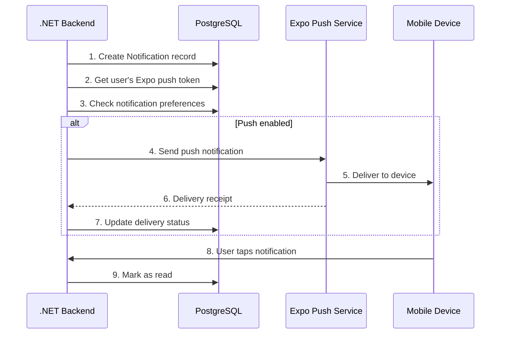

# Elaview Notifications

> Push notification system for the Elaview mobile app using Expo Push Notifications.

## Table of Contents

- [Overview](#overview)
- [Architecture](#architecture)
- [Notification Types](#notification-types)
- [User Preferences](#user-preferences)
- [Implementation](#implementation)
- [Deep Linking](#deep-linking)
- [Badge Management](#badge-management)
- [In-App Notification Center](#in-app-notification-center)
- [Email Notifications](#email-notifications)
- [Testing](#testing)

---

## Overview

| Component | Technology | Purpose |
|-----------|------------|---------|
| Push Service | Expo Push Notifications | Cross-platform push (APNs + FCM) |
| Storage | PostgreSQL | Persist for in-app notification center |
| Deep Links | Expo Router | Navigate to relevant screens |
| Email | SendGrid / Resend | Backup delivery channel |

### Why Expo Push?

- **Simple:** Single API for iOS and Android
- **Reliable:** Handles APNs/FCM complexity
- **Free:** Unlimited push notifications
- **Integrated:** Works seamlessly with Expo SDK

---

## Architecture



---

## Notification Entity

```typescript
// packages/graphql/generated/types.ts

interface Notification {
  id: string;
  userId: string;
  type: NotificationType;
  title: string;
  body: string;
  data: NotificationData;
  read: boolean;
  readAt: Date | null;
  expoPushToken: string | null;
  pushSentAt: Date | null;
  pushStatus: 'pending' | 'sent' | 'delivered' | 'failed' | null;
  pushError: string | null;
  createdAt: Date;
}

interface NotificationData {
  bookingId?: string;
  spaceId?: string;
  payoutId?: string;
  amount?: number;
  route?: string;
  [key: string]: unknown;
}

type NotificationType =
  | 'BOOKING_REQUEST'
  | 'BOOKING_ACCEPTED'
  | 'BOOKING_DECLINED'
  | 'BOOKING_CANCELLED'
  | 'PAYMENT_RECEIVED'
  | 'PAYMENT_FAILED'
  | 'FILE_DOWNLOADED'
  | 'INSTALL_REMINDER'
  | 'VERIFICATION_SUBMITTED'
  | 'BOOKING_APPROVED'
  | 'BOOKING_AUTO_APPROVED'
  | 'AUTO_APPROVAL_WARNING'
  | 'DISPUTE_OPENED'
  | 'DISPUTE_RESOLVED'
  | 'PAYOUT_SENT'
  | 'PAYOUT_FAILED'
  | 'BOOKING_COMPLETED';
```

---

## Notification Types

### Booking Lifecycle Notifications

| Type | Trigger | Recipient | Title | Body Template |
|------|---------|-----------|-------|---------------|
| `BOOKING_REQUEST` | Booking created | Owner | "New booking request" | "{advertiser} wants to book {space}" |
| `BOOKING_ACCEPTED` | Owner accepts | Advertiser | "Booking accepted!" | "{space} accepted your request. Complete payment to confirm." |
| `BOOKING_DECLINED` | Owner declines | Advertiser | "Booking declined" | "{space} declined your request" |
| `BOOKING_CANCELLED` | Either cancels | Other party | "Booking cancelled" | "Booking for {space} was cancelled" |

### Payment Notifications

| Type | Trigger | Recipient | Title | Body Template |
|------|---------|-----------|-------|---------------|
| `PAYMENT_RECEIVED` | Payment succeeds | Owner | "Payment received!" | "${amount} received for {space}" |
| `PAYMENT_FAILED` | Payment fails | Advertiser | "Payment failed" | "Payment for {space} failed. Please try again." |
| `FILE_DOWNLOADED` | Owner downloads file | Owner | "Print fee sent!" | "${fee} sent to your account. Print and install by {date}." |
| `PAYOUT_SENT` | Stripe transfer completes | Owner | "Payout sent" | "${amount} sent to your bank account" |
| `PAYOUT_FAILED` | Transfer fails | Owner | "Payout issue" | "We couldn't send your ${amount} payout. Please check your bank details." |

### Installation Notifications

| Type | Trigger | Recipient | Title | Body Template |
|------|---------|-----------|-------|---------------|
| `INSTALL_REMINDER` | 2 days before deadline | Owner | "Installation due soon" | "Install {space} booking by {date}" |
| `VERIFICATION_SUBMITTED` | Photos uploaded | Advertiser | "Review installation" | "{space} installation ready for review" |
| `BOOKING_APPROVED` | Advertiser approves | Owner | "Installation approved!" | "${amount} payout is on the way" |
| `BOOKING_AUTO_APPROVED` | 48hr timeout | Owner | "Auto-approved!" | "Installation auto-approved. ${amount} sent to your account." |
| `AUTO_APPROVAL_WARNING` | 24hr before auto-approval | Advertiser | "Review needed" | "Review installation for {space} — auto-approves in 24 hours" |

### Dispute Notifications

| Type | Trigger | Recipient | Title | Body Template |
|------|---------|-----------|-------|---------------|
| `DISPUTE_OPENED` | Dispute created | Both | "Dispute opened" | "Booking for {space} is under review" |
| `DISPUTE_RESOLVED` | Admin resolves | Both | "Dispute resolved" | "Booking for {space} dispute has been resolved" |

### Completion Notifications

| Type | Trigger | Recipient | Title | Body Template |
|------|---------|-----------|-------|---------------|
| `BOOKING_COMPLETED` | Campaign ends | Both | "Campaign completed!" | "Your {space} campaign has ended. Thanks for using Elaview!" |

---

## User Preferences

### Preferences Entity

```typescript
interface NotificationPreferences {
  userId: string;
  
  // Global toggles
  pushEnabled: boolean;
  emailEnabled: boolean;
  
  // Category toggles (push)
  pushBookingUpdates: boolean;
  pushPaymentUpdates: boolean;
  pushInstallReminders: boolean;
  pushMarketingUpdates: boolean;
  
  // Category toggles (email)
  emailBookingUpdates: boolean;
  emailPaymentUpdates: boolean;
  emailMarketingUpdates: boolean;
  
  updatedAt: Date;
}
```

### Default Preferences

| Preference | Default |
|------------|---------|
| pushEnabled | `true` |
| emailEnabled | `true` |
| pushBookingUpdates | `true` |
| pushPaymentUpdates | `true` |
| pushInstallReminders | `true` |
| pushMarketingUpdates | `false` |
| emailBookingUpdates | `true` |
| emailPaymentUpdates | `true` |
| emailMarketingUpdates | `false` |

### Notification → Preference Mapping

| Notification Type | Category |
|-------------------|----------|
| `BOOKING_REQUEST`, `BOOKING_ACCEPTED`, `BOOKING_DECLINED`, `BOOKING_CANCELLED` | `bookingUpdates` |
| `PAYMENT_RECEIVED`, `PAYMENT_FAILED`, `PAYOUT_SENT`, `PAYOUT_FAILED` | `paymentUpdates` |
| `INSTALL_REMINDER`, `AUTO_APPROVAL_WARNING` | `installReminders` |
| Promotional, Tips | `marketingUpdates` |

---

## Implementation

### Backend: Sending Notifications

```csharp
// backend/Services/NotificationService.cs

public class NotificationService
{
    private readonly IExpoClient _expo;
    private readonly AppDbContext _db;
    
    public async Task SendAsync(
        string userId,
        NotificationType type,
        string title,
        string body,
        Dictionary<string, object>? data = null)
    {
        // 1. Create database record
        var notification = new Notification
        {
            Id = Guid.NewGuid().ToString(),
            UserId = userId,
            Type = type,
            Title = title,
            Body = body,
            Data = data ?? new Dictionary<string, object>(),
            Read = false,
            CreatedAt = DateTime.UtcNow
        };
        
        _db.Notifications.Add(notification);
        await _db.SaveChangesAsync();
        
        // 2. Get user and preferences
        var user = await _db.Users
            .Include(u => u.NotificationPreferences)
            .FirstOrDefaultAsync(u => u.Id == userId);
            
        if (user?.ExpoPushToken == null)
            return;
            
        // 3. Check preferences
        var prefs = user.NotificationPreferences;
        if (!prefs.PushEnabled || !ShouldSend(type, prefs))
            return;
        
        // 4. Send via Expo
        try
        {
            var message = new ExpoPushMessage
            {
                To = user.ExpoPushToken,
                Title = title,
                Body = body,
                Data = new Dictionary<string, object>
                {
                    ["notificationId"] = notification.Id,
                    ["type"] = type.ToString(),
                    ...data
                },
                Sound = "default",
                Badge = await GetUnreadCount(userId) + 1
            };
            
            var result = await _expo.SendPushNotificationsAsync(new[] { message });
            
            notification.PushSentAt = DateTime.UtcNow;
            notification.PushStatus = result.Success ? "sent" : "failed";
            notification.PushError = result.Error;
            
            await _db.SaveChangesAsync();
        }
        catch (Exception ex)
        {
            notification.PushStatus = "failed";
            notification.PushError = ex.Message;
            await _db.SaveChangesAsync();
        }
    }
    
    private bool ShouldSend(NotificationType type, NotificationPreferences prefs)
    {
        return type switch
        {
            NotificationType.BOOKING_REQUEST or
            NotificationType.BOOKING_ACCEPTED or
            NotificationType.BOOKING_DECLINED or
            NotificationType.BOOKING_CANCELLED => prefs.PushBookingUpdates,
            
            NotificationType.PAYMENT_RECEIVED or
            NotificationType.PAYMENT_FAILED or
            NotificationType.PAYOUT_SENT or
            NotificationType.PAYOUT_FAILED => prefs.PushPaymentUpdates,
            
            NotificationType.INSTALL_REMINDER or
            NotificationType.AUTO_APPROVAL_WARNING => prefs.PushInstallReminders,
            
            _ => true
        };
    }
}
```

### Mobile: Token Registration

```typescript
// apps/mobile/src/hooks/useNotificationSetup.ts

import * as Notifications from 'expo-notifications';
import * as Device from 'expo-device';
import { useEffect } from 'react';
import { Platform } from 'react-native';
import { useMutation } from '@apollo/client';
import { REGISTER_PUSH_TOKEN } from '@/graphql/operations';

// Configure notification behavior
Notifications.setNotificationHandler({
  handleNotification: async () => ({
    shouldShowAlert: true,
    shouldPlaySound: true,
    shouldSetBadge: true,
  }),
});

export function useNotificationSetup() {
  const [registerToken] = useMutation(REGISTER_PUSH_TOKEN);

  useEffect(() => {
    registerForPushNotifications();
  }, []);

  async function registerForPushNotifications() {
    // Only works on physical devices
    if (!Device.isDevice) {
      console.log('Push notifications require a physical device');
      return;
    }

    // Check existing permissions
    const { status: existingStatus } = await Notifications.getPermissionsAsync();
    let finalStatus = existingStatus;

    // Request permissions if not granted
    if (existingStatus !== 'granted') {
      const { status } = await Notifications.requestPermissionsAsync();
      finalStatus = status;
    }

    if (finalStatus !== 'granted') {
      console.log('Push notification permission denied');
      return;
    }

    // Get Expo push token
    const token = await Notifications.getExpoPushTokenAsync({
      projectId: process.env.EXPO_PUBLIC_PROJECT_ID,
    });

    // Register token with backend
    await registerToken({
      variables: { token: token.data },
    });

    // Android-specific channel setup
    if (Platform.OS === 'android') {
      await Notifications.setNotificationChannelAsync('default', {
        name: 'Default',
        importance: Notifications.AndroidImportance.MAX,
        vibrationPattern: [0, 250, 250, 250],
      });
    }
  }

  return { registerForPushNotifications };
}
```

### Mobile: Notification Listeners

```typescript
// apps/mobile/app/_layout.tsx

import * as Notifications from 'expo-notifications';
import { useRouter } from 'expo-router';
import { useEffect, useRef } from 'react';

export default function RootLayout() {
  const router = useRouter();
  const notificationListener = useRef<Notifications.Subscription>();
  const responseListener = useRef<Notifications.Subscription>();

  useEffect(() => {
    // Handle notification received while app is foregrounded
    notificationListener.current = Notifications.addNotificationReceivedListener(
      (notification) => {
        console.log('Notification received:', notification);
        // Optionally show in-app toast
      }
    );

    // Handle notification tap (app in background or killed)
    responseListener.current = Notifications.addNotificationResponseReceivedListener(
      (response) => {
        const data = response.notification.request.content.data;
        handleNotificationTap(data);
      }
    );

    // Check if app was opened from notification
    Notifications.getLastNotificationResponseAsync().then((response) => {
      if (response) {
        const data = response.notification.request.content.data;
        handleNotificationTap(data);
      }
    });

    return () => {
      if (notificationListener.current) {
        Notifications.removeNotificationSubscription(notificationListener.current);
      }
      if (responseListener.current) {
        Notifications.removeNotificationSubscription(responseListener.current);
      }
    };
  }, []);

  function handleNotificationTap(data: Record<string, unknown>) {
    const { bookingId, spaceId, route, type } = data;

    // Use explicit route if provided
    if (route && typeof route === 'string') {
      router.push(route);
      return;
    }

    // Route based on notification type and data
    if (bookingId) {
      switch (type) {
        case 'VERIFICATION_SUBMITTED':
          router.push(`/bookings/${bookingId}/verify`);
          break;
        case 'PAYOUT_SENT':
        case 'BOOKING_APPROVED':
          router.push('/(owner)/earnings');
          break;
        default:
          router.push(`/bookings/${bookingId}`);
      }
      return;
    }

    if (spaceId) {
      router.push(`/spaces/${spaceId}`);
      return;
    }

    // Fallback to notifications tab
    router.push('/notifications');
  }

  return (
    // ... layout content
  );
}
```

---

## Deep Linking

### Route Mapping

| Notification Type | Recipient | Deep Link Route |
|-------------------|-----------|-----------------|
| `BOOKING_REQUEST` | Owner | `/(owner)/bookings/[id]` |
| `BOOKING_ACCEPTED` | Advertiser | `/(advertiser)/bookings/[id]` |
| `BOOKING_DECLINED` | Advertiser | `/(advertiser)/bookings/[id]` |
| `PAYMENT_RECEIVED` | Owner | `/(owner)/bookings/[id]` |
| `FILE_DOWNLOADED` | Owner | `/(owner)/bookings/[id]` |
| `VERIFICATION_SUBMITTED` | Advertiser | `/(advertiser)/bookings/[id]/verify` |
| `BOOKING_APPROVED` | Owner | `/(owner)/earnings` |
| `BOOKING_AUTO_APPROVED` | Owner | `/(owner)/earnings` |
| `AUTO_APPROVAL_WARNING` | Advertiser | `/(advertiser)/bookings/[id]/verify` |
| `DISPUTE_OPENED` | Both | `/bookings/[id]` |
| `PAYOUT_SENT` | Owner | `/(owner)/earnings` |

### Notification Data Structure

```typescript
// Include route in notification data for deep linking
const notificationData = {
  notificationId: notification.id,
  type: 'BOOKING_REQUEST',
  bookingId: booking.id,
  spaceId: booking.spaceId,
  route: `/(owner)/bookings/${booking.id}`, // Explicit route
};
```

---

## Badge Management

### Incrementing Badge

```typescript
// Backend: When sending notification
const unreadCount = await db.notification.count({
  where: { userId, read: false },
});

await expo.sendPushNotificationsAsync([{
  to: pushToken,
  badge: unreadCount + 1,
  // ... other fields
}]);
```

### Decrementing Badge (Mark as Read)

```typescript
// apps/mobile/src/hooks/useMarkAsRead.ts

import * as Notifications from 'expo-notifications';
import { useMutation, useQuery } from '@apollo/client';
import { MARK_AS_READ, GET_UNREAD_COUNT } from '@/graphql/operations';

export function useMarkAsRead() {
  const [markAsRead] = useMutation(MARK_AS_READ);
  const { data } = useQuery(GET_UNREAD_COUNT);

  async function handleMarkAsRead(notificationId: string) {
    await markAsRead({ variables: { id: notificationId } });
    
    // Update badge count
    const newCount = Math.max(0, (data?.unreadCount ?? 1) - 1);
    await Notifications.setBadgeCountAsync(newCount);
  }

  return { markAsRead: handleMarkAsRead };
}
```

### Clear All Badges

```typescript
// apps/mobile/src/hooks/useMarkAllAsRead.ts

export function useMarkAllAsRead() {
  const [markAllAsRead] = useMutation(MARK_ALL_AS_READ);

  async function handleMarkAllAsRead() {
    await markAllAsRead();
    await Notifications.setBadgeCountAsync(0);
  }

  return { markAllAsRead: handleMarkAllAsRead };
}
```

### Sync Badge on App Open

```typescript
// apps/mobile/app/_layout.tsx

import { useEffect } from 'react';
import * as Notifications from 'expo-notifications';
import { useQuery } from '@apollo/client';
import { GET_UNREAD_COUNT } from '@/graphql/operations';

function useBadgeSync() {
  const { data } = useQuery(GET_UNREAD_COUNT, {
    fetchPolicy: 'network-only',
  });

  useEffect(() => {
    if (data?.unreadCount !== undefined) {
      Notifications.setBadgeCountAsync(data.unreadCount);
    }
  }, [data?.unreadCount]);
}
```

---

## In-App Notification Center

### UI Structure

```
┌─────────────────────────────┐
│ Notifications          ✓ All│
├─────────────────────────────┤
│ 🔵 New booking request      │
│    John wants to book your  │
│    Coffee Shop Window       │
│    2 hours ago              │
├─────────────────────────────┤
│    Payment received!        │
│    $172.50 for Downtown     │
│    Billboard                │
│    Yesterday                │
├─────────────────────────────┤
│    Installation approved    │
│    $107.50 payout sent      │
│    3 days ago               │
└─────────────────────────────┘
```

### Implementation

```typescript
// apps/mobile/src/features/notifications/NotificationCenter.tsx

import { FlatList, RefreshControl } from 'react-native';
import { useQuery } from '@apollo/client';
import { GET_NOTIFICATIONS } from '@/graphql/operations';
import { NotificationItem } from './NotificationItem';
import { EmptyNotifications } from './EmptyNotifications';

export function NotificationCenter() {
  const { data, loading, refetch } = useQuery(GET_NOTIFICATIONS, {
    variables: { first: 50 },
    fetchPolicy: 'cache-and-network',
  });

  const notifications = data?.notifications.edges.map((e) => e.node) ?? [];

  return (
    <FlatList
      data={notifications}
      keyExtractor={(item) => item.id}
      renderItem={({ item }) => <NotificationItem notification={item} />}
      ListEmptyComponent={<EmptyNotifications />}
      refreshControl={
        <RefreshControl refreshing={loading} onRefresh={refetch} />
      }
    />
  );
}
```

### Notification Item

```typescript
// apps/mobile/src/features/notifications/NotificationItem.tsx

import { Pressable, View, Text } from 'react-native';
import { useRouter } from 'expo-router';
import { formatRelative } from 'date-fns';
import { useMarkAsRead } from '@/hooks/useMarkAsRead';
import { NotificationIcon } from './NotificationIcon';

interface Props {
  notification: Notification;
}

export function NotificationItem({ notification }: Props) {
  const router = useRouter();
  const { markAsRead } = useMarkAsRead();

  const handlePress = async () => {
    // Mark as read
    if (!notification.read) {
      await markAsRead(notification.id);
    }

    // Navigate to relevant screen
    const route = notification.data.route;
    if (route) {
      router.push(route);
    }
  };

  return (
    <Pressable
      onPress={handlePress}
      style={[styles.container, !notification.read && styles.unread]}
    >
      <NotificationIcon type={notification.type} />
      <View style={styles.content}>
        <Text style={styles.title}>{notification.title}</Text>
        <Text style={styles.body}>{notification.body}</Text>
        <Text style={styles.time}>
          {formatRelative(new Date(notification.createdAt), new Date())}
        </Text>
      </View>
      {!notification.read && <View style={styles.unreadDot} />}
    </Pressable>
  );
}
```

---

## Email Notifications

### When to Send Email

| Scenario | Push | Email |
|----------|------|-------|
| User has push enabled | ✓ | ✗ |
| User has push disabled, email enabled | ✗ | ✓ |
| Critical (payment failed, dispute) | ✓ | ✓ |
| User hasn't opened app in 7+ days | ✓ | ✓ |

### Email Templates

| Type | Subject | Template |
|------|---------|----------|
| `BOOKING_REQUEST` | "New booking request for {space}" | `booking-request.html` |
| `PAYMENT_RECEIVED` | "Payment received: ${amount}" | `payment-received.html` |
| `VERIFICATION_SUBMITTED` | "Review installation for {space}" | `verification-submitted.html` |
| `AUTO_APPROVAL_WARNING` | "Action needed: Review installation" | `auto-approval-warning.html` |
| `PAYOUT_SENT` | "Payout sent: ${amount}" | `payout-sent.html` |

---

## Testing

### Local Testing

```typescript
// Send test notification via Expo's push notification tool
// https://expo.dev/notifications

// Or use the Expo CLI
npx expo push:send --to ExponentPushToken[xxxxx] --title "Test" --body "Hello!"
```

### Test Scenarios

| Scenario | How to Test |
|----------|-------------|
| App in foreground | Open app, trigger notification from backend |
| App in background | Minimize app, trigger notification |
| App killed | Close app completely, trigger notification |
| Deep link | Tap notification, verify correct screen opens |
| Badge count | Send multiple, verify count, mark read, verify decrement |
| Preferences | Disable category, verify notification not received |

### Mock Notifications (Development)

```typescript
// apps/mobile/src/utils/mockNotifications.ts

import * as Notifications from 'expo-notifications';

export async function sendMockNotification(type: NotificationType) {
  const notifications = {
    BOOKING_REQUEST: {
      title: 'New booking request',
      body: 'Jane Smith wants to book your Coffee Shop Window',
      data: { bookingId: 'mock-123', type: 'BOOKING_REQUEST' },
    },
    PAYMENT_RECEIVED: {
      title: 'Payment received!',
      body: '$172.50 received for Coffee Shop Window',
      data: { bookingId: 'mock-123', type: 'PAYMENT_RECEIVED' },
    },
    // ... other types
  };

  const notification = notifications[type];
  
  await Notifications.scheduleNotificationAsync({
    content: {
      title: notification.title,
      body: notification.body,
      data: notification.data,
    },
    trigger: { seconds: 2 },
  });
}
```

---

## Scheduled Notifications

### Reminder Types

| Reminder | Schedule | Condition |
|----------|----------|-----------|
| Installation reminder | 2 days before deadline | Booking in `PAID` or `FILE_DOWNLOADED` |
| Auto-approval warning | 24h before timeout | Booking in `INSTALLED` |
| Campaign ending | 3 days before end date | Booking in `VERIFIED` |

### Scheduler Implementation

```csharp
// backend/Jobs/NotificationScheduler.cs

public class NotificationScheduler : BackgroundService
{
    protected override async Task ExecuteAsync(CancellationToken stoppingToken)
    {
        while (!stoppingToken.IsCancellationRequested)
        {
            await SendInstallReminders();
            await SendAutoApprovalWarnings();
            await SendCampaignEndingReminders();
            
            await Task.Delay(TimeSpan.FromMinutes(15), stoppingToken);
        }
    }
    
    private async Task SendAutoApprovalWarnings()
    {
        var bookings = await _db.Bookings
            .Where(b => b.Status == BookingStatus.INSTALLED)
            .Where(b => b.AutoApprovalAt <= DateTime.UtcNow.AddHours(24))
            .Where(b => !b.AutoApprovalWarningSent)
            .ToListAsync();
            
        foreach (var booking in bookings)
        {
            await _notificationService.SendAsync(
                booking.AdvertiserId,
                NotificationType.AUTO_APPROVAL_WARNING,
                "Review needed",
                $"Review installation for {booking.Space.Title} — auto-approves in 24 hours",
                new Dictionary<string, object>
                {
                    ["bookingId"] = booking.Id,
                    ["route"] = $"/(advertiser)/bookings/{booking.Id}/verify"
                }
            );
            
            booking.AutoApprovalWarningSent = true;
        }
        
        await _db.SaveChangesAsync();
    }
}
```

---

## Related Documentation

- [API Contracts](./API-CONTRACTS.md) - Notification GraphQL operations
- [Booking Lifecycle](./BOOKING-LIFECYCLE.md) - When notifications are triggered
- [Mobile Screens](./MOBILE-SCREENS.md) - Notification center UI
