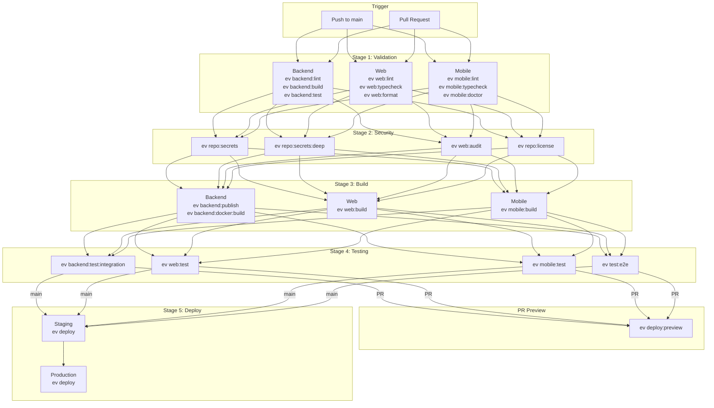

# Comprehensive CI/CD Pipeline Plan

**Status:** PLAN
**Created:** 2026-01-13
**Updated:** 2026-01-13
**Environment:** Devbox + Doppler + GitHub Actions

---

## Overview

This plan uses the `ev` CLI as the single source of truth for all CI/CD operations. All workflows run inside Devbox
shell, ensuring consistency between local development and CI environments.

**Key Principles:**

- All commands executed via `ev` CLI inside Devbox shell
- Staging environment for CI (not dev)
- Doppler for secrets management
- OpenTofu for infrastructure automation
- bun for web client builds
- pnpm for mobile client

---

## Architecture

### Pipeline Flow

```
┌─────────────────────────────────────────────────────────────────────────────────┐
│                           TRIGGER: push/PR to main                               │
└─────────────────────────────────────────────────────────────────────────────────┘
                                         │
         ┌───────────────────────────────┼───────────────────────────────┐
         │                               │                               │
         ▼                               ▼                               ▼
┌─────────────────────┐    ┌─────────────────────┐    ┌─────────────────────┐
│  VALIDATE: Backend  │    │   VALIDATE: Web     │    │  VALIDATE: Mobile   │
├─────────────────────┤    ├─────────────────────┤    ├─────────────────────┤
│ ev backend:lint     │    │ ev web:lint         │    │ ev mobile:lint      │
│ ev backend:build    │    │ ev web:typecheck    │    │ ev mobile:typecheck │
│ ev backend:test     │    │ ev web:format       │    │ ev mobile:doctor    │
└──────────┬──────────┘    └──────────┬──────────┘    └──────────┬──────────┘
           │                          │                          │
           └──────────────────────────┼──────────────────────────┘
                                      │
                                      ▼
         ┌─────────────────────────────────────────────────────────────┐
         │                    SECURITY (Parallel)                      │
         ├─────────────────────────────────────────────────────────────┤
         │  ev repo:secrets           Secret scanning (gitleaks)       │
         │  ev repo:secrets:deep      Deep scan (trufflehog)           │
         │  ev web:audit              Dependency audit                 │
         │  ev repo:license           License compliance               │
         └─────────────────────────────┬───────────────────────────────┘
                                       │
         ┌─────────────────────────────┼─────────────────────────────┐
         │                             │                             │
         ▼                             ▼                             ▼
┌─────────────────────┐  ┌─────────────────────┐  ┌─────────────────────┐
│   BUILD: Backend    │  │     BUILD: Web      │  │   BUILD: Mobile     │
├─────────────────────┤  ├─────────────────────┤  ├─────────────────────┤
│ ev backend:publish  │  │ ev web:build        │  │ ev mobile:build     │
│ ev backend:docker:  │  │ (bundle analysis)   │  │ (EAS Build)         │
│   build             │  │                     │  │                     │
└──────────┬──────────┘  └──────────┬──────────┘  └──────────┬──────────┘
           │                        │                        │
           └────────────────────────┼────────────────────────┘
                                    │
                                    ▼
         ┌─────────────────────────────────────────────────────────────┐
         │                         TESTING                              │
         ├─────────────────────────────────────────────────────────────┤
         │  ev backend:test:integration    Backend integration tests   │
         │  ev web:test                    Web unit/component tests    │
         │  ev mobile:test                 Mobile unit tests           │
         │  ev test:e2e                    Full E2E suite (root tests/)│
         └─────────────────────────────┬───────────────────────────────┘
                                       │
                    ┌──────────────────┴──────────────────┐
                    │                                     │
        ┌───────────┴───────────┐           ┌─────────────┴────────────┐
        │      PR Branch        │           │      Main Branch         │
        ▼                       │           ▼                          │
┌─────────────────────┐         │  ┌─────────────────────────────────┐
│   PREVIEW DEPLOY    │         │  │       STAGING DEPLOYMENT        │
├─────────────────────┤         │  ├─────────────────────────────────┤
│ ev infra:preview:   │         │  │ ev infra:ci:apply               │
│   create            │         │  │ ev deploy                       │
│ ev deploy:preview   │         │  │ ev test:smoke                   │
│ Comment PR URL      │         │  └───────────────┬─────────────────┘
└─────────────────────┘         │                  │
                                │                  ▼
                                │  ┌─────────────────────────────────┐
                                │  │    PRODUCTION DEPLOYMENT        │
                                │  │       (Manual Trigger)          │
                                │  ├─────────────────────────────────┤
                                │  │ Requires approval               │
                                │  │ ev deploy                       │
                                │  │ ev test:smoke                   │
                                │  └───────────────┬─────────────────┘
                                │                  │
                                │                  ▼
                                │  ┌─────────────────────────────────┐
                                │  │       POST-DEPLOYMENT           │
                                │  ├─────────────────────────────────┤
                                │  │ Slack notification              │
                                │  │ GitHub release                  │
                                │  │ Monitoring update               │
                                │  └─────────────────────────────────┘
                                │
                                └──────────────────────────────────────
```

### Mermaid Diagram



---

## ev CLI Commands

### Current Commands (Existing)

| Group       | Command                                                             | Description                  |
|-------------|---------------------------------------------------------------------|------------------------------|
| `env:*`     | `list`, `list:mobile`, `list:web`, `list:backend`                   | List environment variables   |
| `secrets:*` | `list`, `get`, `set`, `notes`                                       | Doppler secrets management   |
| `backend:*` | `start`, `stop`, `restart`, `logs`, `status`, `exec`                | Docker Compose orchestration |
| `infra:*`   | `init`, `plan`, `apply`, `destroy`, `output`, `validate`, `fmt`     | OpenTofu infrastructure      |
| `repo:*`    | `loc`, `info`, `size`, `secrets`, `secrets:history`, `secrets:deep` | Repository analysis          |

### New Commands (Required for CI/CD)

#### Backend Commands

| Command                    | Environment  | Description                                    |
|----------------------------|--------------|------------------------------------------------|
| `backend:install`          | all          | `dotnet restore`                               |
| `backend:build`            | all          | `dotnet build --configuration Release`         |
| `backend:publish`          | staging/prod | `dotnet publish --configuration Release`       |
| `backend:lint`             | all          | `dotnet format --verify-no-changes`            |
| `backend:test`             | all          | `dotnet test --filter "Category!=Integration"` |
| `backend:test:integration` | staging      | `dotnet test --filter "Category=Integration"`  |
| `backend:docker:build`     | staging/prod | Build Docker image                             |
| `backend:docker:push`      | staging/prod | Push to container registry                     |

#### Web Commands

| Command          | Environment | Description                           |
|------------------|-------------|---------------------------------------|
| `web:install`    | all         | `bun install`                         |
| `web:build`      | all         | `bun run build`                       |
| `web:dev`        | dev         | `bun run dev`                         |
| `web:lint`       | all         | `bun run lint`                        |
| `web:typecheck`  | all         | `bun run tsc --noEmit` (with codegen) |
| `web:format`     | all         | `bun run format:check`                |
| `web:format:fix` | dev         | `bun run format`                      |
| `web:test`       | all         | `bun run test`                        |
| `web:codegen`    | all         | `bun run gql:codegen`                 |
| `web:audit`      | all         | `bun audit` (or npm audit)            |

#### Mobile Commands

| Command            | Environment | Description                                                                                      |
|--------------------|-------------|--------------------------------------------------------------------------------------------------|
| `mobile:install`   | all         | `pnpm install`                                                                                   |
| `mobile:lint`      | all         | `pnpm lint`                                                                                      |
| `mobile:typecheck` | all         | `pnpm typecheck`                                                                                 |
| `mobile:doctor`    | all         | `npx expo-doctor`                                                                                |
| `mobile:test`      | all         | `pnpm test`                                                                                      |
| `mobile:start`     | dev         | `pnpm start`                                                                                     |
| `mobile:build`     | all         | `eas build --profile ${ELAVIEW_ENVIRONMENT}` (dev=development, staging=preview, prod=production) |
| `mobile:submit`    | prod        | `eas submit`                                                                                     |

#### E2E Test Commands (root tests/ directory)

| Command             | Environment | Description                                              |
|---------------------|-------------|----------------------------------------------------------|
| `test:e2e`          | all         | Run full E2E suite (Playwright)                          |
| `test:e2e:chromium` | all         | E2E on Chromium only                                     |
| `test:e2e:firefox`  | all         | E2E on Firefox only                                      |
| `test:e2e:webkit`   | all         | E2E on WebKit only                                       |
| `test:smoke`        | all         | Quick smoke tests (environment from ELAVIEW_ENVIRONMENT) |

#### Infrastructure Commands (additions)

| Command                 | Environment  | Description                       |
|-------------------------|--------------|-----------------------------------|
| `infra:ci:plan`         | staging/prod | `tofu plan -no-color -out=tfplan` |
| `infra:ci:apply`        | staging/prod | `tofu apply -auto-approve tfplan` |
| `infra:preview:create`  | staging      | Create PR preview environment     |
| `infra:preview:destroy` | staging      | Destroy PR preview environment    |

#### Deployment Commands

All deployment commands respect `ELAVIEW_ENVIRONMENT` (staging/production).

| Command           | Description                                |
|-------------------|--------------------------------------------|
| `deploy`          | Deploy all services to current environment |
| `deploy:backend`  | Deploy backend only                        |
| `deploy:web`      | Deploy web only                            |
| `deploy:mobile`   | Trigger EAS build/submit                   |
| `deploy:preview`  | Deploy PR preview environment              |
| `deploy:rollback` | Rollback last deployment                   |

#### Repository Commands (additions)

| Command        | Description                             |
|----------------|-----------------------------------------|
| `repo:license` | Check license compliance                |
| `repo:audit`   | Run all security scans (secrets + deps) |

---

## Workflow Files

### Directory Structure

```
.github/workflows/
├── ci-cd.yaml                      # Main orchestrator (shows full graph)
├── jobs/
│   ├── validate-backend.yaml       # Backend validation (reusable)
│   ├── validate-web.yaml           # Web validation (reusable)
│   ├── validate-mobile.yaml        # Mobile validation (reusable)
│   ├── security.yaml               # Security scanning (reusable)
│   ├── build-backend.yaml          # Backend build (reusable)
│   ├── build-web.yaml              # Web build (reusable)
│   ├── build-mobile.yaml           # Mobile build - EAS (reusable)
│   ├── test-integration.yaml       # Integration tests (reusable)
│   ├── test-e2e.yaml               # E2E tests (reusable)
│   └── deploy.yaml                 # Deployment (reusable)
├── deploy-production.yaml          # Manual production trigger
├── preview.yaml                    # PR preview deployments
└── codeql.yaml                     # CodeQL security analysis (scheduled)
```

### Reusable Workflow Pattern

Each job is a separate file with `workflow_call` trigger. The main `ci-cd.yaml` orchestrates them, and **all jobs appear
in one unified GitHub Actions graph**.

**Devbox shell in reusable workflows:**

Each reusable workflow sets up devbox independently, but the **Nix cache is shared** across all jobs via
`enable-cache: true`.

```yaml
# .github/workflows/jobs/validate-backend.yaml
name: Validate Backend

on:
  workflow_call:

defaults:
  run:
    shell: devbox run -- bash -e {0}

jobs:
  validate:
    name: Validate Backend
    runs-on: ubuntu-latest
    steps:
      - uses: actions/checkout@v4
      - uses: jetify-com/devbox-install-action@v0.11.0
        with:
          enable-cache: true
      - run: ev backend:lint
      - run: ev backend:build
      - run: ev backend:test
```

---

## Workflow Specifications

### 1. Main CI/CD Orchestrator (`ci-cd.yaml`)

```yaml
name: CI/CD

on:
  pull_request:
    branches: [ main ]
  push:
    branches: [ main ]

concurrency:
  group: ci-cd-${{ github.ref }}
  cancel-in-progress: true

env:
  ELAVIEW_ENVIRONMENT: staging
  DOPPLER_TOKEN: ${{ secrets.DOPPLER_TOKEN }}

jobs:
  # ═══════════════════════════════════════════════════════════════════════════
  # STAGE 1: VALIDATION (parallel, reusable workflows)
  # ═══════════════════════════════════════════════════════════════════════════

  validate-backend:
    name: Validate Backend
    uses: ./.github/workflows/jobs/validate-backend.yaml
    secrets: inherit

  validate-web:
    name: Validate Web
    uses: ./.github/workflows/jobs/validate-web.yaml
    secrets: inherit

  validate-mobile:
    name: Validate Mobile
    uses: ./.github/workflows/jobs/validate-mobile.yaml
    secrets: inherit

  # ═══════════════════════════════════════════════════════════════════════════
  # STAGE 2: SECURITY
  # ═══════════════════════════════════════════════════════════════════════════

  security:
    name: Security Scanning
    needs: [ validate-backend, validate-web, validate-mobile ]
    uses: ./.github/workflows/jobs/security.yaml
    secrets: inherit

  # ═══════════════════════════════════════════════════════════════════════════
  # STAGE 3: BUILD
  # ═══════════════════════════════════════════════════════════════════════════

  build-backend:
    name: Build Backend
    needs: security
    uses: ./.github/workflows/jobs/build-backend.yaml
    secrets: inherit

  build-web:
    name: Build Web
    needs: security
    uses: ./.github/workflows/jobs/build-web.yaml
    secrets: inherit

  build-mobile:
    name: Build Mobile (EAS)
    needs: security
    if: github.ref == 'refs/heads/main'
    uses: ./.github/workflows/jobs/build-mobile.yaml
    secrets: inherit

  # ═══════════════════════════════════════════════════════════════════════════
  # STAGE 4: TESTING
  # ═══════════════════════════════════════════════════════════════════════════

  test-integration:
    name: Integration Tests
    needs: [ build-backend, build-web ]
    uses: ./.github/workflows/jobs/test-integration.yaml
    secrets: inherit

  test-e2e:
    name: E2E Tests
    needs: [ build-backend, build-web ]
    uses: ./.github/workflows/jobs/test-e2e.yaml
    secrets: inherit

  # ═══════════════════════════════════════════════════════════════════════════
  # STAGE 5: DEPLOY (main branch only)
  # ═══════════════════════════════════════════════════════════════════════════

  deploy:
    name: Deploy to Staging
    needs: [ test-integration, test-e2e ]
    if: github.ref == 'refs/heads/main' && github.event_name == 'push'
    uses: ./.github/workflows/jobs/deploy.yaml
    secrets: inherit
    with:
      environment: staging

  # ═══════════════════════════════════════════════════════════════════════════
  # CI/CD SUMMARY
  # ═══════════════════════════════════════════════════════════════════════════

  summary:
    name: Pipeline Summary
    runs-on: ubuntu-latest
    needs: [ validate-backend, validate-web, validate-mobile, security, build-backend, build-web, test-integration, test-e2e ]
    if: always()
    steps:
      - name: Summary
        run: |
          echo "═══════════════════════════════════════════════════════"
          echo "                   CI/CD PIPELINE SUMMARY               "
          echo "═══════════════════════════════════════════════════════"
          echo ""
          echo "VALIDATION:"
          echo "  Backend:  ${{ needs.validate-backend.result }}"
          echo "  Web:      ${{ needs.validate-web.result }}"
          echo "  Mobile:   ${{ needs.validate-mobile.result }}"
          echo ""
          echo "SECURITY:   ${{ needs.security.result }}"
          echo ""
          echo "BUILD:"
          echo "  Backend:  ${{ needs.build-backend.result }}"
          echo "  Web:      ${{ needs.build-web.result }}"
          echo ""
          echo "TESTING:"
          echo "  Integration: ${{ needs.test-integration.result }}"
          echo "  E2E:         ${{ needs.test-e2e.result }}"
          echo "═══════════════════════════════════════════════════════"

          # Fail if any required job failed
          if [[ "${{ needs.validate-backend.result }}" != "success" ]] || \
             [[ "${{ needs.validate-web.result }}" != "success" ]] || \
             [[ "${{ needs.validate-mobile.result }}" != "success" ]] || \
             [[ "${{ needs.security.result }}" != "success" ]] || \
             [[ "${{ needs.build-backend.result }}" != "success" ]] || \
             [[ "${{ needs.build-web.result }}" != "success" ]] || \
             [[ "${{ needs.test-integration.result }}" != "success" ]] || \
             [[ "${{ needs.test-e2e.result }}" != "success" ]]; then
            echo "❌ CI/CD Pipeline Failed"
            exit 1
          fi
          echo "✅ CI/CD Pipeline Passed"
```

### Reusable Job Examples

#### `jobs/validate-backend.yaml`

```yaml
name: Validate Backend

on:
  workflow_call:

defaults:
  run:
    shell: devbox run -- bash -e {0}

env:
  ELAVIEW_ENVIRONMENT: staging

jobs:
  validate:
    name: Validate
    runs-on: ubuntu-latest
    steps:
      - uses: actions/checkout@v4
      - uses: jetify-com/devbox-install-action@v0.11.0
        with:
          enable-cache: true
      - run: ev backend:lint
      - run: ev backend:build
      - run: ev backend:test
```

#### `jobs/build-web.yaml`

```yaml
name: Build Web

on:
  workflow_call:

defaults:
  run:
    shell: devbox run -- bash -e {0}

env:
  ELAVIEW_ENVIRONMENT: staging

jobs:
  build:
    name: Build
    runs-on: ubuntu-latest
    steps:
      - uses: actions/checkout@v4
      - uses: jetify-com/devbox-install-action@v0.11.0
        with:
          enable-cache: true
      - run: ev web:install
      - run: ev web:build
      - uses: actions/upload-artifact@v4
        with:
          name: web-build
          path: |
            clients/web/.next
            !clients/web/.next/cache
          retention-days: 1
```

#### `jobs/deploy.yaml`

```yaml
name: Deploy

on:
  workflow_call:
    inputs:
      environment:
        required: true
        type: string

defaults:
  run:
    shell: devbox run -- bash -e {0}

env:
  ELAVIEW_ENVIRONMENT: ${{ inputs.environment }}

jobs:
  deploy:
    name: Deploy to ${{ inputs.environment }}
    runs-on: ubuntu-latest
    environment:
      name: ${{ inputs.environment }}
      url: ${{ inputs.environment == 'production' && 'https://app.elaview.com' || 'https://staging.elaview.com' }}
    steps:
      - uses: actions/checkout@v4
      - uses: jetify-com/devbox-install-action@v0.11.0
        with:
          enable-cache: true
      - uses: actions/download-artifact@v4
      - run: ev infra:ci:apply
      - run: ev deploy
      - run: ev test:smoke
```

### 2. PR Preview Deployment (`preview.yaml`)

```yaml
name: Preview Deployment

on:
  pull_request:
    types: [ opened, synchronize, reopened ]

concurrency:
  group: preview-${{ github.event.pull_request.number }}
  cancel-in-progress: true

env:
  ELAVIEW_ENVIRONMENT: staging
  DOPPLER_TOKEN: ${{ secrets.DOPPLER_TOKEN }}
  PR_NUMBER: ${{ github.event.pull_request.number }}

jobs:
  deploy-preview:
    name: Deploy Preview
    runs-on: ubuntu-latest
    environment:
      name: preview-${{ github.event.pull_request.number }}
      url: ${{ steps.deploy.outputs.url }}
    defaults:
      run:
        shell: devbox run -- bash -e {0}
    steps:
      - uses: actions/checkout@v4

      - name: Setup Devbox
        uses: jetify-com/devbox-install-action@v0.11.0
        with:
          enable-cache: true

      - name: Create Preview Infrastructure
        run: ev infra:preview:create

      - name: Build Web
        run: |
          ev web:install
          ev web:build

      - name: Deploy Preview
        id: deploy
        run: |
          ev deploy:preview
          echo "url=https://pr-${{ env.PR_NUMBER }}.preview.elaview.com" >> $GITHUB_OUTPUT

      - name: Comment PR
        uses: actions/github-script@v7
        with:
          script: |
            github.rest.issues.createComment({
              issue_number: context.issue.number,
              owner: context.repo.owner,
              repo: context.repo.repo,
              body: `## 🚀 Preview Deployment Ready

              **URL:** ${{ steps.deploy.outputs.url }}

              **Commit:** \`${{ github.sha }}\`

              This preview will be automatically destroyed when the PR is closed.`
            })

  cleanup-preview:
    name: Cleanup Preview
    runs-on: ubuntu-latest
    if: github.event.action == 'closed'
    defaults:
      run:
        shell: devbox run -- bash -e {0}
    steps:
      - uses: actions/checkout@v4

      - name: Setup Devbox
        uses: jetify-com/devbox-install-action@v0.11.0
        with:
          enable-cache: true

      - name: Destroy Preview Infrastructure
        run: ev infra:preview:destroy
```

### 3. Production Deployment (`deploy-production.yaml`)

```yaml
name: Deploy to Production

on:
  workflow_dispatch:
    inputs:
      version:
        description: 'Version to deploy (commit SHA or tag)'
        required: true
        type: string
      skip_tests:
        description: 'Skip smoke tests (emergency only)'
        required: false
        type: boolean
        default: false

env:
  ELAVIEW_ENVIRONMENT: production
  DOPPLER_TOKEN: ${{ secrets.DOPPLER_TOKEN_PROD }}

jobs:
  approve:
    name: Approval Required
    runs-on: ubuntu-latest
    environment:
      name: production-approval
    steps:
      - name: Approval Granted
        run: echo "Production deployment approved by ${{ github.actor }}"

  deploy:
    name: Deploy to Production
    runs-on: ubuntu-latest
    needs: approve
    environment:
      name: production
      url: https://app.elaview.com
    defaults:
      run:
        shell: devbox run -- bash -e {0}
    steps:
      - uses: actions/checkout@v4
        with:
          ref: ${{ inputs.version }}

      - name: Setup Devbox
        uses: jetify-com/devbox-install-action@v0.11.0
        with:
          enable-cache: true

      - name: Apply Infrastructure
        run: ev infra:ci:apply

      - name: Deploy to Production
        run: ev deploy

      - name: Smoke Tests
        if: ${{ !inputs.skip_tests }}
        run: ev test:smoke

      - name: Rollback on Failure
        if: failure()
        run: ev deploy:rollback

  post-deploy:
    name: Post-Deployment
    runs-on: ubuntu-latest
    needs: deploy
    defaults:
      run:
        shell: devbox run -- bash -e {0}
    steps:
      - uses: actions/checkout@v4
        with:
          ref: ${{ inputs.version }}

      - name: Create GitHub Release
        uses: actions/create-release@v1
        with:
          tag_name: release-${{ github.run_number }}
          release_name: Production Release ${{ github.run_number }}
          body: |
            ## Production Deployment

            **Version:** ${{ inputs.version }}
            **Deployed by:** ${{ github.actor }}
            **Date:** ${{ github.event.head_commit.timestamp }}
          draft: false
          prerelease: false
        env:
          GITHUB_TOKEN: ${{ secrets.GITHUB_TOKEN }}

      - name: Notify Slack
        run: |
          echo "Production deployment successful"
          # ev notify:slack --channel=#deployments --message="Production deployed: ${{ inputs.version }}"
```

### 4. CodeQL Security Analysis (`codeql.yaml`)

```yaml
name: CodeQL

on:
  push:
    branches: [ main ]
  pull_request:
    branches: [ main ]
  schedule:
    - cron: '0 0 * * 1'

jobs:
  analyze-typescript:
    name: Analyze TypeScript
    runs-on: ubuntu-latest
    permissions:
      security-events: write
      actions: read
      contents: read
    steps:
      - uses: actions/checkout@v4

      - name: Initialize CodeQL
        uses: github/codeql-action/init@v3
        with:
          languages: javascript-typescript
          queries: security-extended

      - name: Perform CodeQL Analysis
        uses: github/codeql-action/analyze@v3
        with:
          category: "/language:javascript-typescript"

  analyze-csharp:
    name: Analyze C#
    runs-on: ubuntu-latest
    permissions:
      security-events: write
      actions: read
      contents: read
    defaults:
      run:
        shell: devbox run -- bash -e {0}
    steps:
      - uses: actions/checkout@v4

      - name: Setup Devbox
        uses: jetify-com/devbox-install-action@v0.11.0
        with:
          enable-cache: true

      - name: Initialize CodeQL
        uses: github/codeql-action/init@v3
        with:
          languages: csharp
          queries: security-extended

      - name: Build Backend
        run: ev backend:build

      - name: Perform CodeQL Analysis
        uses: github/codeql-action/analyze@v3
        with:
          category: "/language:csharp"
```

---

## OpenTofu Infrastructure Integration

### Resources Managed

| Resource             | Purpose              | CI/CD Usage                       |
|----------------------|----------------------|-----------------------------------|
| Container Registry   | Docker image storage | `ev infra:output registry_url`    |
| PostgreSQL           | Database             | `ev infra:output database_url`    |
| Redis                | Caching/sessions     | `ev infra:output redis_url`       |
| CDN                  | Static assets        | `ev infra:output cdn_url`         |
| Load Balancer        | Traffic routing      | Blue-green deployments            |
| Preview Environments | PR previews          | `ev infra:preview:create/destroy` |

### Preview Environment Infrastructure

```hcl
# infra/preview.tf (example)
variable "pr_number" {
  type = string
}

resource "railway_service" "preview" {
  name = "elaview-preview-pr-${var.pr_number}"
  # ... configuration
}

output "preview_url" {
  value = "https://pr-${var.pr_number}.preview.elaview.com"
}
```

### CI/CD Infrastructure Commands

```bash
# Plan changes (CI - outputs to file, no color)
ev infra:ci:plan
# → tofu plan -no-color -out=tfplan -var-file=staging.tfvars

# Apply changes (CI - auto-approve from plan file)
ev infra:ci:apply
# → tofu apply -auto-approve tfplan

# Create preview environment
ev infra:preview:create
# → tofu apply -auto-approve -var="pr_number=$PR_NUMBER" -target=module.preview

# Destroy preview environment
ev infra:preview:destroy
# → tofu destroy -auto-approve -var="pr_number=$PR_NUMBER" -target=module.preview
```

---

## Secrets Management

### Doppler Configuration

| Environment | Doppler Config | Usage                 |
|-------------|----------------|-----------------------|
| Development | `dev`          | Local development     |
| Staging     | `staging`      | CI/CD, PR previews    |
| Production  | `production`   | Production deployment |

### GitHub Secrets Required

| Secret               | Description                               |
|----------------------|-------------------------------------------|
| `DOPPLER_TOKEN`      | Doppler service token (staging config)    |
| `DOPPLER_TOKEN_PROD` | Doppler service token (production config) |
| `EXPO_TOKEN`         | EAS Build authentication                  |
| `GITHUB_TOKEN`       | Auto-provided by GitHub                   |

### Accessing Secrets in ev Commands

```bash
# Doppler injects secrets automatically in devbox shell
# No need to manually reference secrets in ev commands

# Example: ev deploy           internally uses
doppler run -- railway up --service=elaview-backend
```

---

## Caching Strategy

### Devbox Cache

```yaml
- name: Setup Devbox
  uses: jetify-com/devbox-install-action@v0.11.0
  with:
    enable-cache: true  # Caches Nix packages
```

### Application-Level Caching

Caching should be handled within ev commands where appropriate:

```bash
# ev web:install could include
bun install --frozen-lockfile
# bun automatically caches in ~/.bun/install/cache

# ev backend:build could use
dotnet build --no-restore  # if restore was cached
```

### GitHub Actions Cache

For large artifacts that benefit from cross-run caching:

```yaml
- name: Cache Playwright Browsers
  uses: actions/cache@v4
  with:
    path: ~/.cache/ms-playwright
    key: playwright-${{ runner.os }}-${{ hashFiles('tests/package.json') }}
```

---

## Implementation Checklist

### Phase 1: ev CLI Extensions

- [ ] Fix `scripts/core/dir.sh` paths (clients/ not apps/) ✓ (user fixed)
- [ ] Add `backend:install`, `backend:build`, `backend:publish`, `backend:lint`, `backend:test`
- [ ] Add `backend:test:integration`, `backend:docker:build`, `backend:docker:push`
- [ ] Add `web:install`, `web:build`, `web:lint`, `web:typecheck`, `web:format`, `web:test`, `web:codegen`, `web:audit`
- [ ] Add `mobile:install`, `mobile:lint`, `mobile:typecheck`, `mobile:doctor`, `mobile:test`
- [ ] Add `mobile:build`, `mobile:submit`
- [ ] Add `test:e2e`, `test:e2e:chromium`, `test:e2e:firefox`, `test:e2e:webkit`, `test:smoke`
- [ ] Add `infra:ci:plan`, `infra:ci:apply`, `infra:preview:create`, `infra:preview:destroy`
- [ ] Add `deploy`, `deploy:backend`, `deploy:web`, `deploy:mobile`, `deploy:preview`, `deploy:rollback`
- [ ] Add `repo:license`, `repo:audit`

### Phase 2: GitHub Workflows

- [ ] Rename existing `.yaml.dev` files to `.yaml` (activate current workflows)
- [ ] Create `ci-cd.yaml` (main orchestrator)
- [ ] Create reusable workflows in `jobs/` directory
- [ ] Create `preview.yaml` (PR previews)
- [ ] Create `deploy-production.yaml` (manual production deployment)
- [ ] Create `codeql.yaml` (security analysis)
- [ ] Delete old individual workflow files (consolidated into ci-cd.yaml)

### Phase 3: Infrastructure

- [ ] Set up Doppler staging config
- [ ] Set up Doppler production config
- [ ] Configure container registry in OpenTofu
- [ ] Create preview environment module in OpenTofu
- [ ] Configure GitHub environments (staging, production, production-approval)
- [ ] Set up required GitHub secrets

### Phase 4: Testing Infrastructure

- [ ] Set up E2E test framework in `tests/` directory
- [ ] Create Playwright configuration
- [ ] Add smoke test suite
- [ ] Configure test database seeding

---

## Summary

| Component      | Commands   | Workflows                           |
|----------------|------------|-------------------------------------|
| Backend        | 10 new     | Validation, Build, Test, Deploy     |
| Web            | 10 new     | Validation, Build, Test, Deploy     |
| Mobile         | 10 new     | Validation, Build (EAS)             |
| E2E            | 6 new      | Integration with CI                 |
| Infrastructure | 4 new      | Preview, Staging, Production        |
| Deployment     | 7 new      | Staging (auto), Production (manual) |
| CI Utilities   | 6 new      | Aggregate commands                  |
| **Total**      | **53 new** | **4 workflow files**                |

---

**Last Updated:** 2026-01-13